#### 一、JVM体系概述

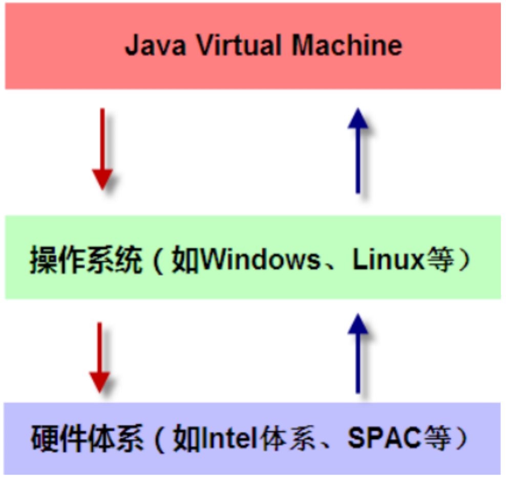

JVM是运行在操作系统之上的，它与硬件没有直接交互。

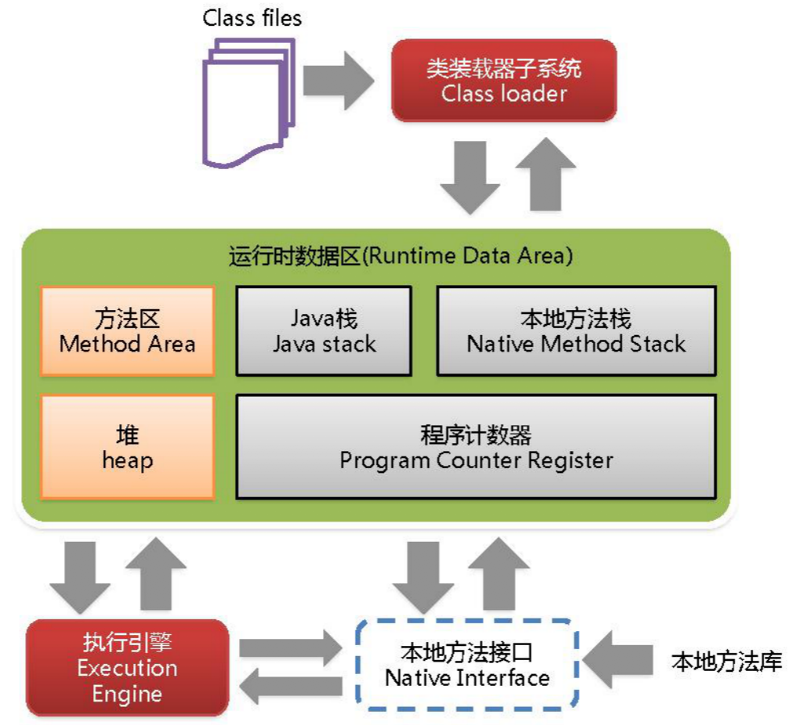

#### 二、类装载器

特点：双亲委派机制+沙箱安全机制

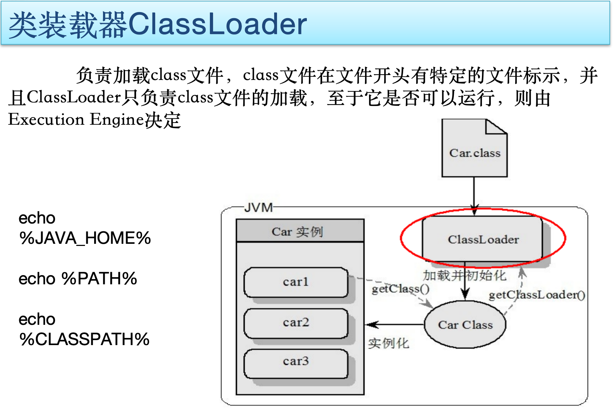

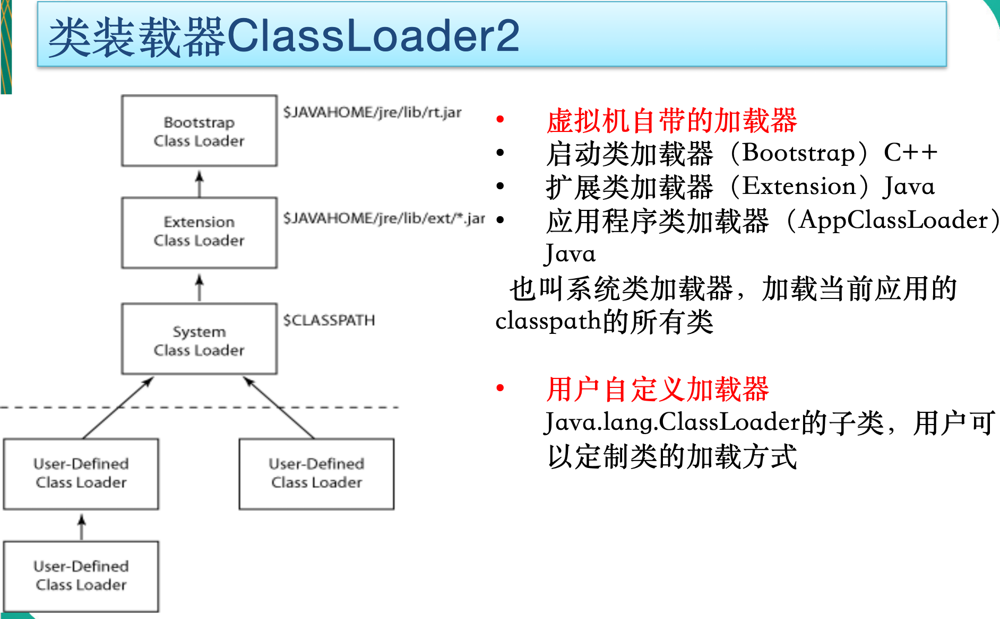

代码查看加载类的ClassLoader：

```java
public static void main(String[] args)throws Exception {
        Object obj = new Object();
        System.out.println(obj.getClass().getClassLoader());

        Class clazz = Class.forName("com.demo.Demo");
        System.out.println(clazz);

        Test t = new Test();
        System.out.println(t.getClass().getClassLoader());
        System.out.println(t.getClass().getClassLoader().getParent());
        System.out.println(t.getClass().getClassLoader().getParent().getParent());
    }
```

输出结果：

```java
null
class com.demo.Demo
sun.misc.Launcher$AppClassLoader@18b4aac2
sun.misc.Launcher$ExtClassLoader@610455d6
null
```

	所示结果展示了jdk自带的三种类加载器，启动类加载器（BootStrap）、扩展类加载器（Extension）、应用程序类加载器（AppClassLoader）。（还有一种，用户自定义类加载器，通过实现sun公司规定的jvm虚拟机规范来实现。继承Java.lang.ClassLoader，用户可继承这个类来定制类加载方式。了解即可。）
	
	启动类加载器：负责加载jdk自带的jar，将所有的如Object、String等类直接加载到JVM的永久代中，加载jdk的rt.jar。
	
	扩展类加载器：负责加载第三方的jar，也就是在jre/lib/ext/文件夹下的所有jar包。
	
	系统类加载器：负责加载所有classpath下的的jar。

#### 三、执行引擎

Execution Engine执行引擎负责解释命令，提交操作系统执行。

#### 四、本地接口、本地方法栈

	本地接口的作用是融合不同编程语言为Java所用， 它的初衷是融合C/C++程序，为了调用C++程序，在内存中专门开辟了一块区域处理标记为native的代码。它的具体做法是Native Method Stack中登记native方法，在Execution Engine执行时加载native libraies。
	
	本地方法栈，它的具体做法是在Native Method Stack中登记native方法，在Execution Engine执行时加载本地方法库。

#### 五、PC寄存器

	每个线程都有一个程序计数器，是线程私有的，就是一个指针，指向方法区的方法字节码（用来存储指向下一条指令的地址，也即将要执行的指令代码），由执行引擎读取下一条指令，是一个非常小的空间，几乎可以忽略不计。

#### 六、方法区

	方法区是被所有线程共享，所有的字段和方法字节码，以及一些特殊方法如构造函数，接口代码也在此定义。简单说，所有定义的方法的信息都保存在该区域，此区域属于共享空间。
	
	静态变量+常量+类信息（构造方法/接口定义）+运行时常量池存在方法区中（但，实例变量存在堆内存中，和方法区无关）。

实际而言，方法区（Method Area）和堆一样，是各个线程共享的内存区域，它用于存储虚拟机加载的：类信息+普通常量+静态常量+编译器编译后的代码等等，虽然JVM规范将方法区描述为堆的一个逻辑部分，但它却还有一个别名叫做Non-Heap(非堆)，目的就是要和堆分开。
	
	对于HotSpot虚拟机，很多开发者习惯将方法区称之为“永久代(Parmanent Gen)” ，但严格本质上说两者不同，或者说使用永久代来实现方法区而已，永久代是方法区(相当于是一个接口interface)的一个实现，jdk1.7的版本中，已经将原本放在永久代的字符串常量池移走。
	
	常量池（Constant Pool）是方法区的一部分，Class文件除了有类的版本、字段、方法、接口等描述信息外，还有一项信息就是常量池，这部分内容将在类加载后进入方法区的运行时常量池中存放。

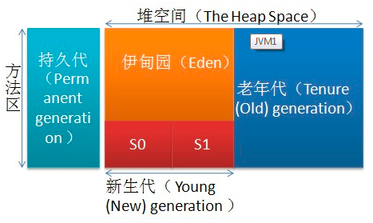

#### 七、栈

	栈也叫栈内存，主管Java程序的运行，是在线程创建时创建，它的生命周期是跟随线程的生命周期，线程结束栈内存也就释放，对于栈来说不存在垃圾回收问题，只要线程一结束该栈就Over，生命周期和线程生命周期一致，是线程私有的。8种基本数据类型的变量+对象的引用变量+实例方法都是在函数的栈内存中分配。

栈主要存储什么？

本地变量（Local Variables）：输入参数和输出参数以及方法内的变量；

栈操作（Operand Stack）：记录出栈、入栈的操作；

栈帧数据（Frame Data）：包括类文件、方法等。

栈运行原理？

	栈中的数据都是以栈帧（Stack Frame）的格式存在，栈帧是一个内存区块，是一个数据集，是一个有关方法（Method）和运行期数据的数据集，当一个方法A被调用时就产生了一个栈帧F1，并被压入到栈中，A方法又调用了B方法，于是产生栈帧F2也被压入到栈。。。。。。执行完毕后，先弹出F3栈帧，再弹出F2栈帧，再弹出F1栈帧。。。遵循“先进后出/后进先出”原则。

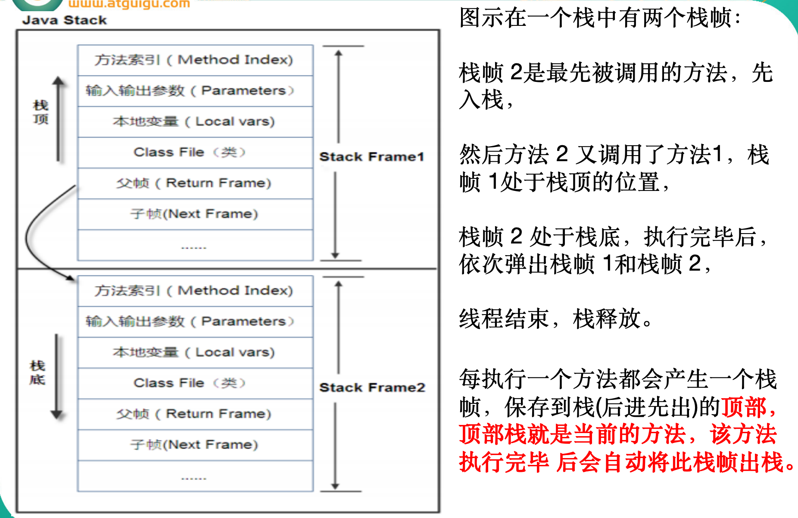

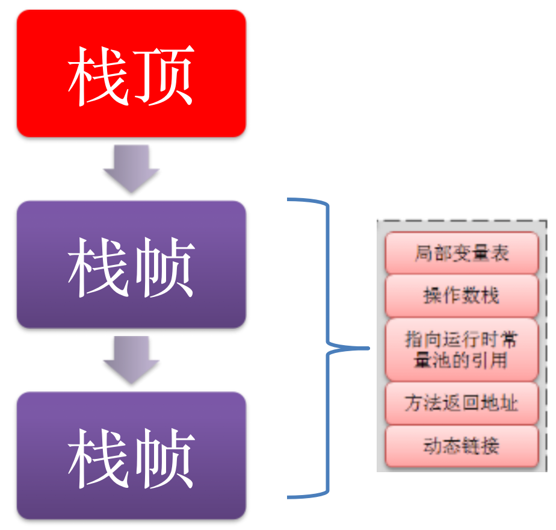

栈溢出异常：

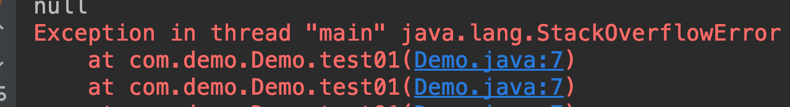

#### 八、栈+堆+方法区的交互关系

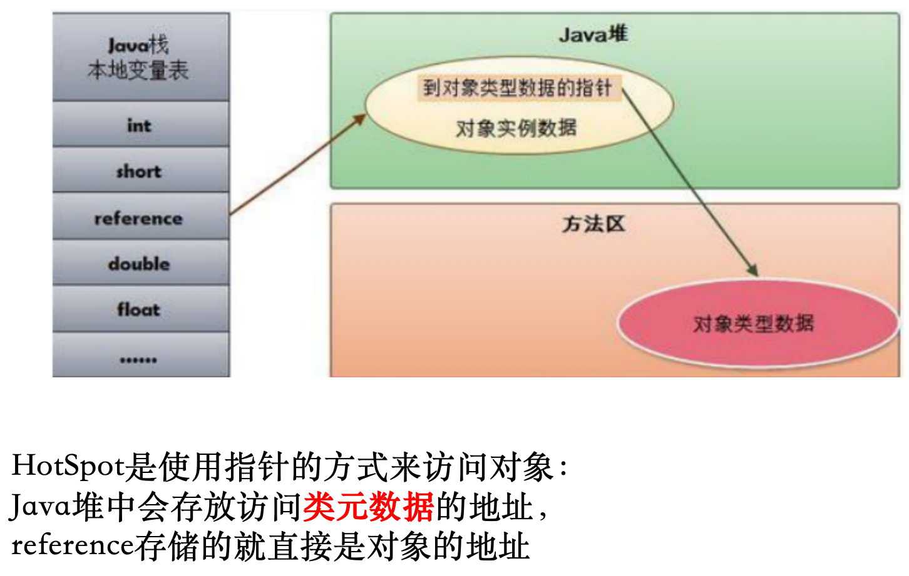

理解：

	栈中保存的是各种基本类型，以及reference(对象到堆的引用)，其实就是指针。而堆中的数据，例如你所new出来的User，他们都有属性id，name等等。这些模版，都保存在方法区中。这样就保证了堆中一个类型的对象，都是一样的属性。而你的实体模版，都保存在方法区。 

#### 九、堆

	一个JVM实例只存在一个堆内存，堆内存的大小是可以调节的。类加载器读取了类文件以后，需要把类、方法、常变量放到堆内存中，保存所有引用类型的真实信息，以方便执行器执行，堆内存分为三个部分：

Young Meneration Space 新生区：Young/New

Tenure generation Space 养老区：Old

permanent Space 永久区： Perm

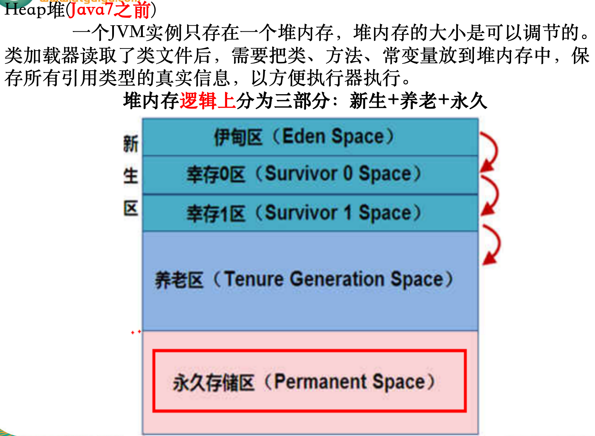

新生区：

	新生区是类的诞生、成长、消亡的区域，一个类在这里产生，应用，最后被垃圾回收器收集，结束生命。新生区又分为两部分：伊甸区（Eden Space）和幸存者区（Survivor Space），所有的类都是在伊甸区被new出来的。幸存区有两个：0区（Survivor 0 Space）和1区（Survivor 1 Space）。当伊甸园的空间用完时，程序又需要创建对象，JVM的垃圾回收器将对伊甸园区进行垃圾回收（Minor GC），将伊甸园区中的不再被其他对象所引用的对象进行销毁。让后将伊甸园区中剩余对象移动到幸存者0区。如果幸存者0区也满了，再对该区进行垃圾回收，然后移动到1区。那如果1区也满了呢？在移动到养老区。若养老区也满了，那么这个时候将产生Major GC（Full GC），进行养老区的内存清理。若养老区执行了Full GC之后发现依然无法进行对象的保存，就会产生OOM异常“OutOfMemoryError”。
	
	如果出现java.lang.OutOfMemoryError: Java heap space异常，说明Java虚拟机的堆内存不够。原因有二：
（1）Java虚拟机的堆内存设置不够，可以通过参数-Xms、-Xmx来调整。
（2）代码中创建了大量大对象，并且长时间不能被垃圾收集器收集（存在被引用）。

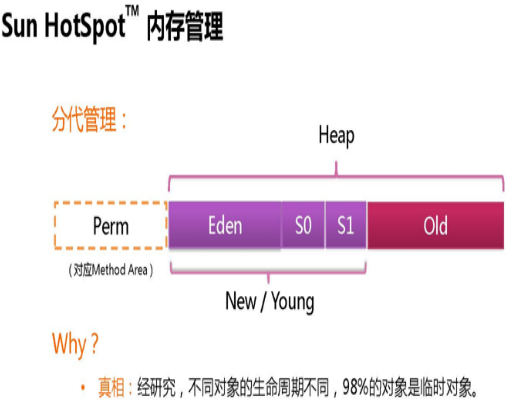

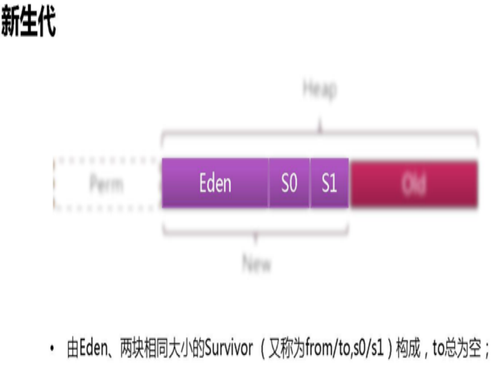

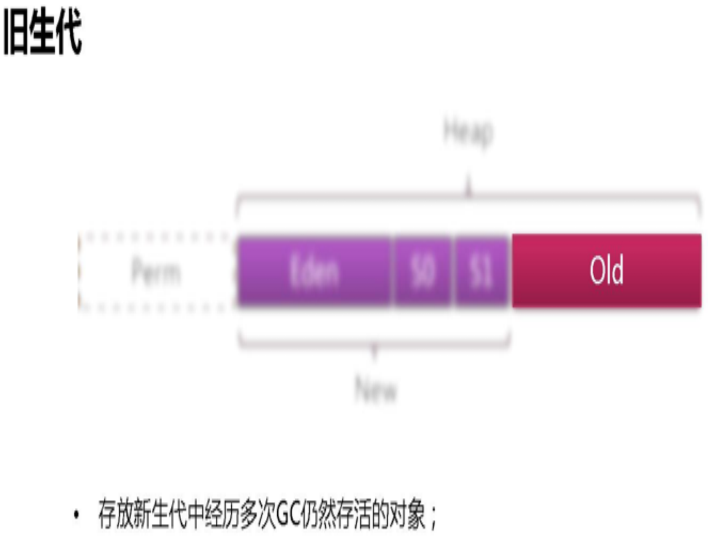

#### 十、永久区

	永久存储区是一个常驻内存区域，用于存放JDK自身所携带的CLass，Interface的元数据，也就是说它存储的是运行环境必须的类信息，被装载进此区域是不会被垃圾回收器回收掉的，关闭JVM才会释放此区域所占用的内存。
	
	如果出现java.lang.OutOfMemoryError: PermGen space，说明是Java虚拟机对永久代Perm内存设置不够。一般出现这种情况，都是程序启动需要加载大量的第三方jar包。例如：在一个Tomcat下部署了太多的应用。或者大量动态反射生成的类不断被加载，最终导致Perm区被占满。 
Jdk1.6及之前： 有永久代, 常量池1.6在方法区
Jdk1.7：       有永久代，但已经逐步“去永久代”，常量池1.7在堆
Jdk1.8及之后： 无永久代，常量池1.8在元空间

#### 十一、jdk8与jdk7堆内存变化

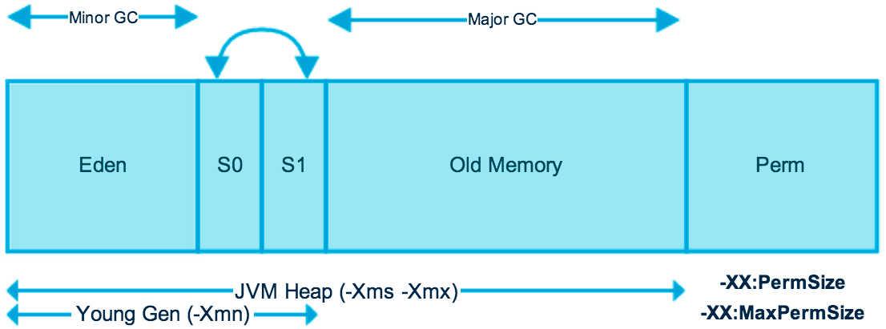

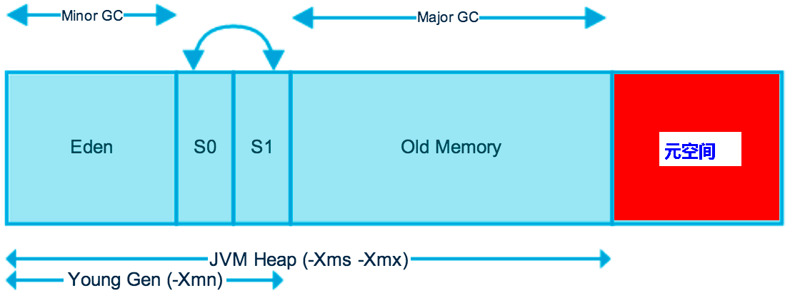

#### 十二、调整堆内存常用参数

```properties
-Xms1024m -Xmx1024m -XX:+PrintGCDetails
```

-Xms：设置初始分配大小，默认为物理内存的1/64；

-Xmx：最大分配内存，默认为物理内存的1/4；

-XX:+PrintGCDetails：输出详细的GC处理日志；

构建一个堆内存溢出：

```properties
-Xms8m -Xmx8m -XX:+PrintGCDetails
```


```java
public static void main(String[] args) {
        String str = "................";
        while (true){
            str += str + new Random().nextInt(88888888) + new Random().nextInt(999999999);
        }
    }
```

结果：

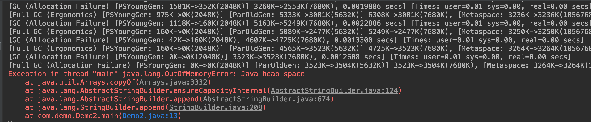

#### 十三、Eclipse使用MAT

	使用MAT插件分析内存快照。参数：-XX:+HeapDumpOnOutOfMemoryError。

#### 十四、GC

##### GC是什么：

	分代收集算法。次数上频繁收集Young区；次数上较少收集Old区；基本不动Perm区。

##### GC的作用域：

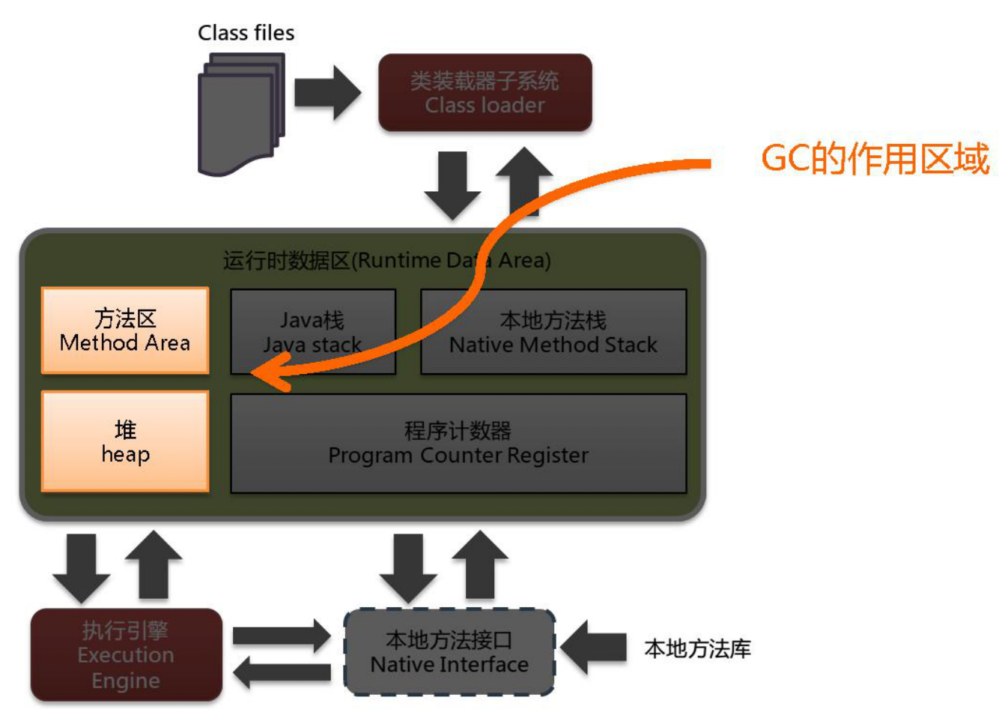

##### GC算法算法：

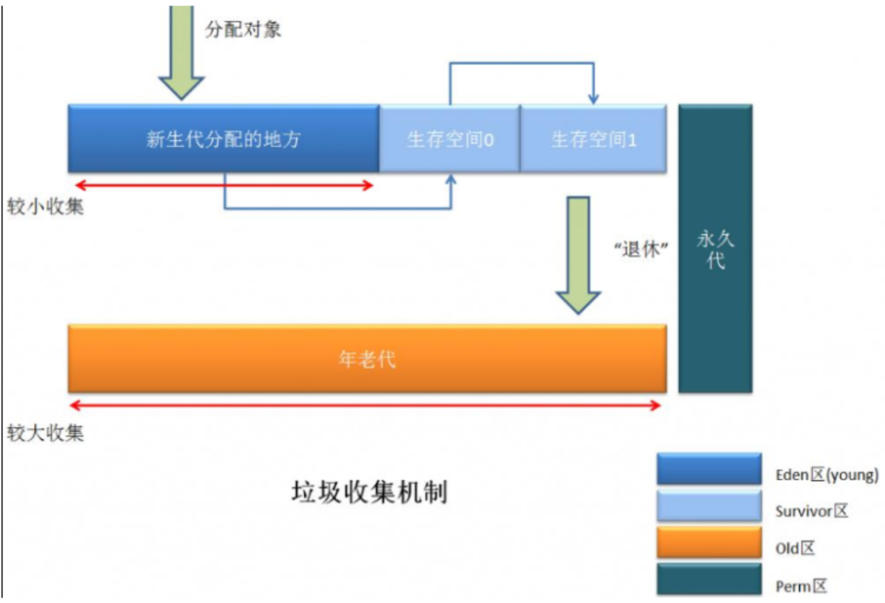

	JVM在进行GC时，并非每次都对上面三个内存区域一起回收的，大部分时候回收的都是指新生代。
	
	因此GC按照回收的区域又分了两种类型，一种是普通GC（minor GC），一种是全局GC（major GC or Full GC）。
	
	普通GC（minor GC）：只针对新生代区域的GC。
	
	全局GC（major GC or Full GC）：针对年老代的GC，偶尔伴随对新生代的GC以及对永久代的GC。

##### GC4大算法：

1.引用计数法

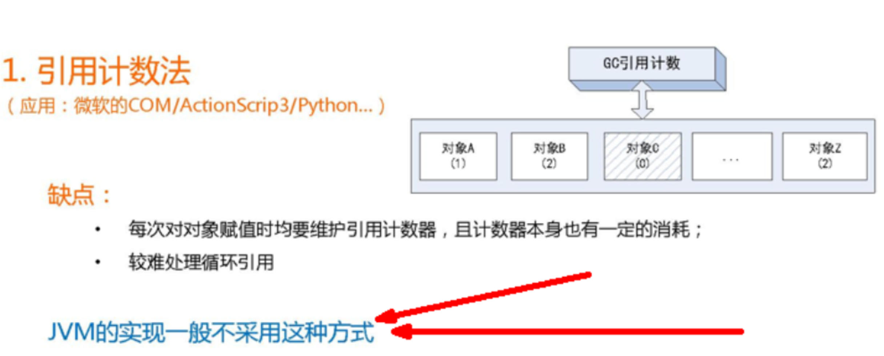

2.复制算法（Copying）

年轻代中使用的是Minor GC，这种GC算法采用的是复制算法（Copying）

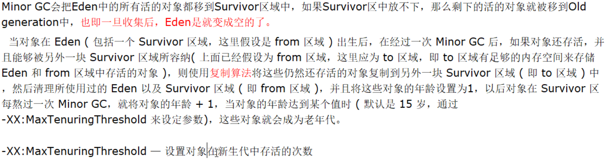

理解：

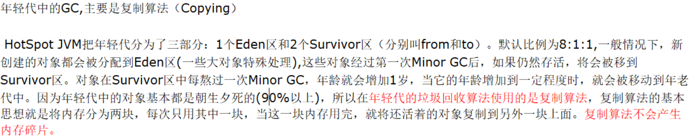

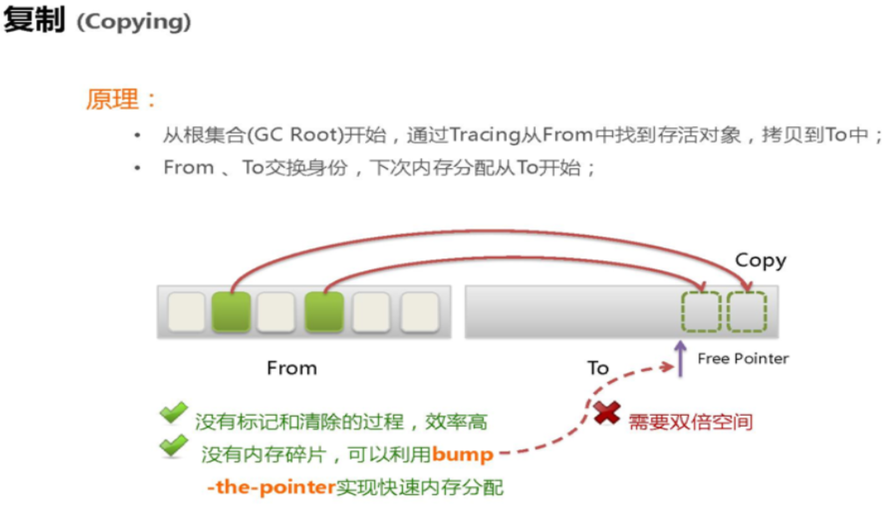

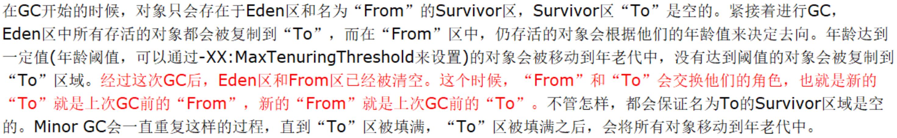

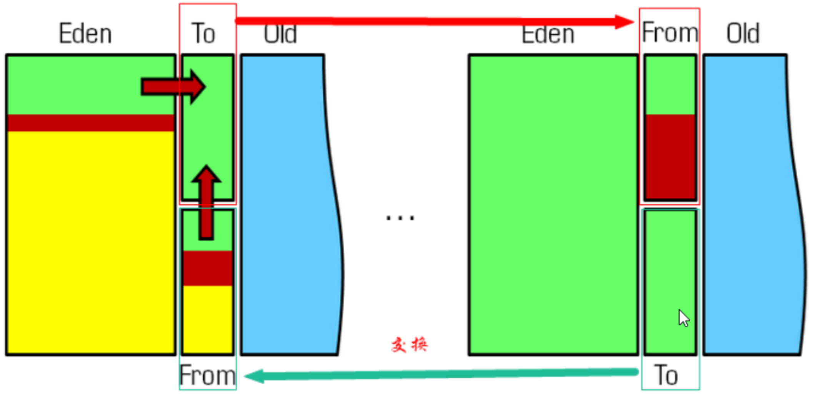

	因为Eden区对象一般存活率较低，一般的，使用两块10%的内存作为空闲和活动区间，而另外80%的内存，则是用来给新建对象分配内存的，一旦发生GC，将10%的form活动区间与另外80%中存活的eden对象转移到10%的to空间区间，接下来将之前90%内存全部释放，以此类推。

劣势：

	1.它浪费了一半的内存
	
	2.如果对象的存活率很高，假设100%都存活，那么我们需要将所有对象都复制一遍，并将所有引用地址复制一遍，复制这一工作所花费的时间，在对象存活率达到一定程度时，将会变的不可忽视。所以以上描述不难看出，复制算法要想使用，最起码对象的存活率要非常低才行，而且最重要的是，我们必须要克服50%的内存浪费。

3.标记清除（Mark-Sweep）

老年代的垃圾回收一般是由标记清除与标记整理混合实现。

原理：

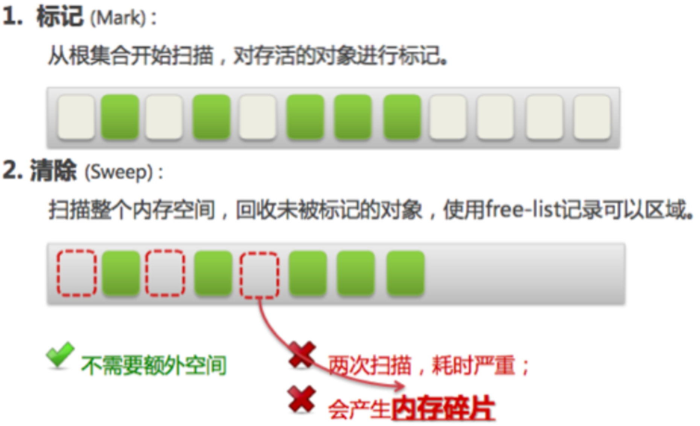

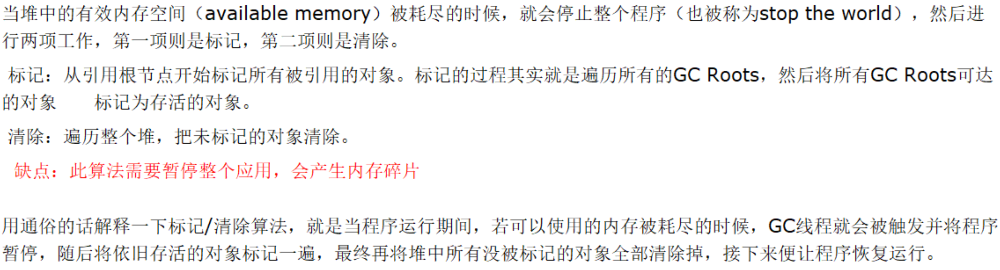

劣势：

	1.首先，它的缺点就是效率比较低（递归与全堆对象遍历），而且在进行GC的时候，需要停止应用程序，这会导致用户体验非常差。
	
	2.其次，主要的缺点则是这种方式清理出来的空间内存是不连续的，这点不难理解，我们死亡对象都是随机的出现在内存的各个角落的，现在把他们清除之后，内存的布局自然会乱七八糟的。而为了应付这一点，JVM就不得不维持一个内存空闲列表，这又是一种开销。而且在分配数组对象的时候，寻找连续的内存空间会不太好找。

4.标记压缩（Mark-Compact）

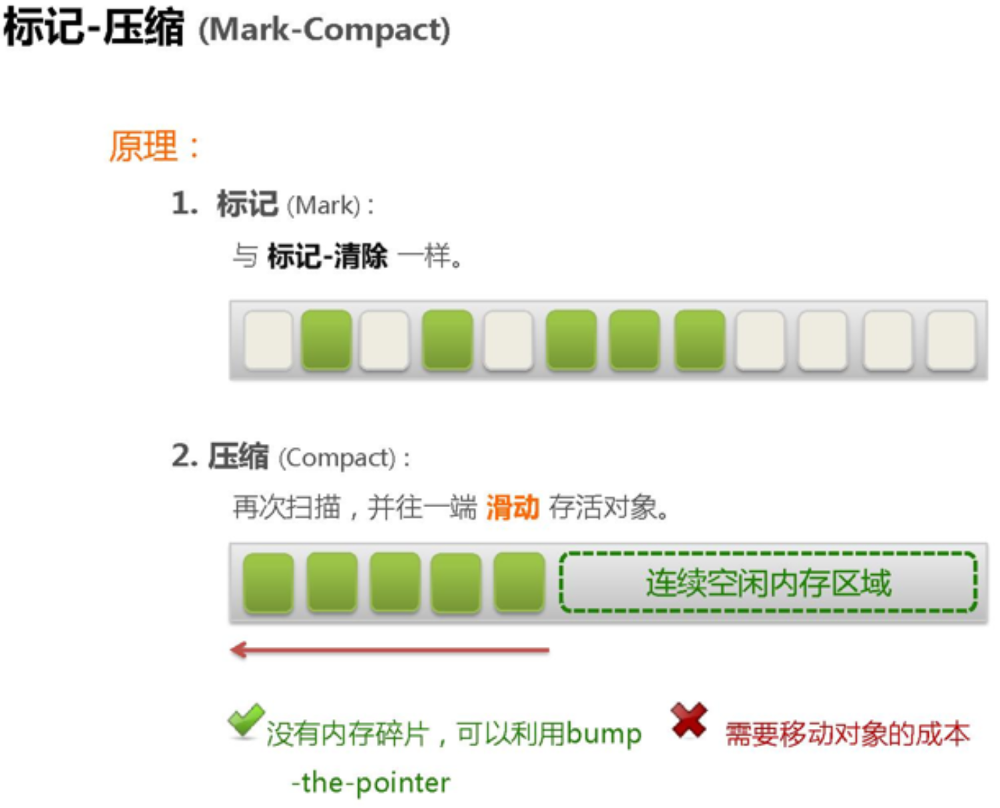

	在整理压缩阶段，不再对标记的对象做回收，而是通过所有存活对象都向一端移动，然后直接清除边界以外的内存。可以看到，标记的存活对象将会被整理，按照内存地址依次排列，而未被标记的内存会被清理掉。如此一来，当我们需要给新对象分配内存时，JVM只需要持有一个内存的起始地址即可，这比维护一个空闲列表显然少了许多开销。
	
	标记/整理算法不仅可以弥补标记/清除算法当中，内存区域分散的缺点，也消除了复制算法当中，内存减半的高额代价。

5.标记清除压缩（Mark-Sweep-Compact）

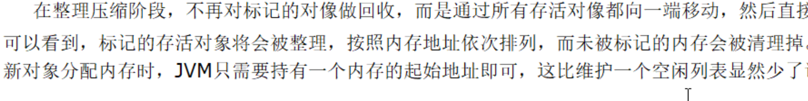

##### 小总结：

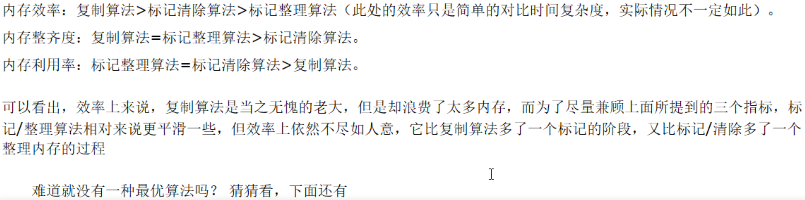

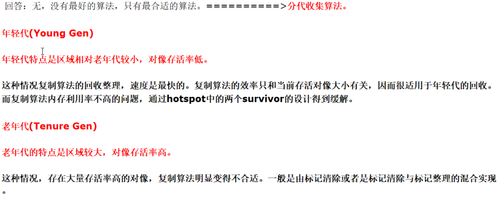

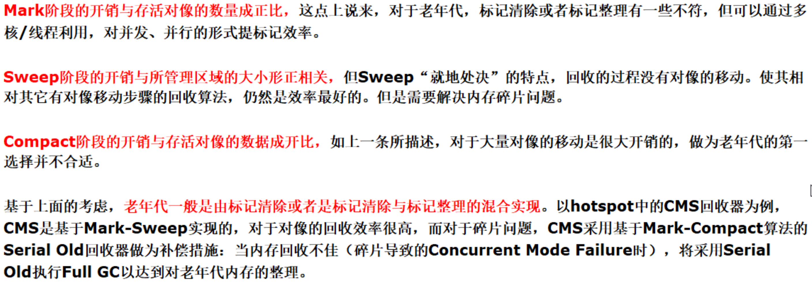

##### 面试题：

1.JVM内存模型以及分区，需要详细到每个区放什么

2.堆里面的分区：Eden，survival from to。老年代，各自的特点

3.GC的三种收集方法：表记清除、表及整理、复制算法的原理与特点，分别用在什么地方

4.Minor GC与Full GC分别在什么时候发生