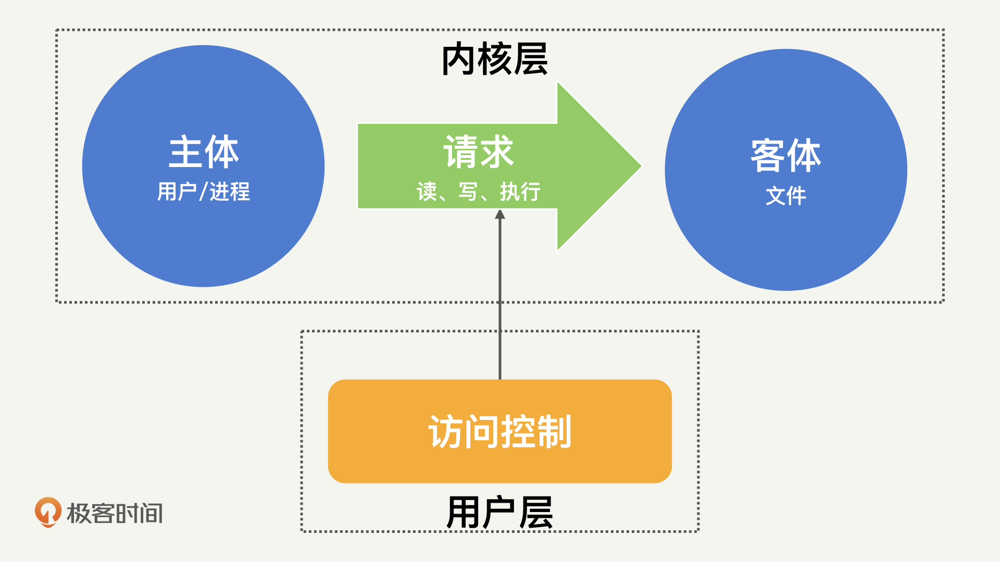
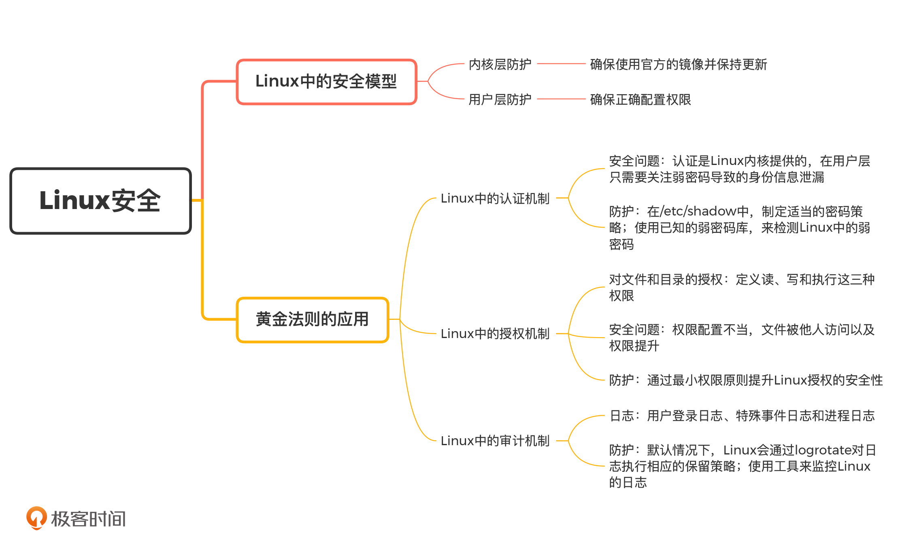

# Linux系统安全

### Linux的安全模型

​		我们先来看一下 Linux 的构成，Linux 可以分为内核层和用户层。用户层通过内核层提供的操作接口来执行各类任务。

​		内核层提供的权限划分、进程隔离和内存保护的安全功能，是用户层的安全基础。一旦内核安全被突破（比如黑客能够修改内核逻辑），黑客就可以任意地变更权限、操作进程和获取内存了。这个时候，任何用户层的安全措施都是没有意义的。

​		既然 Linux 的内核安全这么重要，那我们是不是要在防护上付出大量的精力呢？事实上，正如我们不需要在开发应用时（尤其是使用 Java 这类相对高层的语言时），过多地关心操作系统相关的内容一样，我们在考虑 Linux 安全时，也不需要过多地考虑内核的安全，更多的是要考虑用户层的安全。所以，对于 Linux 内核层的安全，我们只需要按照插件漏洞的防护方法，确保使用官方的镜像并保持更新就足够了。

​		既然，使用最多的是用户层，那我们就来看一下，用户层的操作都有什么。		在 Linux 中，用户层的所有操作，都可以抽象为“主体 -> 请求 -> 客体”这么一个流程。比如，“打开 /etc/passwd”这一操作的主体是实际的用户，请求是读，客体是 /etc/passwd 这个文件。



#### Linux 系统安全防护的核心是正确配置用户层权限

1.Linux 中的认证机制

​		Linux 系统是一个支持多用户的操作系统，它通过普通的文本文件来保存和管理用户信息。这其中，有两个比较关键的文件：/etc/passwd和/etc/shadow。		我们知道，在 Linux 中，/etc/passwd是全局可读的，不具备保密性。因此，/etc/passwd不会直接存储密码，而是用 x 来进行占位。那实际的用户密码信息，就会存储到仅 ROOT 可读的/etc/shadow中。

​		在/etc/shadow中，除了加密后的密码，也保存了诸如密码有效天数、失效多少天告警之类的密码管理策略。我们可以通过 Chage 命令来对密码管理策略进行修改，比如，通过下面的 Chage 命令，就可以强制 Test 用户在 60 天内必须对密码进行修改。通过这样的方式，就可以降低密码泄漏的可能性了。

````shell
chage -M 60 test
````

​		因为认证这个功能是由 Linux 内核来提供的，所以在用户层，我们需要关心的安全问题，就是弱密码导致的身份信息泄漏。为了解决这个问题，在/etc/shadow中，我们可以制定适当的密码策略。除此之外，我们也可以通过John the Ripper，使用已知的弱密码库，来对 Linux 中的弱密码进行检测。下面的命令，就是使用 John the Ripper 检测弱密码。

命令实例：

````shell
unshadow /etc/passwd /etc/shadow > mypasswd
john mypasswd
john --show mypassw
````

2.Linux 中的授权机制

​		在“黄金法则”中，认证只是第一步，它提供了一个可信的身份标识。有了这个身份标识之后，就需要通过授权来限制用户能够发起的请求了。在 Linux 中，客体只有文件和目录两种，针对这两种类型的客体，Linux 都定义了读、写和执行这三种权限。

​		除此之外，Linux 还提供了一些额外的权限标签，来进行更细粒度地权限控制。

​		比如，Linux 提供了文件属性的概念，来对文件设置更多的保护。通过chattr +i /etc/passwd可以防止文件被任何用户修改。想要了解更多的文件属性，你可以参考Wikipedia。

​		Linux 还提供了“粘滞位”的功能，主要用来防止用户随意操作其他用户的文件。比如chmod +t /tmp可以阻止删除 /tmp 目录下其他用户的文件。这些都是 Linux 在授权中的自我保护机制，那我们能在这个过程中进行怎样的防护呢？前面，我们一直在强调，Linux 系统面临的安全威胁其实就是权限问题。也就是说，要么就是敏感文件的权限配置不当，导致这些文件可以被额外的用户访问或执行；要么就是应用存在漏洞或密码泄漏，导致低权限用户可以获得更高的权限。

要解决权限问题，我们就要实践

#### 最小权限原则

​		我们先来看一个 Linux 系统安全中最普遍的问题：滥用 ROOT。很多人在登录 Linux 系统后，第一个命令就是通过 su 来获取 ROOT 的 Shell 环境，这样我们就不需要在每次操作的时候，通过 sudo 来临时提升至 ROOT 权限。

​		但是，这里你需要注意一点，在 ROOT 的 Shell 环境中启动的所有进程也都具备 ROOT 权限。如果启动的是一个立即返回的进程，如 CAT，不会有太多问题，但如果是一个长期运行的进程，就很容易产生权限的滥用。

​		比如，当你以 ROOT 的身份启动 Redis 或者 MySQL 等存储工具时，如果这时有其他用户连入 Redis 或者 MySQL，那他们也能间接地获取 ROOT 的权限。在大部分服务器入侵的场景中，黑客都是通过这些具备 ROOT 权限的进程漏洞，来实现权限提升的。

​		因此，在运行任何长驻进程时，我们都需要谨记“最小权限”原则。也就是说，我们可以根据要执行的操作等级，配置“最小权限”来启动常驻进程。比如，如果只是在 Redis 和 MySQL 这样的数据库中进行文件读写操作，根本不需要 ROOT 这种最高等级的权限。

​		因此，“最小权限”原则在 Linux 系统中的应用是非常重要的。那你可能会问了，Linux 系统中的操作那么多，每个操作都需要自己进行权限配置吗？当然不是，我们常常会使用一些已知的工具，来实现“最小权限”启动长驻进程的功能，而你需要做的，就是正确地启动或者配置这些工具。

​		比如说，我们可以通过 mysqld 启动 MySQL 服务，mysqld 会将 MySQL 的进程分配到“mysql”这个用户，并在 ROOT 下建立守护进程。具体的效果如下：

````shell
root     297353  0.0  0.0 115432  1360 ?        S    Aug12   0:00 /bin/sh /usr/local/mysql/bin/mysqld_safe --datadir=/var/lib/mysql --pid-file=/var/lib/mysql/mysql.pid
mysql    297553 31.3  4.3 11282756 5729572 ?    Sl   Aug12 22593:40 /usr/local/mysql/bin/mysqld --basedir=/usr/local/mysql --datadir=/var/lib/mysql --plugin-dir=/usr/local/mysql/lib/plugin --user=mysql --log-error=/var/log/mariadb/mariadb.log --pid-file=/var/lib/mysql/mysql.pid --socket=/var/lib/mysql/mysql.sock
````

类似的，当启动 Nginx 时，Nginx 会将 Worker 节点以 nobody 的用户身份来执行。具体的效果如下：

````shell
root       7083  0.0  0.0  61032  5324 ?        Ss   Aug12   0:01 nginx: master process nginx
nobody   331122  0.0  0.0  90768 31776 ?        S    11:44   0:00 nginx: worker process
nobody   331123  0.0  0.0  90768 32720 ?        S    11:44   0:00 nginx: worker process
nobody   331124  0.0  0.0  90768 31776 ?        S    11:44   0:00 nginx: worker process
````

​		当然，也有一些工具不提供这类最小权限切换的功能，比如，在直接执行redis-server启动 Redis 的时候，就需要我们自己来对用户身份进行切换。那用户身份切换怎么做呢？

​		我们首先来看 Nginx 的例子，在启动 Nginx 的时候，Linux 提供了 nobody 这么一个用户的身份。实际上，任何人进入 Linux 系统首先获得的用户身份就是 nobody，然后再从 nobody 进行登录，切换到其他正常用户身份上。

​		因此，nobody 通常拥有整个操作系统中最小的权限。所以，对于不提供最小权限切换功能的工具，我们就可以使用 nobody 的用户身份，来进行主动切换了。

​		在执行redis-server启动 Redis 的时候，我们就可以通过以下命令，以 nobody 的身份执行redis-server了（前提是，我们需要对日志和 PID 等目录进行适当配置，确保能够以 nobody 身份写入）：

````shell
su -s /bin/redis-server nobody
````

这样一来，我们就能通过“最小权限”原则，提升 Linux 系统授权的安全性了。

3.Linux 中的审计机制

​		我们在前面的课程中说过，“黄金法则”中的审计主要就是日志记录和分析。那么，Linux 系统中的日志都有哪些呢？在 Linux 系统中，系统的日志信息通常存储在 /var/log 目录下，部分应用程序也会把相关日志记录到这个目录中。系统日志主要分为 3 类，用户登录日志、特殊事件日志和进程日志。

​		用户登录日志主要是/var/log/wtmp和/var/run/utmp，用来保存用户登录相关的信息。用户登录日志本身为二进制文件，我们无法直接通过文本方式查看，但是可以配合who/users/ac/last/lastlog这样的命令来获取。

​		特殊事件日志主要包括/var/log/secure和/var/log/message。其中，/var/log/secure主要记录认证和授权相关的记录，如果有人试图爆破 SSH，我们就可以从这个日志中观察出来。/var/log/message由 syslogd 来维护，syslogd 这个守护进程提供了一个记录特殊事件和消息的标准机制，其他应用可以通过这个守护进程来报告特殊的事件。

​		进程日志：当通过 accton 来进行系统进程管理时，会生成记录用户执行命令的 pacct 文件。

​		默认情况下，Linux 会通过 logrotate 对日志执行相应的保留策略（比如日志切割和旧日志删除等）。通过配置/etc/logrotate.conf可以对不同日志的保留策略进行修改。

​		那如何对日志进行监控呢？这里，我向你推荐 2 种常见的日志分析工具 ELK 和 Zabbix，你可以利用这些工具来监控 Linux 的安全日志。也就是说，我们可以通过在这些分析平台配置恰当的规则（如 SSH 登录尝试失败 3 次以上），来及时发现黑客的部分入侵尝试，迅速产生报警。然后，我们就可以针对具体的问题，进行人工复查了。

#### 总结



### 网络安全：和别人共用Wi-Fi时


### 网站收藏

检测你的密码是否泄漏：https://haveibeenpwned.com/

Attack框架官网：https://attack.mitre.org/

SQL注入之盲注：https://www.freebuf.com/articles/web/175049.html

基于Insert语句的注入：https://www.jianshu.com/p/1f82582452df?utm_campaign

应用安全保护技术RASP：https://www.freebuf.com/articles/web/197823.html

Error Handling for REST with Spring:https://www.baeldung.com/exception-handling-for-rest-with-spring

监控github代码库：https://github.com/0xbug/Hawkeye

Maven Dependency Plugin：http://maven.apache.org/plugins/maven-dependency-plugin/

Version Maven Plugin：https://www.mojohaus.org/versions-maven-plugin/

OWASP Dependency-Check：https://jeremylong.github.io/DependencyCheck/

retire.js：https://github.com/retirejs/retire.js/

检测弱密码John the Ripper：https://github.com/magnumripper/JohnTheRipper