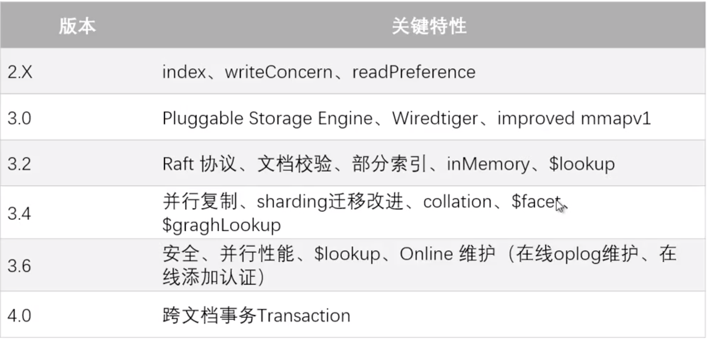
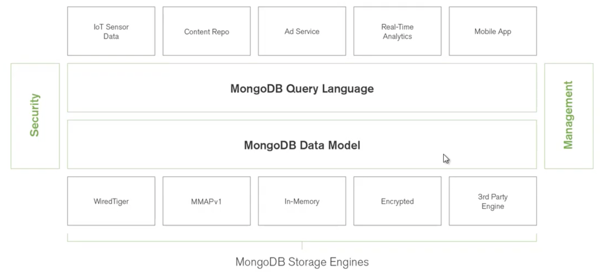
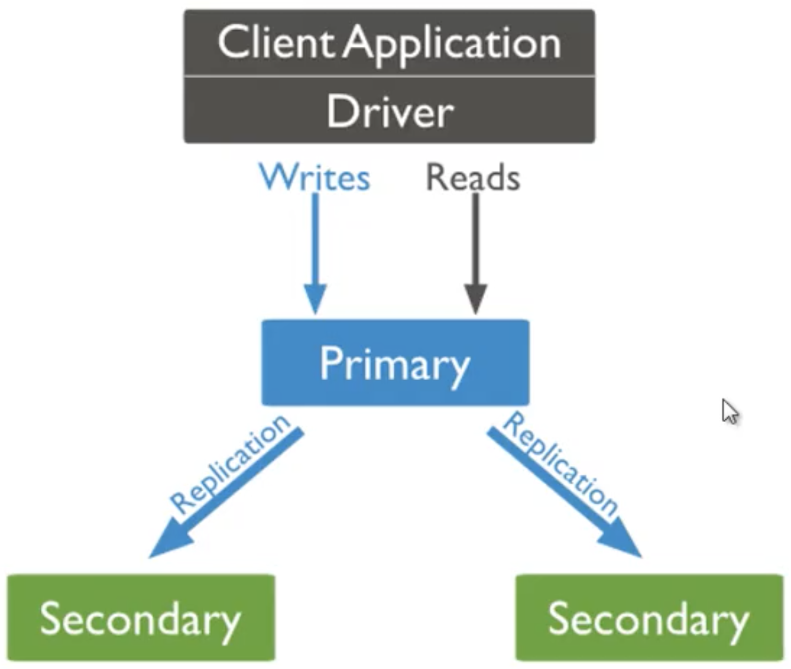
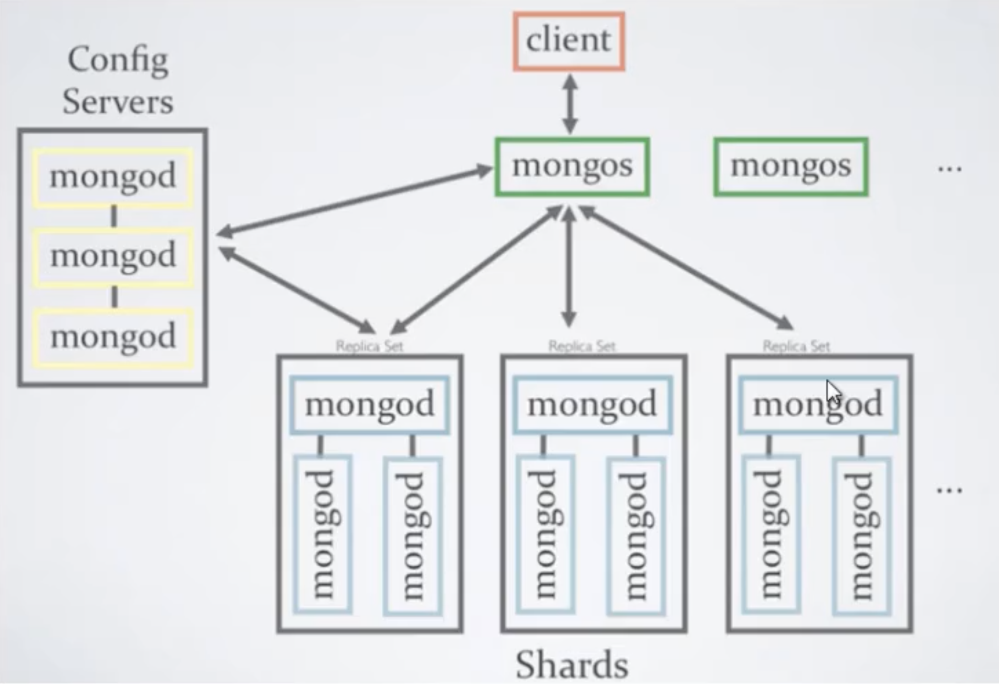
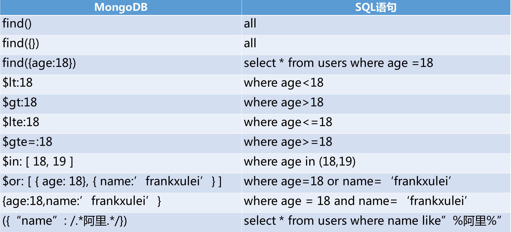
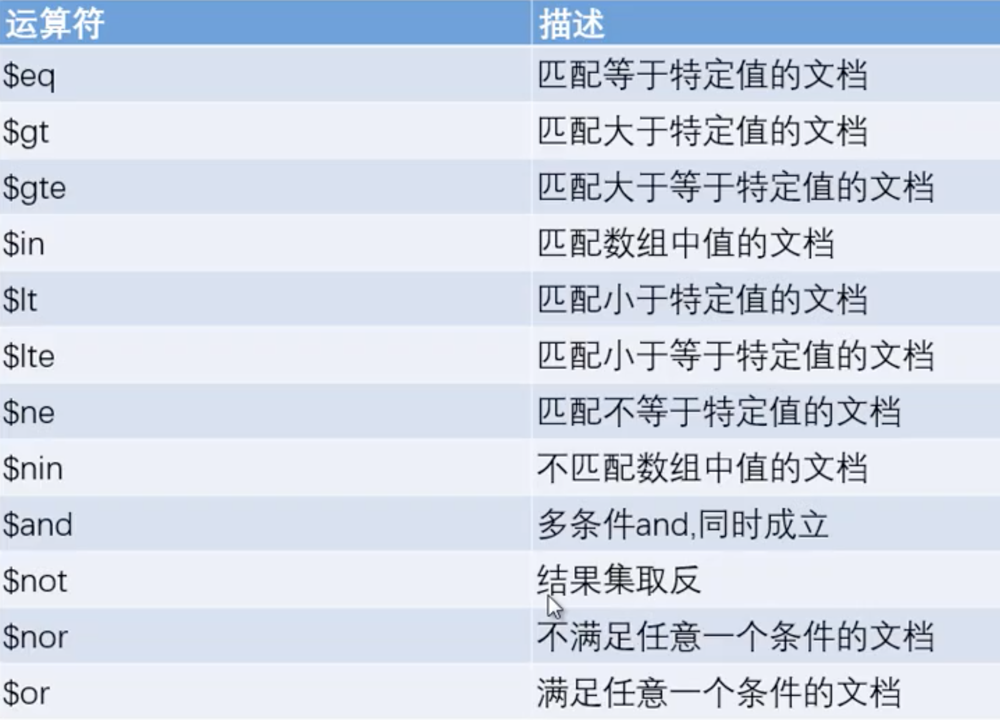
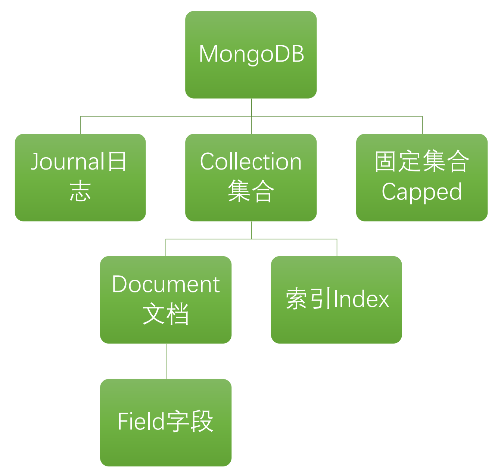
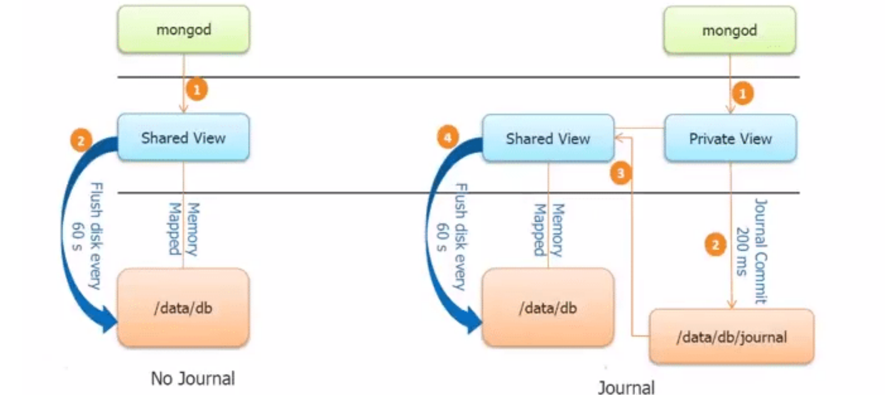
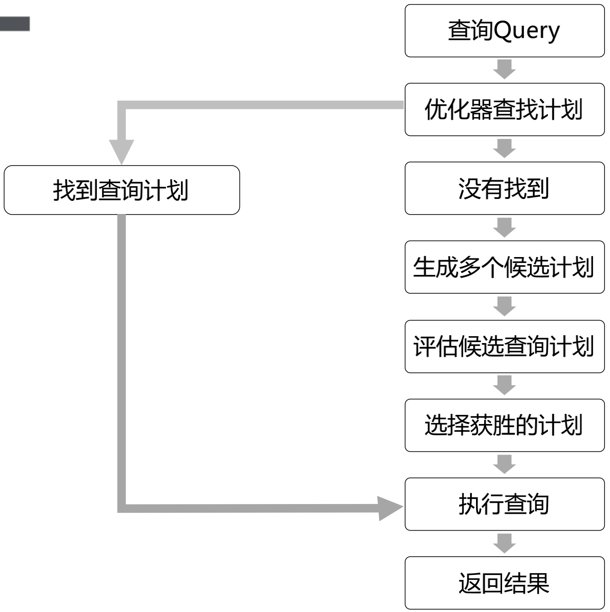
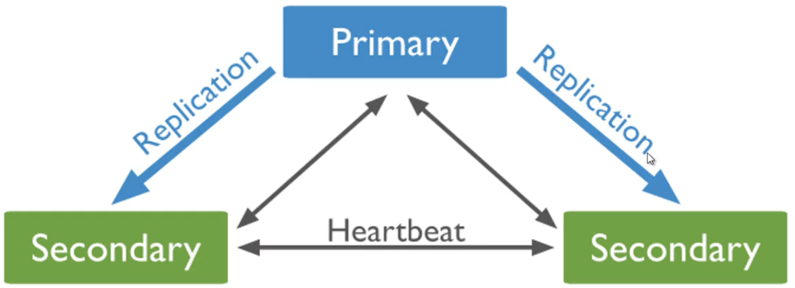

# MongoDB数据库入门

## 术语对应

| SQL          | MongoDB                                                      |
| ------------ | ------------------------------------------------------------ |
| Database     | database                                                     |
| table        | Collection                                                   |
| row          | Document                                                     |
| Column       | Field（字段）                                                |
| index        | index                                                        |
| Table joins  | $lookup(因为是非关系型数据库，所以关联查询，是其弱项)        |
| Primary key  | primary key                                                  |
| Aggregation  | Aggregation pipeline(聚合管道，类似MapReduce阶段查询的概念)  |
| Transactions | Multi-document transactions(4.0提供多文档事务，而且需要可复制集群的支持，且不支持分布式事务) |

## 历史版本新特性

wiredtiiger是比较强大的数据库引擎

## 架构图

## 主从复制架构

## 分片集群

不停机，热插拔服务器

## 启动注意

mongod是服务器程序，--dbpath "xxxx" --logpath "xxxxxxxx"，要配置以上两个路径

mongo是客户端，用来连接服务端。

# MongoDB数据查询与聚合分析

## mongodb与sql对应

{}表示为一个（空）文档

## 查询运算符

## 文档嵌套查询

## 数据查询结果投影

1表示字段选取，0表示字段不选取 

## 去重

distinct

为了性能，尽量使用索引

## 分组

简单的分组直接使用group

### 聚合管道

aggregate

### 聚合函数

### MapReduce

reduce：规约、简化

# MongoDB数据库核心知识

## 体系架构

MongoDB是面向文档的数据库

存储引擎主要解决数据的存储和磁盘的交互问题，MongoDB存储引擎也是可拔插的。

MongoDB目前的默认存储引擎是WiredTiger，支持文档级别的锁，类似mysql的行锁。3.0之前，用的是MMAPv1，这个存储引擎在锁机制的支持上，做的不是很好。

collection就叫集合，虽然他类比成mysql中的表格，但是，还是有很大区别的。表格更强调数据的完整性。而MongoDB的collection对于数据的完整性没有要求，结构可以频繁更改。这也就是说的，MongoDB无架构模式，free schmear。

## 数据逻辑架构

journal日志功能是非常核心的模块，关系到性能、灾备、持久化的问题。

capped collection：集合容量（数据大小）是固定的，超过的话允许淘汰（先进先出）。可以用此结构模拟消息队列使用。

## 存储引擎

MMAPv1：3.0以前默认的

WiredTiger：3.0以后默认的

Encrypted：商用（加密引擎）

In-Memory：商用

RocksDB：Facebook开源（优化了数据结构，写入性能优化）

TerarkDB：国内程序员开源（查询优化，写入提升）

存储引擎负责管理数据存储，包括内存和磁盘两个区域。

## 集合Collection

## 文档模型与BSON

bson是二进制json，相比直接存储字符串，更节省空间。

bson有16M的限制。

超过16M使用GridFS。

### 文档设计范式

数据模型两种方式：

1.Normalized范式

2.Denormalized反范式

mongodb文档结构分为：

1.引用方式：也就是RDBMS中的外键关联

2.嵌入式：也就是document文档中的内嵌节点

面试题：

MongoDB内嵌和引用的对比：

Embedding内嵌：快速读取、数据冗余、数据更新时比较复杂

Linking引用：节约空间、关系灵活、数据更新时比较简单、需要从多个表读取

## 日志journal机制

MongoDB的log和journal还是不一样。log是系统日志，journal是数据库日志，更加详细，保障数据安全。

为了防止突发故障导致数据丢失。

WiredTiger使用写前日志，write-ahead transaction log和checkpoint检查点，一起来确保数据正确持久。（数据写入前，先写日志）

如果MongoDB日志存在检查点，就使用日志重放修改直到上个检查点。

日志使用snappy压缩。

最小日志128byte，小于不压缩。

单节点，不启用日志，会导致数据丢失。

WiredTiger引擎日志默认100ms刷一次磁盘，日志文件最大100M。

WiredTiger会自动删除直到上一个CheckPoint的日志文件。

日志底层原理：

Shared view,是一个内存中的，和磁盘上存在映射关系的映射表。

右边的图，是开启日志后，mongodb的写入顺序。数据先写入内存的private view，然后每隔100ms写入一次磁盘上的journal日志。然后再更新，shared view，最后再间隔60s，将数据刷入磁盘。

如图中200ms以内的刷盘间隔内的数据，可能会丢失。200ms是参数，也可以你自己配置刷盘间隔。（storage.joural.commitIntervalMs）

# MongoDB数据库管理备份

## 备份机制

mongodump备份，mongorestore恢复

mongodump适用于小型数据库，不适用于大型系统（大型系统，还是需要专业的工具）

mongodump是资源密集型的，会影响性能

为了节省空间，备份空间不包含index文件，恢复数据库需要重建索引

对于副本集，mongodump提供--oplog选项，包含在oplog条目中（oplog在备份时，对写入查询的数据，都放在oplog，备份完成后，再统一写入，保证数据完整）

要恢复带--oplog的备份，使用--oplogReplay选项

备份命令

`mongodump --host 127.0.0.1 --port 27017`

`monggodump --out /data/backup/`

`mongodump --collection users --db tao`

`mongodump --host aliyun.com --port 27017 --username root --password "123" --out dump-2021`

## 备份原则

• 标记文件，以便可以识别备份的内容以及备份反映的时间点。

• 如果mongodump和mongorestore的性能影响太大，请使用其他备份策略，例如

Filesystem Snapshots或MongoDB Cloud Manager。 

• 使用--oplog参数在mongodump备份期间捕获传入的写操作，以确保备份反映一致的数据

状态。

• 测试备份MongoDB部署，确保备份可用。

## 基于Linux的LVM备份机制

• MongoDB可以使用Linux系统级别的工具来实现基于文件快照的备份

• Logical volume manager逻辑卷管理器 

• 文件快照或“block-level”备份方法使用系统级工具来创建包含MongoDB数据文件设备的

拷贝。 

• 这种方法快速、可靠，但需要额外的系统配置

• 3.2版本更改：当MongoDB数据文件和日志文件驻留在不同的卷上时，对使用WiredTiger

存储引擎的数据库提供卷级备份支持，但是要创建一致备份必须锁定数据库，并且备份过程

中暂停所有写入。 

• 3.2之前的版本，数据文件和日志文件必须驻留相同的卷上

## MongoDB数据导入导出

mongoexport，mongoimport

# MongoDB数据库性能分析与调优

## 数据库性能优化因素

影响MongoDB性能的因素：

硬件：硬盘速度、内存容量

网络：网络连接

软件：索引算法、文档建模、锁机制、监控日志

## MongoDB索引与查询优化

推荐嵌套文档来处理数据，加快查询。

MongoDB一般会默认使用50%系统内存。

1.MongoDB索引建立参考关系型数据库

2.MongoDB索引有独立存储文件格式

3.为了提升性能可以独立磁盘分区存储索引（日志也可以独立磁盘存储）

4.查询数据时评估是否使用索引

5.使用索引会加载索引到内存中

6.MongoDB使用的索引算法是B-tree

7.尽量让索引常驻内存，加速查询

8.索引过多也会影响性能，增加维护和存储成本

MongoDB的索引类型：

1.Single Field单字段索引 单字段索引

2.Compound Index多键值索引，处理数组字段

3.Multikey Index 多键值索引，处理数组字段

4.Geospatial Index 地理位置索引，经度纬度坐标

5.Text Indexes 文本索引

6.Hashed Indexes 哈希索引，处理哈希字段

7.Partial Indexes 部分索引，为满足过滤条件表达式的文档建立索引

8.Sparse Indexes 稀疏索引，跳过无字段文档

9.TTL Indexes TTL索引，生存周期

大多数用单字段索引。1、2用的比较多，基于地理位置的应用用4比较多。其它的很少用。

数据结构：balance tree

大多数数据库都用的B+tree（WireTiger用的就是B+tree）

## 查询计划Query Plan

mongodb会自动的查询计划竞赛，找到最优的计划，并执行。

### MongoDB查询计划竞赛

\1. 查询计划竞赛机制

\2. MongoDB优化器为查询请求产生多个执行计划

\3. 并行执行所有的执行计划

\4. 保留执行最快的Query Plan查询计划，其他丢弃

\5. 缓存最优的执行计划 Plan Cache Flushes

\6. 后期多次调用同一个查询使用缓存的查询计划

\7. 每次查询都会优先查找匹配的查询计划

\8. 没有执行重新生成的过程

\9. 查询计划可以更新，也可以删除PlanCache.clear()

mongodb查询计划生成过程：

## Explain函数分析查询语句性能

\1. explain函数解释器分析MongoDB命令执行情况

\2. MongoDB提供db.collection.explain()方法，cursor.explain ()方

法和explain命令，以返回查询计划和查询计划执行统计信息。

\3. explain()返回结果是查询计划

\4. 格式为阶段树

\5. 每个阶段将其结果（即文档或索引键）传递给父节点

\6. 叶节点访问集合或索引

\7. 内部节点操作子节点产生的文档或索引键

\8. 根节点是MongoDB从中派生结果集的最后阶段

## MongoDB索引过滤器

\1. Index filter：索引过滤器

\2. 2.6版本增加的特性

\3. MongoDB为查询形状筛选最佳的索引

\4. 此索引过滤器会为某个query Shape保存

\5. 当查询优化器执行查询时，会查找其对应的索引过滤器，并且使用此

索引

### 创建Index参数

\1. db.users.createIndex(keys, options)

\2. db.users.createIndex({name:1})

\3. 也可以使用 e瀁瀆瀈瀅eI瀁de瀋() 方法来创建索引

\4. 1.升序索引 -1降序索引

\5. Options 参数

\6. Background 后台创建索引，不阻塞主线程

\7. Unique 唯一索引

\8. Name 索引的名字

\9. Sparse 默认false，true只引用包含该字段的文档

\10. expireAfterSeconds TTL多久时间以后失效

### 创建索引

\1. db.collection.createIndex( { id: 1 } ) 

\2. db.collection.createIndex( { id: 1,age:-1} ) 

\3. 也可以使用 ensureIndex() 方法来创建索引

\4. ensureIndex() 方法在3.0版本以后过期，不推荐使用

\5. 推荐使用createIndex()

\6. 1.升序索引 -1降序索引

\7. 也可以为集群创建索引

\8. sh.enableSharding("test")

\9. sh.shardCollection("test.MS",{"id":1})

### MongoDB索引限制

\1. 从2.6版本开始，如果现有的索引字段的值超过索引键的限制，

MongoDB中不会创建索引。

\2. 集合中索引不能超过64个

\3. 索引名的长度不能超过125个字符

\4. 复合索引最多可以有31个字段

\5. 索引存储在内存(RAM)中,应该确保该索引的大小不超过内存的限制。

\6. 如果文档的索引字段值超过了索引键的限制，MongoDB不会将任何

文档转换成索引的集合。

MongoDB使用的是Btree，myslq使用的是B+tree

# MongoDB数据库监控与日志分析

mongodb的锁，都是表锁（collectioin）。后来，就改成了document级别的锁，就是行锁。

## MongoDB监控指标日志数据

# MongoDB数据库安全机制

# MongoDB数据库高可用集群架构

## 主从复制架构

基于oplog实现

## 读写分离架构 

## 高可用集群

mongodb集群启动，要添加额外的启动参数--replSet xxxx（集群名称）

主节点添加从节点命令：rs.add("ip:port")

查看集群状态：rs.status（）