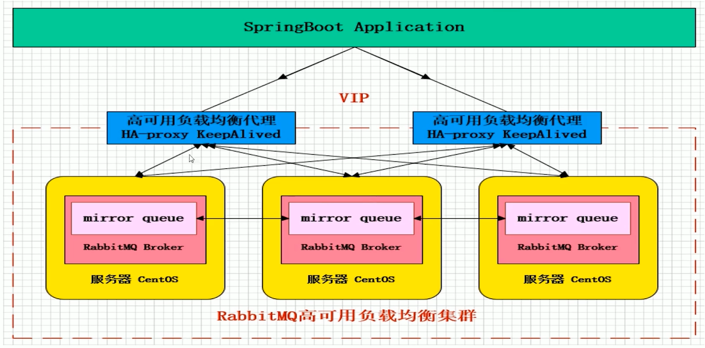
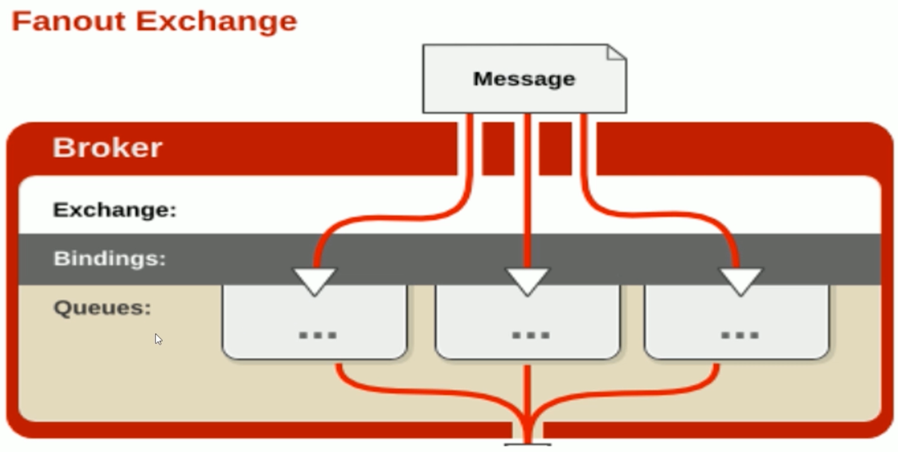

#### RabbitMQ基础概念及常用命令：  

RabbitMQ高可用负载均衡集群：



AMQP协议：


Server：又称Broker，接受客户端的连接，实现AMQP实体服务

Connection：连接，应用程序与Broker的网络连接

Channel：网络信道，几乎所有的操作都在Channel中进行，Channel是进行消息读写的通道。客户端可建立多个Channel，每个Channel代表一个会话任务

Message：消息，服务器和应用程序之间传送的数据，由Properties和Body组成。Properties可以对消息进行修饰，比如消息的优先级、延迟等高级特性；Body则就是消息体内容

Virtual host：虚拟地址，用于进行逻辑隔离，最上层的消息路由。一个Virtual Host里面可以有若干个Exchange和Queue，同一个Virtual Host里面不能有相同名称的Exchange或Queue

Exchange：交换机，接受消息，根据路由键转发消息到绑定的队列

Binding：Exchange和Queue之间的虚拟连接，binding中可以包含routing key

Routing key：一个路由规则，虚拟机可用它来确定如何路由一个特定消息

Queue：也称为Message Queue，消息队列，保存消息并将它们转发给消费者

RabbitMQ架构：


rabbitmq消息流转：


常用命令：

服务启动：

```shell
rabbitmq-server start &
```

服务停止：

```shell
rabbitmqctl stop_app
```

管理插件：

```shell
rabbitmq-plugins enable rabbitmq_management
```

关闭应用：`rabbitmqctl stop_app`

启动应用：`rabbitmqctl start_app`

节点状态：`rabbitmqctl status`

添加用户：`rabbitmqctl add_user username password`

列出所有用户：`rabbitmqctl list_users`

删除用户：`rabbitmqctl delete_user username`

清除用户权限：`rabbitmqctl clear_permissions -p vhostpath username`

列出用户权限：`rabbitmqctl list_user_permissions username`

修改密码：`rabbitmqctl change_password username newpassword`

设置用户权限：`rabbitmqctl set_permissions -p vhostpath username ".*"".*"".*"`

创建虚拟主机：`rabbitmqctl add_vhost chostpath`

列出所有虚拟主机：`rabbitmqctl list_vhosts`

列出虚拟主机上所有权限：`rabbitmqctl list_permissions -p vhostpath`

删除虚拟主机：`rabbitmqctl delete_vhost vhostpath`

查看所有队列信息：`rabbitmqctl list_queues`

清除队列里的消息：`rabbitmqctl -p vhostpath purge_queue blue`

移除所有数据，要在rabbitmqctl stop_app之后使用：`rabbitmqctl reset`

组成集群命令：`rabbitmqctl join_cluster <clusternode> [--ram]`

查看集群状态：`rabbitmqctl cluster_status`

修改集群节点的存储形式：`rabbitmqctl change_cluster_node_type disc|ram`

忘记节点：`rabbitmqctl forget_cluster_node [--offline]`

修改节点名称：`rabbitmqctl rename_cluster_node oldname1 newnode1 [oldnode2] [newnode2]`

注意：

启动rabbitmq之前，需要修改配置文件`vim  /usr/lib/rabbitmq/lib/rabbitmq_server-3.6.5/ebin/rabbit.app`，修改启动loopback_users，后面为一个json数组，需要去掉无关的符号。

安装完图形界面插件，默认端口号为15672。访问地址：http://192.168.0.108:15672。默认用户名、密码为：guest

#### Hello World:

````java
public class Procuder {

	public static void main(String[] args) throws IOException, TimeoutException {
		//1.创建一个ConnectionFactory
		ConnectionFactory connectionFactory = new ConnectionFactory();

		connectionFactory.setHost("192.168.0.110");
		connectionFactory.setPort(5672);
		connectionFactory.setVirtualHost("/");

		//2.通过连接工厂创建连接
		Connection connection = connectionFactory.newConnection();

		//3.通过connection创建channel
		Channel channel = connection.createChannel();

		//4.通过channel发送消息
		for (int i = 0;i < 9999 ; i++){
			String msg = "hello rabbitmq";
			channel.basicPublish("","test001",null,msg.getBytes());
		}

		channel.close();
		connection.close();

	}
}
````

````java
public class Consumer {

	public static void main(String[] args) throws Exception{
		//1.创建一个ConnectionFactory
		ConnectionFactory connectionFactory = new ConnectionFactory();

		connectionFactory.setHost("192.168.0.110");
		connectionFactory.setPort(5672);
		connectionFactory.setVirtualHost("/");

		//2.通过连接工厂创建连接
		Connection connection = connectionFactory.newConnection();

		//3.通过connection创建channel
		Channel channel = connection.createChannel();

		//4.声明（创建）一个队列
		String queueName = "test001";
		channel.queueDeclare(queueName,true,false,false,null);

		//5.创建消费者
		QueueingConsumer queueingConsumer = new QueueingConsumer(channel);

		//6.设置channel
		channel.basicConsume(queueName,true,queueingConsumer);

		//7.获取消息
		while (true){
			QueueingConsumer.Delivery delivery = queueingConsumer.nextDelivery();
			String msg = new String(delivery.getBody());
			System.out.println("消费端："+msg);
			//Envelope envelope = delivery.getEnvelope();
		}

	}

}
````

#### Exchange(交换机):

​	接受消息，并根据路由键转发消息所绑定的队列。


Name：交换机名称

Type：交换机类型direct、topic、fanout、headers

Durability：是否需要持久化，true为持久化

Auto Delete：当最后一个绑定到Exchange上的队列删除后，自动删除该Exchange

Internal：当前Exchange是否用于RabbitMQ内部使用，默认为False

Arguments：扩展参数，用户扩展AMQP协议自定制化使用

Direct Exchange：


​	所有发送到Direct Exchange的消息被转发到RouteKey中指定的Queue。注意：Direct模式可以使用RabbitMQ自带的Exchange：default Exchange，所以不需要将Exchange进行任何绑定（binding）操作，消息传递时，RouteKey必须完全匹配才会被队列接受，否则该消息会被放弃。

Topic Exchange：


​	所有发送到Topic Exchange的消息被转发到所有关心RouteKey中指定Topic的Queue上。Exchange将RouteKey和某Topic进行模糊匹配，此时队列需要绑定一个Topic。

注意：可以使用通配符进行模糊匹配。符号"#"匹配一个或多个词，符合"*"匹配不多不少一个词。

例如："log.#"能够匹配到"log.info.oa"

​	    "log.*"只会匹配到"log.erro"

Fanout Exchange：



​	不处理路由键，只需要简单的将队列绑定到交换机上。发送到交换机的消息都会被转发到与该交换机绑定的所有队列上。Fanout交换机转发消息是最快的。

#### Binding（绑定）：

​	Exchange和Exchange、Queue之间的连接关系。Binding中可以包含Routing Key。

#### Queue（消息队列）：

​	消息队列，实际存储消息数据。Durability，是否持久化（Durable：是，Transient：否）。Auto delete：如选yes，代表当最后一个监听被移除后，该Queue会自动被删除。

#### Message（消息）：

​	服务器和应用程序之间传送的数据。本质上就是一段数据，由Properties和Payload（Body）组成。常用属性：delivery model、headers（自定义属性）。其他属性，content_type、content_encoding、priority、correlation_id、reply_to、expiration、message_id、timestamp、type、user_id、app_id、cluster_id。

#### Virtual host（虚拟主机）：

​	虚拟地址，用于进行逻辑隔离，最上层的消息路由。一个Virtual Host里面可以有若干个Exchange和Queue。同一个Virtual Host里面不能有相同名称的Exchange或Queue。

#### 消息如何保障100%的投递成功？

生产端-可靠性投递：

消息落库，对消息状态进行打标。


消息的延迟投递，做二次确认，回调检查。


#### 幂等性概念： 

借鉴数据库乐观锁机制：比如执行一条更新库存的sql语句。

`update t_reps set count = count -1 ,version = version +1 where version = 1`

消费端-幂等性保障：海量订单产生的业务高峰期，如何避免消息的重复消费问题？

消费端实现幂等性，就意味着，我们的消息永远不会消费多次，即使我们收到了多条一样的消息。

主流幂等性解决方案：

1.唯一ID+指纹码机制，利用数据库主键去重

`select count(1) from t_order where id = 唯一ID+指纹码`

好处，实现简单。坏处，高并发下有数据库写入性能瓶颈。解决方案，跟进ID进行分库分表进行算法路由。

2.利用Redis的原子性去实现

需要考虑的问题。

第一：我们是否要进行数据库落库，如果落库的话，关键解决的问题是数据库和缓存如何做到原子性？

第二：如果不进行落库，那么都存储到缓存中，如何设置定时同步的策略？

#### Confirm确认消息：


消息的确定，是指生产者投递消息后，如果Broker收到消息，则会给生产者一个应答。

生产者进行接收应答，用来确定这条消息是否正常的发送到Broker，这种方式也是消息的可靠性投递的核心保障。

如何实现Confirm确认消息？

第一：在channel上开启确认模式：channel.confirmSelect()

第二：在channel 上添加监听：addConfirmListener，监听成功和失败的返回结果，根据具体的结果对消息进行重新发送、或记录日志等后续处理。

#### Return消息机制：


Return Listener用于处理一些不可路由的消息。

我们的消息生产者，通过指定一个Exchange和RoutingKey，把消息送达到某一个队列中去，然后我们的消费者监听队列，进行消费处理操作。

但是某些情况下，如果我们在发送消息的时候，当前的exchange不存在或者指定的路由key路由不到，这个时候如果我们需要监听这种不可达的消息，就要使用Return Listener。

基础API汇总有一个关键配置：Mandatory，如果为true，则监听器会接收到路由不可达的消息，然后进行后续处理，如果为false，那么broker端自动删除该消息。

#### 消费端消息自定义监听：

````java
public class MyConsumer extends DefaultConsumer{
  public MyConsumer(Channel channel){
    super(channel);
  }
  @Override
  public void handleDelivery(String consumerTag,Envelope envelope,BasicProperties properties,byte[] body)throws IOException{
    
  }
}
````

#### 消费端限流：

RabbitMQ提供了一种qos（服务质量保证）功能，即在非自动确认消息的前提下，如果一定数目的消息（通过基于consume或者channel设置qos的值）未被确认前，不进行消费新的消息。

`void BasicQos(init prefetchSize,ushort prefetchCount,boolean global);`

参数解释：

prefetchSize：0

prefetchCount：告诉RabbitMQ不要同时给一个消费者推送多于N个消息，即一旦有N个消息还没有ack，则该consumer将block掉，直到有消息ack

global：true/false是否将上面设置应用于channel，简单说，就是上面限制是channel级别的还是consumer级别

prefetchSize和flobal这两项，rabbitmq没有实现，暂且不研究。

prefetch_count在no_ask=false的情况下生效，即在自动应答的情况下，这两个值是不生效的。

#### 消费端ACK与重回队列：

消费端的手工ACK和NACK：

消费端进行消费的时候，如果由于业务异常我们可以进行日志记录，然后进行补偿。

如果由于服务器宕机等严重问题，那我们就需要手工进行ACK，保障消费端消费成功。

消费端的重回队列：

消费端重回队列是为了对没有处理成功的消息，把消息重新回递给Broker。一般在实际应用中，都会关闭重回队列，也就是设置为false。

#### TTL队列/消息：

TTL：

Time To Live的缩写，也就是生存时间。

RabbitMQ支持消息的过期时间，在消息发送时可以进行指定。

RabbitMQ支持队列的过期时间，从消息入队开始计算，只要超过了队列的超时时间配置，那么消息会自动的清除。

#### 死信队列：

DLX：Dead-Letter-Exchange

利用DLX，当消息在一个队列中变成死信之后，它能被重新publish到另一个Exchange，这个Exchange就是DLX。

消息变成死信有以下几种情况：

1.消息被拒绝（basic.reject/basic.nack）并且requeue=false

2.消息TTL过期

3.队列达到最大长度

DLX也是一个正常的Exchange，和一般的Exchange没有区别，它能在任何的队列上被指定，实际上就是设置某个队列的属性。

当这个队列中有死信时，RabbitMQ就会自动的将这个消息重新发布到设置的Exchange上去，进而被路由到另一个队列。

可以监听这个队列中消息做相应处理，这个特性可以弥补RabbitMQ3.0以前支持的immediate参数的功能。

死信队列设置：

首先需要设置死信队列的exchange和queue，然后进行绑定：

Exchange:dlx.exchange

Queue:dlx.queue

RoutingKey:#

然后我们进行正常声明交换机、队列、绑定，只不过我们需要在队列上加上一个参数即可：`arguments.puc("x-dead-letter-exchange","dlx.exchange");`

这样消息在过期、requeue、队列在达到最大长度时，消息就可以直接路由到死信队列。

#### RabbitMQ集群架构模式：

#### 主备模式：

实现RabbitMQ的高可用集群，一般在并发和数据量不高的情况下，这种模型非常的好且简单。主备模式也称为Warren模式。所谓的rabbotmq另外一种模式就是warren（兔子窝），就是一个主/备方案（主节点如果挂了，从节点提供服务而已）


HaProxy配置：

````properties
listen rabbitmq_cluster
bind 0.0.0.0:5672 #配置TCP模式
mode top  #简单的轮询
balance roundrobin #主节点
server bhz76 192.168.11.76:5672 check inter 5000 rise 2 fall 2
server bhz76 192.168.11.77:5672 backup check inter 5000 rise 2 fall 2  #备用节点
````

备注：rabbitmq集群节点配置，#inter每隔5秒队mq集群做健康检查，2次正确证明服务器可用，3次失败证明服务器不可用，并且配置主备机制

#### 远程模式：

​	远程模式可以实现双活的一种模式，简称Shovel模式，所谓Shovel就是我们可以把消息进行不同数据中心的肤质工作，我们可以跨地域的让两个mq集群互联。远距离通信复制，所谓Shovel就是我们可以把消息进行不同数据中心的复制工作。


Shovel集群的配置，首先启动rabbitmq插件，命令如下：

````shell
rabbitmq-plugins enable amqp_client
rabbitmq-plugins enable rabbitmq_shovel
````

创建rabbitmq.config文件：`touch /etc/rabbitmq/rabbitmq.config`

添加配置见rabbitmq.config

最后我们需要源服务器和目的地服务器都使用相同的配置文件(rabbitmq.config)


#### 镜像模式：

​	集群模式非常经典的就是Mirror镜像模式，保证100%数据不丢失，在实际工作中也是用的最多的。并且实现集群非常的简单，一般互联网大厂都会构建这种镜像集群模式。

​	Mirror镜像队列，目的是为了保证rabbitmq数据的高可靠性解决方案，主要就是实现数据的同步，一般来讲就是2-3个节点实现数据同步（对于100%数据可靠性解决方案一般是3节点）。


#### 多活模式：

​	这种模式也是实现异地数据复制的主流模式，因为Shovel模式配置比较复杂，所以一般来说实现异地集群都使用这种双活或者多活模型来去实现的。这种模型需要依赖rabbitmq的federation插件，可以实现持续的可靠的AMQP数据通信，多活模式在实际配置与应用非常的简单。

​	RabbitMQ部署架构采用双中心模式（多中心），那么在两套（或多套）数据中心中各部署一套RabbitMQ集群，各中心的RabbitMQ服务除了需要为业务提供正常的消息服务外，中心之间还需要实现部分队列消息共享。


#### Federation插件：

​	Federation插件是一个不需要构建Cluster，而在Brokers之间传输消息的高性能插件，Federation插件可以在Brokers或者Cluster之间传输消息，连接的双方可以使用不同的users和virtual hosts，双方也可以使用版本不同的RabbitMQ和Erlang。Federation插件使用AMQP协议通信，可以接受不连续的传输。

​	Federation Exchanges，可以看成Downstream（下游）从Upstream（上游）主动拉取消息，但并不是拉取所有消息，必须是在Downstream上已经明确定义Bindings关系的Exchange，也就是有实际的物理Queue来接受消息，才会从Upstream拉取消息到Downstream。使用AMQP协议实施代理间通信，Downstream会将绑定关系组合在一起，绑定/解除绑定命令将发送到Upstream交换机。因此，Federation Exchange只接受具有订阅的消息。


#### RabbitMQ集群镜像模式构建：

#### rabbitmq生产环境架构：


需要实现的功能：

支持消息高性能的序列化转换、异步化发送消息

支持消息生产实例与消费实例的链接池化、缓存化，提升性能

支持可靠性投递消息，保障消息100%不丢失

支持消费端的幂等操作，避免消费端重复消费问题

支持迅速消息发送模式，在一些日志收集/统计分析等需求下可以保证高性能，超高吞吐量

支持延迟消息模式，消息可以延迟发送，指定延迟时间，用于某些延迟检查、服务限流场景

支持事务消息，且100%保障可靠性投递，在金融行业单笔大金额操作时会有此类需求

支持顺序消息，保证消息送达消费端的前后顺序，例如下订单等复合性操作

支持消息补偿，重试，以及快速定位异常/失败消息

支持集群消息负载均衡，保障消息落到具体SET集群的负载均衡

支持消息路由策略，指定某些消息路由到指定的SET集群


RabbitMQ的Spring配置示例代码:

```java
package com.ysol.web.api.config;

import com.ysol.web.api.rabbitmq.MessageDelegate;
import org.springframework.amqp.core.*;
import org.springframework.amqp.rabbit.connection.CachingConnectionFactory;
import org.springframework.amqp.rabbit.connection.ConnectionFactory;
import org.springframework.amqp.rabbit.core.RabbitAdmin;
import org.springframework.amqp.rabbit.core.RabbitTemplate;
import org.springframework.amqp.rabbit.listener.SimpleMessageListenerContainer;
import org.springframework.amqp.rabbit.listener.adapter.MessageListenerAdapter;
import org.springframework.amqp.support.ConsumerTagStrategy;
import org.springframework.context.annotation.Bean;

import java.util.UUID;

/**
 * rabbitmq配置类
 */
//@Configuration
//@ComponentScan({"com.ysol.web.api.*"})
public class RabbitMQConfig {

	@Bean
	public ConnectionFactory connectionFactory(){
		CachingConnectionFactory connectionFactory = new CachingConnectionFactory();
		connectionFactory.setAddresses("172.168.10.182");
		connectionFactory.setUsername("guest");
		connectionFactory.setPassword("guest");
		connectionFactory.setVirtualHost("/");
		return connectionFactory;
	}

	@Bean
	public RabbitAdmin rabbitAdmin(ConnectionFactory connectionFactory){
		RabbitAdmin rabbitAdmin = new RabbitAdmin(connectionFactory);
		rabbitAdmin.setAutoStartup(true);
		return rabbitAdmin;
	}

	@Bean
	public RabbitTemplate rabbitTemplate(ConnectionFactory connectionFactory){
		RabbitTemplate rabbitTemplate = new RabbitTemplate(connectionFactory);
		return rabbitTemplate;
	}

	@Bean
	public SimpleMessageListenerContainer messageListener(ConnectionFactory connectionFactory){
		SimpleMessageListenerContainer container = new SimpleMessageListenerContainer(connectionFactory);
		container.setQueues(queue001());
		container.setConcurrentConsumers(1);
		container.setMaxConcurrentConsumers(5);
		container.setDefaultRequeueRejected(false);
		container.setAcknowledgeMode(AcknowledgeMode.AUTO);
		container.setConsumerTagStrategy(new ConsumerTagStrategy() {
			@Override
			public String createConsumerTag(String queue) {
				return queue + "_" + UUID.randomUUID().toString();
			}
		});
//		container.setMessageListener(new ChannelAwareMessageListener() {
//			@Override
//			public void onMessage(Message message, Channel channel) throws Exception {
//				String msg = new String(message.getBody());
//				System.out.println("收到消息："+msg);
//			}
//		});

		MessageListenerAdapter adapter = new MessageListenerAdapter(new MessageDelegate());
		//默认接受消息的方法
		adapter.setDefaultListenerMethod("handleMessage");
		adapter.setMessageConverter(new TextMessageConverter());

		container.setMessageListener(adapter);
//		队列名和方法名对应的设置,来绑定某个方法来处理某个队列的消息
//		Map<String,String> queueOrTagToMethodName = new HashMap<>();
//		queueOrTagToMethodName.put("queue01","method01");
//		queueOrTagToMethodName.put("queue02","method02");
//		adapter.setQueueOrTagToMethodName(queueOrTagToMethodName);

//		GsonHttpMessageConverter converter = new GsonHttpMessageConverter();
//		adapter.setMessageConverter(converter);

		return container;
	}

	@Bean
	public TopicExchange topicExchange001(){
		return new TopicExchange("topic001",true,false);
	}

	@Bean
	public Queue queue001(){
		return new Queue("queue001",true);
	}

	@Bean
	public Binding binding001(){
		return BindingBuilder.bind(queue001()).to(topicExchange001()).with("spring.*");
	}

}

```

