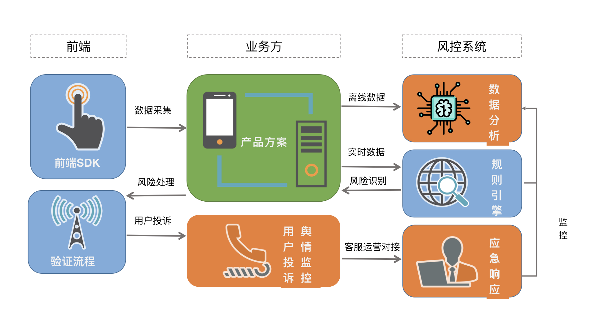
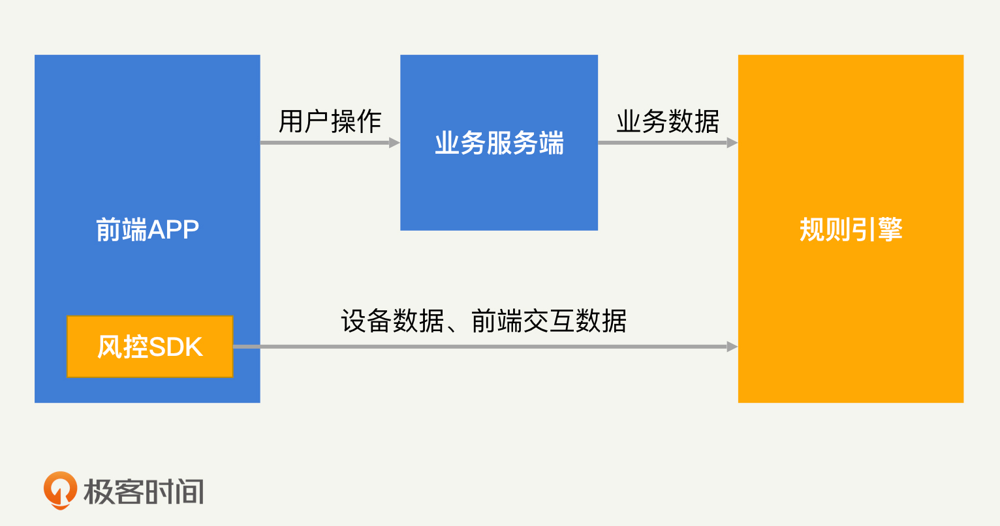
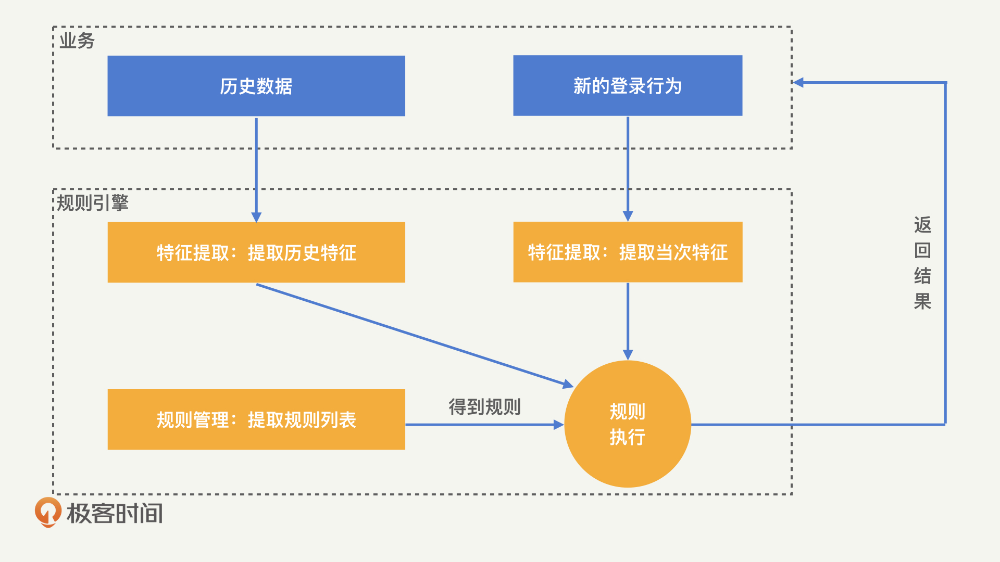
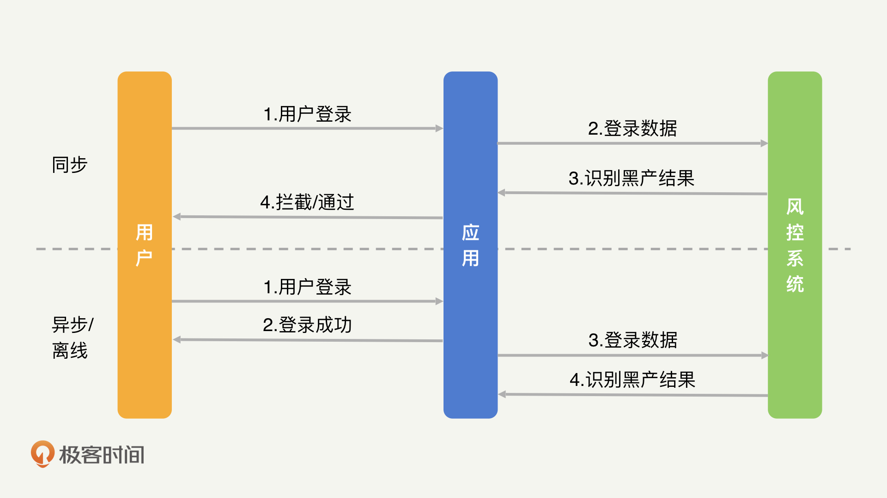
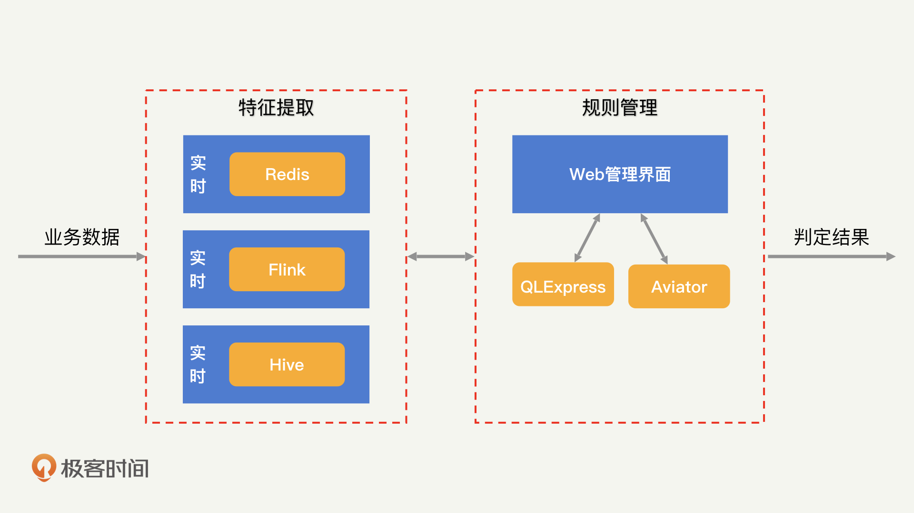
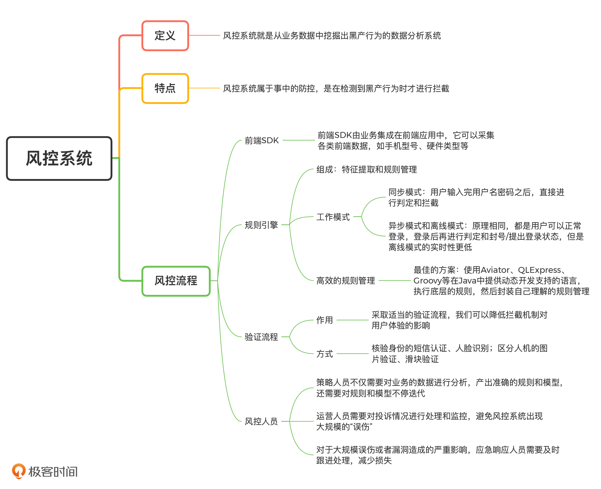
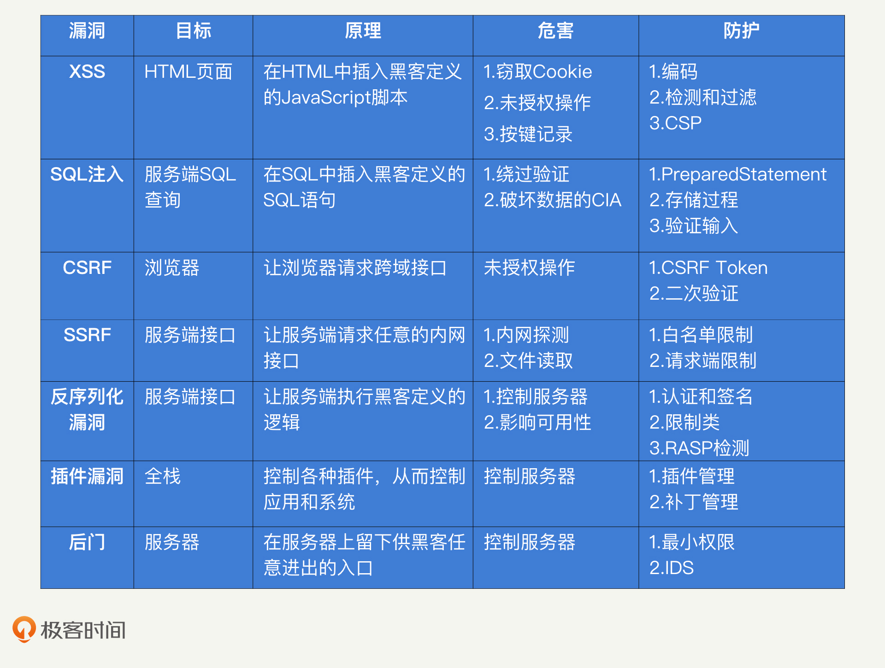
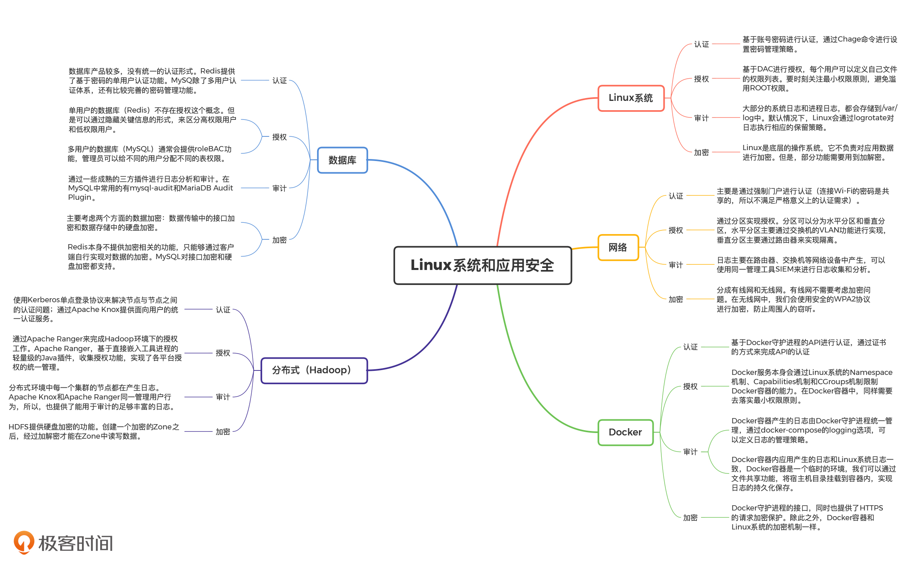
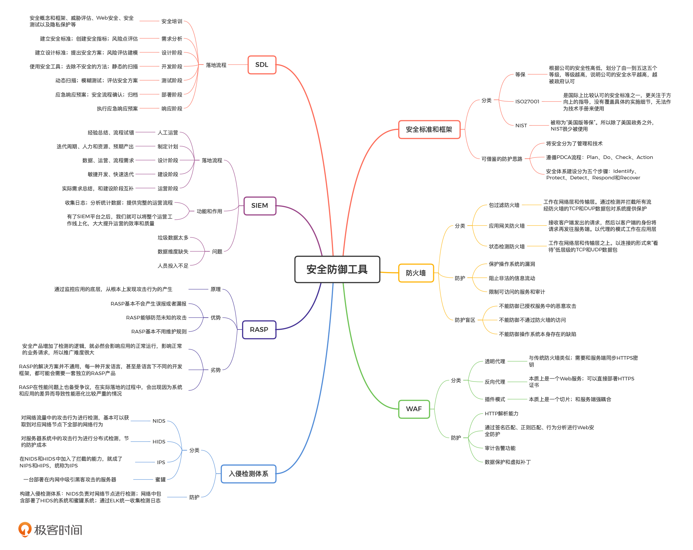
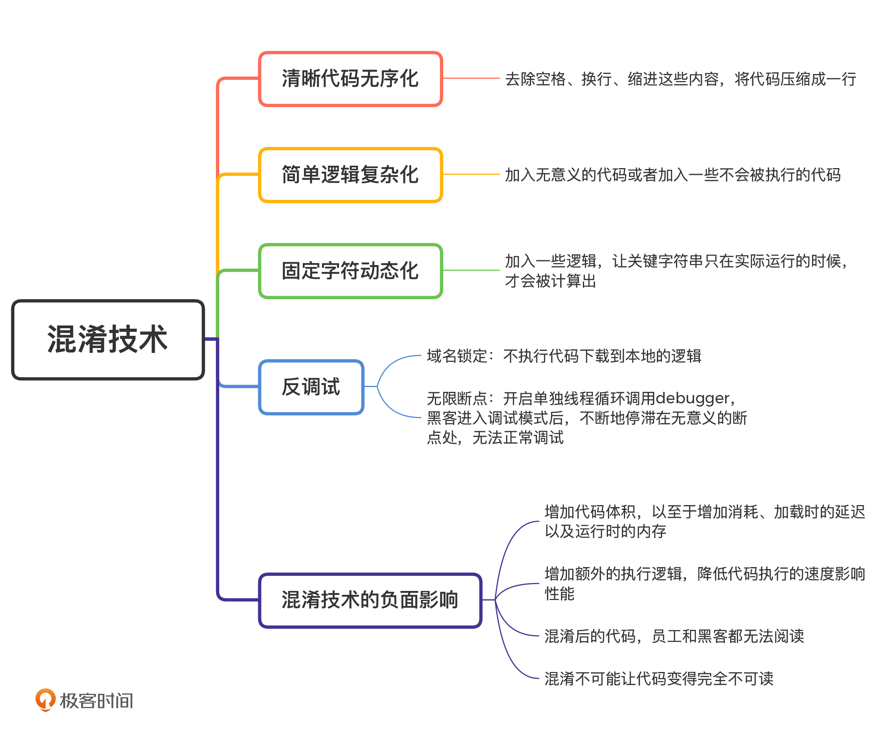

### 业务安全

​		学习一个新知识的最好方法，一定是从我们学过的知识入手。所以，今天我会对比基础安全，来帮助你理解业务安全。基础安全其实就是我们前几个模块关注的安全攻防视角下的安全概念和知识，也叫网络安全。想要理解业务安全，我们先来认识一下黑产。黑产是基于正常的业务产品逻辑，采取非正常或者批量的操作，来获取利益的行为。业务安全就是通过各类产品策略，来对黑产进行识别和拦截，从而保障业务的正常运行。你一定见过，或者参加过“红包雨”领红包的活动。在活动中，用户可以通过“红包雨”游戏领取一定金额的红包，金额大小由前端决定。通过这个例子，我们来对比一下黑客和黑产的攻击。在基础安全的攻击视角中，黑客会逆向前端代码，找到最终决定金额的逻辑，然后自己伪造一个大额的红包请求。这样一来，黑客就可以不用玩游戏，同时还能获得一个大额的红包。 在业务安全的攻击视角中，黑产会开发一个自动玩游戏领红包的工具，操纵大量的账号来参与活动。最终，将各个账号的小额红包汇总到一个账号下，从而实现获利。


第一，“黑产”强调的是“产业化”。

第二，黑客强调的是技术对抗，而“黑产”更看重资源对抗。

#### 防护

用户资源、IP 资源、设备资源、操作资源


#### 总结


### 产品安全

​		在安全标准和框架中讲过，我们可以通过 NIST 的安全框架 IPDRR，在基础安全中构建出一道比较全面的纵深防线。在业务安全中，IPDRR 同样可以指导我们与黑产进行对抗。

​		接下来，再看我对业务安全中 IPDRR 内容的重点讲解。

​		Identify（识别）：和基础安全一样，业务安全的识别阶段主要是进行威胁评估的工作。我们需要找到黑产可能获取到的业务逻辑中的投入成本，比如，应用发放的红包、优惠券等。

​		Protect（保护）：在业务安全中，我们是通过产品方案来实施认证和授权过程的。比如，对于登录过程增加双因子认证和验证码等，就是加强认证的安全性。

​		Detect（检测）：检测阶段主要是风控系统发挥作用。

​		Respond（响应）：发现黑产的攻击后，我们可以通过封禁账号、拦截操作、拒绝提现等方式，来阻止黑产获取利益。

​		Recover（恢复）：最后就是对整个系统进行恢复了。在业务安全中，黑产可能已经盗取了某些账号，或者已经领取了部分红包。这时，我们就需要通过合适的运营机制，将账号返回给原用户，把红包退回到奖金池中。

​		以上就是业务安全中的 IPDRR，从中我们可以看出，业务安全的纵深防线也是环环相扣的，我们需要在各方面都进行防护，避免安全短板的出现。IPDRR 的指导思想贯穿了整个业务安全的防御过程，内容很多也很重要。所以，今天我们先来看 IPDRR 中的前两个部分，识别和保护。

#### 业务安全中的威胁评估怎么做？

​		前面说了，在识别过程中，我们的主要工作就是威胁评估。在业务安全中，黑产的最终目的是窃取公司投入的成本来获取利益，但公司成本的具体表现形式很多，因此，业务安全中的威胁评估也更加复杂。下面，我就以一个典型的业务场景为例，总结在业务安全的威胁评估中，我们需要重点考虑的因素。我们来看最近比较流行的邀约活动，几乎所有的 App 都会在拉新阶段开启各种各样的邀约活动。而且对于这类能够刺激用户增长的活动，公司都很舍得投入大量的资本，因此邀约活动是黑产聚集的“重灾区”。邀约的逻辑：已注册用户可以通过邀请码的形式邀请新用户注册，注册成功后（可能需要新用户完成一定任务）双方都可以获得一定的奖励，如现金红包（可以参考拼多多）。邀约活动的目的很明确，就是拉取新用户为公司带来用户增长。那对黑产来说，获利的方式就是通过大量注册小号，完成邀约任务，获得现金红包的奖励。现在的奖励金额一般是几块到十几块不等，因此，黑产的利润很高。这个时候，如果公司想要拦截邀约活动中的黑产用户，需要考虑哪些因素呢？我认为需要重点考虑实时性要求、漏判影响和误伤影响这三方面因素。实时性很好理解，就是我们要评估在哪个阶段对黑产进行评估和拦截。所谓漏判，就是没有识别出黑产，让其成功获利。而误伤就是正常用户被判定成了黑产，无法正常使用业务功能。

​		首先是实时性要求。选择拦截黑产的时机是非常重要的。一般来说，拦截时间越靠前就能越早拦截黑产，但是误伤对用户体验的损伤也越大，而拦截时间越靠后风险越小。除此之外，我们还要考虑业务的逻辑。比如，对于邀约活动来说，红包提现一般都需要审核。因此，我们不需要在邀约活动中实时拦截，只需要在提现的时候进行拦截即可。这样的拦截方式风险更小、效果更好。

​		其次是漏判影响和误伤影响。它们的联系很紧密，我就一起来讲。我们在指定业务安全防控策略的时候，漏判影响和误伤影响决定了策略的严格程度。如果漏判影响更大，就需要制定更严格的策略对黑产进行控制；如果误伤影响更大，策略要相对宽松，有的时候我们甚至可以放过一定的黑产来降低误伤。对于邀约活动来说，在黑产刷走大量现金之后，漏判影响是指公司有大量的资金损失。这对公司来说并不致死，因为用户的正常邀约行为不会受到黑产影响。误伤影响比漏判影响严重的多，误伤一旦出现，就会让用户对邀约活动的真实性产生质疑。如果你做过业务，一定知道，用户的信任是很难培养的。而一旦丧失了用户的信任，业务基本也就失败了。因此，公司基本不容许出现误伤的拦截。总之，对于邀约活动的业务安全防御来说，避免误伤是我们最核心的关注点。为了避免误伤，我们可以将防御机制延后，避免对用户正常参与活动的流程产生影响。同时，我们可以将防控策略放宽，通过放过一定的黑产来降低误伤。当然，还有很多其他类型的业务和活动，比如，微博中常见的排行榜、支付宝的集福抽奖活动，你可以试着对它们进行一次威胁评估工作，来看看在这些业务活动中，我们所面临的黑产威胁是什么样的，以及我们应该以什么样的态度去防御黑产。

#### 如何利用产品方案防御黑产？

​		对业务进行威胁评估之后，我们就需要为业务提供安全防护了。对业务安全来进行保护，就是为业务制定合适的安全产品方案，来提升黑产的资源成本，从而实现保护业务的目的。那么，安全产品方案具体是什么呢？我们来看一个例子。在登录业务中，我们需要防止盗号的发生。这种情况下的安全产品方案就是提高黑产发起盗号的资源成本，比如，我们可以在产品机制上加入二次验证机制，如短信验证等。这样一来，黑产需要完成一次登录的成本就大大增加了。相比于我们使用各种复杂的策略和算法对每一次登录行为进行判定，安全产品方案的实现更简单一些，只需要增加一个基本功能就足够了。而且安全产品方案其实不识别黑产，也就不存在误伤和漏判，只需要考虑用户体验的损伤就足够了。因此，一个安全的产品方案是对抗黑产最有效的防护手段。下面，我们再以“满减红包”为例，来讨论一下产品方案中需要考虑的防控因素有哪些。“满减红包”是各类电商、O2O 领域中最常见的促销手段。但是这种促销手段，很可能因为产品方案不当引来黑产的攻击。比如，前两年“饿了么”对新用户的补贴较多的时候，就有人利用新用户的大额红包代下单外卖，实现获利。

​		可以看出，通过对领取条件、满减金额和有效期进行不同的限制，我们就可以设计不同的产品方案，来达到不同的安全等级。下面，我们来具体分析一下。领取条件：注册就给红包，会给与黑产极大的便利。而下单后再减，能刺激用户再消费，有了前一单的收益，下一单的红包补贴就基本不会亏。当补贴减少时采取会员制，公司就能通过会员费来增加额外的收入。满减金额：满减条件同样是需要慎重把握的一个方案。满 10 减 10，相当于不需要黑产付出任何成本。一旦变成满 10.01 减 10，效果就天差地别了。想要支付这多出的 1 分钱，黑产必须进行一个完整的支付流程，必须绑定银行卡等其他支付方式，这些都是额外的成本。而满 30 减 10，对公司来说应该是稳赚不赔的，也就不需要考虑漏判的风险。有效期：有效期过长同样会给黑产带来便利。因为黑产售卖“满减红包”或者“代下单”，是需要时间来找买家的。所以，有效期越长，黑产卖红包的时间就越长。如果把有效期设为 2 天，黑产就很有可能面临优惠券卖不出去而过期的风险，收益就会大大降低。那平台是如何限制“代下单”这种行为的呢？最常见的，当饿了么下单的手机号变更时，是不允许使用之前的红包的。而且，饿了么也不允许备注中出现手机号。这些产品方案其实都是在提高黑产“代下单“的成本。总结来说，安全产品方案是不存在标准答案的，更多的是根据业务的诉求来进行衡量。但在任何情况下，我都不建议忽略掉安全产品方案。为什么这么说呢？其实，借助刚才的分析我们就能知道，满减条件中的满 10 减 10 和满 10.01 减 10，对正常用户来说没有什么区别，却能给业务安全带来极大增益。因此，我们可以在业务发展初期，适当降低安全产品方案的复杂程度，但是仍然要保持必要的信息和数据收集。在业务稳定后，再逐步进行完善和升级。

​		在邀约活动中，我们可以适当增加用户任务的难度，如必须连续活跃三天用户才能得到收益；在抽奖活动中，我们可以增加参与抽奖的门槛，如必须是注册一个月以上的老用户才能参加；在排行榜活动中，我们可以将排行榜的计算规则隐藏，让黑产摸不清刷的方式。这些常见的安全产品方案可以提升黑产攻击业务的成本，让业务更安全。

### 风控系统

​		在上一讲中，我们讲了如何通过安全的产品方案，提升黑产攻击业务的资源成本，降低应用被攻击的风险。当然，仅靠产品方案是没办法完全抵御黑产的。因为在产品方案中，我们还需要对用户体验进行关注。比如说，为了拦截黑产盗取他人账号登录，或批量登录自有账号的行为，我们的产品方案可能是，通过加入短信验证、人脸验证和滑块验证来提高登录的门槛。当你在登录一款应用的时候，如果需要进行两次甚至是三次的验证操作，那么，这种糟糕的体验感很有可能驱使你放弃使用这款应用。为了解决这个问题，在业务安全中，我们会采取折中的方案：如果识别到一次登录行为是异常操作，那么就弹出多次验证；如果识别是正常操作，就让其用简单的用户名密码登录即可。对于一款热门的应用来说，一天可能要面临上亿次的登录行为。这其中有正常用户的登录行为，也有黑产的登录行为，我们应该如何从海量的登录数据中准确地判定它们呢？这就是 IPDRR 中的检测，也就是我们常说的风控系统需要完成的事情。那么风控系统究竟是如何识别黑产的呢？今天，我们就一起来探讨一下。

​		简单来说，风控系统就是从业务数据中挖掘出黑产行为的数据分析系统。

​		我们可以通过对比产品方案来深入理解风控系统。

​		产品方案抵御黑产的方式，是普适性地提高用户的使用成本，不区分用户是否是黑产。因此在产品方案中不存在数据挖掘和分析的工作。

​		在风控系统抵御黑产的过程中，为了不增加正常用户的使用成本，我们必须对黑产用户进行区分，然后告诉业务只对黑产进行拦截，放行正常用户。而区分黑产就需要对海量的业务数据进行分析和挖掘了。

​		总结来说：产品方案属于事前的防控，是从根本上提高黑产操作的成本；风控系统属于事中的防控，是在检测到黑产行为时才进行拦截。

​		目前，风控系统的整体框架已经基本成熟了，各个公司的风控系统也都大同小异。一般来说，一个完整的风控系统框架应当包括前端 SDK、规则引擎和验证流程。但是，一个完整的风控流程还需要人工进行数据分析、处理用户投诉、监控舆情，并采取应急响应机制。完整的风控流程如下图所示：



#### 风控系统如何利用前端 SDK 采集数据？

​		想要在风控中做好数据分析，数据当然是越多越好。我们只有尽可能多地采集各类用户的数据，才能够更准确地识别黑产。各类用户数据包括用户身份信息、行为记录、设备类型、鼠标或者屏幕点击轨迹等。但是，业务在正常的开发过程中，一般不会采集和业务无关的数据（比如设备相关的信息）。为了解决这个问题，风控系统通常会提供一个前端 SDK。前端 SDK 由业务集成在前端应用中，它可以采集各类前端数据，如手机型号、硬件类型等。



​		除此之外，前端 SDK 还会计算出一个唯一的设备指纹，通过这个设备指纹，我们就能够实现对设备行为的追踪。

#### 规则引擎如何帮助风控系统识别黑产？

​		采集到业务数据之后，我们就要对其中的黑产进行识别了。在风控系统中，一次操作行为是来自黑产还是正常用户，是由规则引擎来决定的。那么，规则引擎是如何识别黑产的呢？下面，我来详细讲解一下。规则引擎会接收到业务提供的原始数据，而想要从中识别出黑产，我们首先需要通过一些统计手段找到其中有用的特征。那什么是“有用的特征”呢？举个例子，想要从登录行为中识别出黑产，仅仅知道设备指纹是不够的，我们还需要知道，这个设备在最近一段时间内发起了多少次登录请求。这就是特征提取需要进行的工作了。经过特征提取得到特征之后，我们就需要制定规则对登录行为进行判定。比如说，我们可以定义，一个设备在 1 分钟内登录 5 次的行为属于异常行为，应当进行拦截。这样一来，当有新的登录行为发生时，通过规则引擎，我们就可以直接判定其是否为黑产。规则引擎的识别过程如下图：



​		那么，应该如何做好一款规则引擎呢？我认为关键在两个方面：采用正确的工作模式、设计高效的规则管理功能。下面，我们就来具体看一下。

​		1.正确的工作模式规则引擎可以分为同步、异步和离线三种模式。下面，我就以登录场景为例，为你解释一下这三种模式的工作过程。

​		在同步模式下，用户输入完用户名密码之后，需要先经过规则引擎的判定，只有正常用户才能够正常登录，黑产则直接被拦截，不允许登录。

​		在异步模式下，用户一开始是可以正常登录的，登录后才交由规则引擎判定，如果最终确定是黑产，则会被封号或者踢出登录状态。

​		离线模式的效果和异步模式一致，不过异步模式通常会在几秒到几分钟的时间内完成判定和处罚，离线模式则需要几小时甚至一天的时间才能够完成判定。这三种模式的工作过程如下图：



​		我们知道，实时性越高、对黑产拦截得越及时，黑产所能够获得的收益也就越少。那是不是我们都采用同步模式就好了呢？当然不是。相比于同步模式，异步和离线模式在业务接受度和数据分析能力上都更优。下面，我们来具体分析一下。首先，同步模式需要侵入到业务的正常流程中，这对于业务来说，一方面会产生较高的接入改造成本，另一方面，也给业务的正常运行带来风险。因此，我们经常会遇到业务不接受同步模式的情况。其次，实时性越高，我们获得到的信息就越少。以登录的场景为例，同步模式下的拦截行为发生在成功登录之前，所以，我们无法知道用户名密码是否正确。异步和离线是事后的分析，所以我们能够知道用户是否登录成功。显然，连续登录失败比连续登录成功更可疑。因此，用户是否登录成功这个信息，对于我们提升识别准确率会有很大的帮助。而实时性越低，我们和黑产的对抗优势也就越多。如何理解这句话呢？我们来看实时性最低的离线模式。通常来说，离线模式能慢慢处理和运行几天甚至是几个月的数据。而数据越多，规则引擎的准确率和召回率也会越高，所以我们的优势也就越多。最后，即使是使用同步模式，我们也需要使用异步和离线模式做数据分析和规则验证，这样才能保障同步模式的判定结果不会出现太大的误伤。因此，在大部分情况下，我更推荐使用异步或者离线模式，仅在部分没办法做事后的拦截和处罚的业务场景中，我们才会使用同步模式。举个例子，在提现操作中，提现成功后，钱就已经从公司转移到黑产手里了，我们没有办法追回，因此我们必须采用同步模式，在提现操作前对黑产进行拦截。

​		2.高效的规则管理

​		如果你做过数据分析工作，一定知道同步、异步、离线其实都是数据分析工作中常见的模式，已经有很成熟的工具来为它们服务了，比如：通过 Redis 完成实时计算；通过 Flink 完成异步计算；通过 Hive 完成离线计算等。因此，规则引擎不存在技术上的独特性。但是，我认为特别“完美”的规则引擎还没有出现。因为规则管理有较高的复杂性和独特性。换一句话说就是，想要新建一条规则并执行是一件很容易的事情，但如何高效管理成百上千的规则，让风控人员和业务人员能够清晰地看到每个规则的效果、准确率和实际意义，是一个很有挑战性的工作。就拿最出名的开源规则引擎Drools来说吧。Drools 定义了一套自有的 IF 匹配语言 DRL，并提供了基于Rete 算法的高效规则执行功能。然而，Drools 并没有提供十分高效的规则管理工具。而高效的规则执行功能所能带来的性能提升，其实并不会特别明显。因为规则引擎的复杂度其实在于特征提取。特征提取完成之后，规则管理基本就是简单的 IF 匹配了。因此，我认为 Drools 并不是一个适用于风控系统的规则引擎。除了 Drools 之外，部分规则引擎也会尝试使用 Web 界面的方式来降低规则管理的复杂度。比如，在一些开源的风控系统中（比如Nebula），我们可以看到各种用来增加修改规则的 Web 页面。但是，各个公司的规则形式，以及各个业务对规则的理解都不尽相同，因此，你在使用这些开源风控系统的时候，总会有部分需求无法实现。所以，我才说“规则管理需要较高的灵活性才能够适用于各个业务”。而矛盾的是，灵活性过高又会大大提高规则管理的复杂性，因此，我们必须慎重把握规则管理的灵活性。目前来看，我觉得比较好的解决方案是，使用Aviator、QLExpress、Groovy等在 Java 中提供动态开发支持的语言，来进行底层的规则执行，在此基础之上，我们再去封装自己理解的规则管理。这样一来，我们就实现了灵活性和复杂度的平衡。



​		当然，你可能会想到使用机器学习来解决规则管理的难题。机器学习相关的内容，我会在后续的课程中详细来讲。总结来说，规则引擎是风控系统的核心。想要做好一个规则引擎，我们需要思考清楚两件事情：第一，规则引擎以什么样的模式接入业务；第二，如何进行规则管理。

#### 风控系统为什么需要经过验证流程才能拦截黑产？

​		事实上，当我们使用规则引擎识别出一个用户行为可能是黑产的时候，不能够直接进行拦截。因为规则引擎的判定结果永远存在“误伤”。有时候为了尽可能不漏过黑产，“误伤”的比例会很高。比如说，当用户因为忘记密码多次登录网站失败的时候，网站就会怀疑这是黑产在进行操作。这个时候，我们如果直接拦截，就会收到大量的用户投诉。为了解决这个问题，风控系统中加入了验证流程。采取适当的验证流程，我们可以降低拦截机制对用户体验的影响。所以，在上面的例子中，网站会使用滑块验证码来验证你是否是黑产。基于业务场景的不同，验证的方式还有很多，比如，核验身份的短信认证、人脸识别，区分人机的图片验证、滑块验证等。很多应用都会对存疑的用户和行为施加各种验证流程，来保障用户身份的真实可靠。所以，为了让风控系统成功落地，验证流程是我们不能忽视的一个环节。

#### 有哪些风控人员？

​		和 SIEM 一样，风控系统的成功运行离不开各类人员的持续投入。风控人员一般分为策略人员、运营人员和应急响应人员。下面，我就来说说他们是如何推动风控系统落地的。在规则引擎中，策略人员需要对业务的数据进行分析，产出准确的规则和模型。而且，随着和黑产的对抗升级，策略人员还需要对规则和模型不停迭代。除了数据分析和规则迭代以外，规则引擎的“误伤”也必然会导致部分用户的不满和投诉。因此，运营人员需要对投诉情况进行处理和监控，避免风控系统出现大规模的“误伤”。同时，因为会有的黑产高调宣扬自己从业务中获利的成功经历，所以，运营人员还需要对黑产的言论和动向进行把控，来感知风险。最后，对于大规模误伤或者漏洞造成的严重影响，应急响应人员需要及时跟进处理，来进一步减少业务的损失。

#### 总结

​		一个完整的风控系统需要结合业务全流程。前期需要通过前端 SDK 采集设备数据，然后结合业务的离线数据，由算法或者策略人员进行数据分析，整理出具体的规则。接着，通过同步、异步或者离线的方式和业务进行对接，并基于规则对业务数据进行判定。如果发现了黑产的用户和行为，风控系统还需要提供对应的验证流程，来降低对用户体验的损伤。最后，风控系统还需要保持对用户客诉、黑产舆情的监控，及时发现、响应和处理风险，降低业务的损失。规则引擎作为风控系统的核心，主要分为特征提取和规则管理两个部分。特征提取可以依靠现有的各类大数据处理框架实现。规则管理则因为各个公司和业务对规则的复杂度和灵活度要求不同，很难有非常合适的解决方案，需要我们根据不同的情况灵活调整和实现。



## Web安全总结



## Linux安全总结



## 构建安全防御体系



### 前端安全

​	无法让黑客在前端代码中分析出有效信息呢？答案就是混淆。在理想状态下，我们混淆了前端代码之后，不仅能让黑客无法篡改前端代码，还能保证即使黑客成功篡改代码，那么篡改后的前端代码依然不可用。同时，黑客无法获得前端的接口密钥和签名等信息，也就无法伪造正常的前端应用去发起请求了。我们知道，安全中通常不存在理想状态。我们最需要做的，就是不断地升级对抗，来接近这个理想的目标。刚才我们说的是混淆技术可以实现的结果，那混淆技术究竟是什么呢？在不同的语言和环境（如：Android 、iOS 和 Web）中，混淆技术都是相对独立的。尽管混淆技术相对独立，但我还是希望，你可以通过理解一门语言的混淆技术和思路，做到“一通百通”。我也希望能够更好地启发你去思考，如何去做好前端安全。接下来，我就以 JavaScript 为例，带你梳理混淆的常见技术和思路。

  1. 清晰代码无序化

  2. 简单逻辑复杂化

  3. 固定字符动态化

  4. 反调试

     前面 3 种技术都是直接对源码进行混淆。但是，大多数情况下，黑客在分析代码的时候，不是直接阅读源码，而是通过调试的方法在 JavaScript 代码运行过程中，获取实际的代码执行方向以及变量的值。因此，为了保护前端安全，我们要采用反调试技术。在 JavaScript 中，主要有两种方法可以对抗调试：域名锁定和无限断点。下面，我们一一来看。

     第一种是域名锁定。

     ​		当黑客来想要分析一个网页的时候，通常会将代码下载下来放到本地运行。但是，我们更希望这个分析过程仍然发生在当前的域名下，这样我们就能够通过请求去分析黑客到底干了什么。因此，我们可以在 JavaScript 中加入一段域名判断的逻辑。这样一来，当 JavaScript 运行的环境是 localhost（本地主机）域名，或者其他未知的域名时，JavaScript 就会产生错误，黑客就无法正常运行下载后的 JavaScript 文件了。我来举个例子。在 JavaScript 中，我们可以通过 window.location.host 获取当前域名，然后判断这个域名是否等于网站的域名，比如 server.com。如果不等于的话， 说明 JavaScript 不是通过正常访问域名的形式执行的。因此，JavaScript 会直接返回，不执行后续的逻辑。代码如下：

     ````javascript
     function obfuscate() {
       if(window.location.host != 'server.com'){
         return;
       }
       console.log("I'm obfuscator!");
     }
     obfuscate();
     ````

     第二种是无线断点。

     ​		在调式技术中，我们最常用到的功能就是断点。通过设置断点，我们可以让程序停留在某一个代码或者指令上，方便查看停留的这个时刻中各个变量的具体值是什么。在 JavaScript 中，debugger 指令就是用来添加断点的。所以，在反调试的时候，我们可以在 JavaScript 中开启一个单独的线程，来循环调用 debugger。这样一来，如果黑客进入到调试模式，就会不断地停滞在无意义的断点处，从而无法正常调试。在正常运行 JavaScript 的时候，debugger 不会生效，也就不会影响用户的正常使用。除此之外，针对提供了额外的 JavaScript 接口的浏览器（比如 Chrome），我们可以通过在 JavaScript 中检测开发者工具是否开启等特征，来实现反调试。开发者工具是开发人员在调试过程中必须使用的工具，一旦开启，基本就代表已经进入调试状态了。因此，我们可以在检测到开发者工具开启的时候，不去执行正常的 JavaScript 逻辑，这样就能够起到反调试的作用了。好了，说完了这 4 种混淆技术，我要提醒你一点。这些混淆技术不是独立使用的，而应该是组合使用的。完整的混淆流程应该是这样的：首先，我们可以在原有的 JavaScript 代码中加入反调试的逻辑，然后通过简单逻辑复杂化和固定字符动态化的方法，隐藏原有的逻辑和反调试的逻辑。最后，通过清晰代码无序化，将所有的额外信息进行剔除，最终将代码变成了压缩成一行的 JavaScript 文件。

混淆负面影响

​		尽管混淆技术是保护前端安全的重要技术，但混淆技术改变了前端代码，就不可避免会影响前端的功能。这也是混淆始终达不到理想状态的一个主要原因。对于 JavaScript 的混淆来说，它的负面影响主要包括三个方面：增加体积、影响性能和无法分析报错。混淆带来的最直接影响就是增加代码体积。在固定字符动态化的例子中，原本简单的 4 行代码经过混淆之后，变成了几十行。如果应用更复杂一些，一个几 KB 的 JavaScript 文件经过混淆之后变成几百 KB，也是很正常的事情。这样一来，用户网络加载一个大型的 JavaScript 文件，所面对的消耗、加载时的延迟以及运行时的内存等都会有明显增长。除了增加代码体积以外，混淆还会增加额外的执行逻辑，降低代码执行的速度影响性能。比如说，console.log 本来只是一个简单的指令，但是在混淆之后，JavaScript 需要对它进行数据的取值、索引的计算以及字符串的拼接等操作。这样一来，混淆后的代码执行速度必然会下降。而且这些无用的操作，事实上是可以无限添加的。因此，在混淆的时候，如何把控复杂化的程度，是我们需要谨慎考量和测试的。还有一点是不可避免的，那就是混淆后的代码，不仅黑客无法阅读，你其实也无法阅读。在混淆之前，如果前端出现错误，我们可以直接通过错误信息定位错误；但是在混淆之后，错误信息会变得“很难看”，而且代码只会剩下一行，我们也就无法定位了。你还需要注意一点：混淆不可能让代码变得完全不可读。因为你的代码最终需要执行在用户终端，而执行的条件就是终端能够读懂代码。以 JavaScript 为例，黑客完全可以自己定义一个浏览器来执行 JavaScript 代码。这样一来，尽管黑客没办法直接阅读 JavaScript 文件，但仍然可以通过浏览器执行的指令集和内存环境来进行分析。

#### 总结



# 网站收藏

检测你的密码是否泄漏：https://haveibeenpwned.com/

Attack框架官网：https://attack.mitre.org/

SQL注入之盲注：https://www.freebuf.com/articles/web/175049.html

基于Insert语句的注入：https://www.jianshu.com/p/1f82582452df?utm_campaign

应用安全保护技术RASP：https://www.freebuf.com/articles/web/197823.html

Error Handling for REST with Spring:https://www.baeldung.com/exception-handling-for-rest-with-spring

监控github代码库：https://github.com/0xbug/Hawkeye

Maven Dependency Plugin：http://maven.apache.org/plugins/maven-dependency-plugin/

Version Maven Plugin：https://www.mojohaus.org/versions-maven-plugin/

OWASP Dependency-Check：https://jeremylong.github.io/DependencyCheck/

retire.js：https://github.com/retirejs/retire.js/

检测弱密码John the Ripper：https://github.com/magnumripper/JohnTheRipper

Docker漏洞扫描clair：https://github.com/quay/clair

MySQL审计服务：https://github.com/mcafee/mysql-audit

MySQL审计服务：https://mariadb.com/kb/en/mariadb-audit-plugin-log-settings/

Apache Knox+Apache Ranger使用文档：https://docs.cloudera.com/HDPDocuments/HDP3/HDP-3.1.0/security-overview/content/apache_knox_gateway_overview.html

内网攻击流量监测Snort：https://www.snort.org/#get-started

内网攻击流量监测Suricata：https://suricata-ids.org/

HIDS工具：https://osquery.io/

开源蜜罐测评报告：https://www.freebuf.com/articles/paper/207739.html

百度OpenRASP：https://rasp.baidu.com/#section-intro

代理：https://www.kuaidaili.com/free

按键精灵：http://www.anjian.com/

规则引擎：http://www.drools.org.cn/

RETE算法：https://www.jianshu.com/p/3e9afe9e0617

星云（TH-Nebula)业务风控系统：https://github.com/threathunterX/nebula

Java 中提供动态开发支持的语言：http://fnil.net/aviator/、https://github.com/alibaba/QLExpress、https://baike.baidu.com/item/Groovy/180590?fr=aladdin

安全基线：https://www.cisecurity.org/cis-benchmarks/

基于 CIS 的 Docker 安全基线：https://github.com/docker/docker-bench-security