## 安全防御工具

### 安全标准和框架

​		国内的安全标准和框架，就是我们常听到的等级保护制度（方便起见，后文都简称“等保”）。等级保护根据公司的安全性高低，划分了由一到五这五个等级。每个等级都有需要满足和达标的安全要求。等级越高说明公司的安全水平越高，越被政府认可。安全等级三级以上的公司，还会受到国家信息安全监管部门的监督和检查。

​		在国外，比较知名的安全标准和框架包括：ISO27000 系列、NIST、COBIT 和 ITIL。接下来，我们一一来讲。我们前面讲了等级保护制度，实际上，NIST 也被称为“美国版等保”。因为 NIST 是美国政府提出的，对公司的安全能力进行监督和管控的安全框架。但是，NIST 并未考虑公司在实施安全标准时需要付出的成本，所以除了美国政务之外，NIST 很少被使用。

​		而 ISO27000 系列和 COBIT 都是不包含具体实施细节的安全标准和框架。其中，ISO27000 系列是国际上比较认可的安全标准之一。它提供了兼容性极高的安全体系和信息安全管理的最佳实践指导。但是，ISO27000 系列更关注于方向上的指导，没有覆盖具体的实施细节，所以无法作为技术手册来使用。COBIT（ Control Objectives for Information and related Technology）则是给安全管理者提供了一个内控的框架，它本身更关注于内控和审计。最后，我们来看 ITIL（ Information Technology Infrastructure Library ）。ITIL 是一个提升服务质量的标准框架，而安全只是影响服务质量的一个因子。因此，ITIL 会更多地考虑如何提高公司的研发和管理效率，在机密性、可用性和完整性上只给予了比较基本的关注。以上这些安全标准和框架，除了能对企业的安全建设进行指导，也提供了测评的服务。测评的目的，一方面是帮助公司认识到自身安全水平，另一方面也是公司对外宣传的一个标杆。比如说，国内目前最流行的 ISO27001 测评。各个公司都会以通过了 ISO27001 测评，来对用户和合作伙伴表明，自己的安全水平达到了一个比较成熟的高度。这就是一个对外宣传的表现。除此之外，等级保护制度作为国家标准，还具备规避和降低公司法律风险的能力。比如，当公司出现了某个安全事件导致数据泄漏，如果这个公司没有做过“等保”的话，那么法院就可能认为公司在安全上没有尽到自己的职责，而根据《网络安全法》给予这个公司很严厉的惩罚。但是，如果公司做了“等保”的话，法院可能会认为公司有努力在做，只是仍然有缺陷，而不会给予非常严厉的惩罚。所以，完全不做“等保”和做了但不到位，处罚的标准就完全不同了。

#### 现有安全标准和框架有哪些可以借鉴的地方？

1.等保：为什么安全体系建设要区分管理与技术？

​		首先，我们来看一下等保的分类思路。等保对公司的安全要求划分为了十类，分别是：技术要求：安全物理环境、安全通信网络、安全区域边界、安全计算环境、安全管理中心；管理要求：安全管理制度、安全管理机构、安全管理人员、安全建设管理、安全运维管理。对于每个分类的具体含义，你通过名字应该就能够理解，这里我就不细说了。从这些分类中，我们可以看出，等保的大体思路是将安全分为了管理和技术。我们之前就讲过，安全往往是需要自上而下来推动的。因此，安全并不是一个纯技术的“活”，它也需要在管理层面上作出改进。比如，等保要求公司必须要成立专门的安全管理机构，安排专门的安全管理人员，这样才有人能够对公司的整体安全来负责，去推动安全的落地。

2.ISO27001：如何通过 PDCA 流程进行规划安全建设？

​		ISO27001 是国内比较流行的安全评估认证之一。它提出了 14 个不同的安全方向，分别是：安全策略。信息安全组织。人力资源安全。资产管理。访问控制。密码学。物理和环境安全。操作安全。通信安全。系统获取、开发和维护。供应关系。信息安全事件管理。业务连续性管理中的信息安全考虑。符合性。可以看到，这个划分还是很全面的。这些安全方向基本包括了安全行业内的各个知识领域。在每个安全方向中，ISO27001 会列举出公司需要完成的安全事项，我觉得你甚至可以依照这个标准来学习安全。

​		不仅如此，ISO 的一系列框架和标准其实都遵循 PDCA 流程，PDCA 也是项目管理上经常被提到的管理方法。这里我就简单说一下。

​		Plan：计划，确定安全的目标并制定建设的规划。

​		Do：执行，按照计划的内容和时间来执行。

​		Check：检查，对执行的结果进行总结，看是否符合预期。

​		Action：改进，如果执行不符合预期，或者计划出现纰漏，则进行分析和改进。

​		那 PDCA 流程如何应用在安全体系的建设中呢？这里，我就举一个公司在做 ISO27001 例子。

​		Plan：认证机构会先到公司进行调研和培训，然后和公司一块制定一个详细的安全规划。

​		Do：公司会花几个月的时间，去执行这些规划。

​		Check：完成之后，认证机构再次去公司进行回访，评估完成的情况。			Action：如果达到预期，则通过认证；否则继续计划、执行、检查的操作。

​		其实，我们在实际去建设公司的安全体系时，也完全可以按照 PDCA 的流程来进行。我们可以先制定一个年度或者季度的规划，根据指定的规划去执行。当前阶段完成之后，我们要先检查是否满足了安全需求，以及还有哪些安全风险存在，然后提出改进的方案。基于这个方案，我们就可以接着制定下一个阶段的规划了。

3.NIST：如何通过 IPDRR 建立纵深防御？

​		NIST 提出了公司建立安全体系的 IPDRR 方法框架，主要包括 Identiify、Protect、Detect、Respond 和 Recover 这五个部分。

​		我认为 NIST 所提出的 IPDRR 方法，是解决各类安全问题的一种通用思路。这里，我就以 Web 安全为例，结合 IPDRR 方法的五个步骤，来详细讲解一下，针对 Web 应用中可能出现的各种漏洞，我们该如何建立安全防护体系。

​		第一步是 Identify（识别）。我们需要掌握公司有哪些 Web 应用，并对 Web 应用做威胁评估。也就是说，我们需要定位公司的资产，衡量这些资产的价值，然后评估资产保护的优先级和投入成本。

​		第二步是 Protect（保护）。我们要在安全事件发生之前，对数据和资产采取适当的保护措施。（比如：通过访问控制机制来避免越权访问、通过加密来保护数据的 CIA、通过防火墙保护内网隔离等）。在开发上，我们需要采用安全的方法，尽量避免漏洞出现。同时，我们可以部署 WAF 等安全工具，统一对 Web 攻击进行防护检测。

​		第三步是 Detect（检测）。在安全事件发生之中或者之后，我们要能及时发现和检测出安全事件或者攻击行为。这就需要对请求的日志和返回的结果进行分析，评估是否产生攻击行为和数据泄漏。

​		第四步是 Respond（响应）。当检测到安全事件后，我们需要采取有效的措施，来阻止攻击的持续进行，尽可能地降低事件所带来的影响。我认为最可行的操作，就是对出现漏洞的 Web 业务进行下线，对已经受到影响的数据进行隔离。这也要求我们制定好详细的应急预案，避免攻击发生时公司陷入手忙脚乱的无序状态。

​		第五步是 Recover（恢复）。当事件响应完成后，我们要将应用或者服务恢复到攻击前的状态，也就是对应用和数据进行修复和重新上线。同时，也要对事件的原因进行复盘分析，然后进一步完善安全机制。

​		从这个例子中，我们知道，针对 Web 安全体系建设，我们可以根据 IPDRR 方法 采取多重安全策略进行保护。这也符合安全防护的一个原则：纵深防御，即任何单点的安全策略都存在纰漏和被绕过的可能。因此，我们需要采取多重相互独立的安全策略，使得这些策略相互补充，降低安全策略被绕过的可能性。

#### 总结

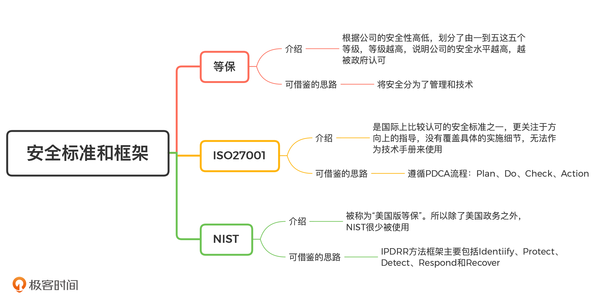

### 防火墙

​		防火墙是部署在网络边界上的一种安全设备，其概念比较宽泛，根据需求不同可以工作在 OSI（Open System Interconnection，开放式系统互联） 网络模型的一层或多层上。一般情况下，防火墙会和路由器搭配使用（或者说路由器能够承担部分防火墙的功能），来对网络进行隔离。

​		根据实现方式和功能的不同，防火墙可以分为三种类型：包过滤防火墙、应用网关防火墙和状态检测防火墙。不同的防火墙在性能和防护能力上都有各自的特点，适用于不同的场景。下面我们一一来看。

#### 分类

​		包过滤防火墙

​		包过滤防火墙工作在网络层和传输层上。在这两个层级中，网络请求都是以 TCP 或者 UDP 数据包的形式进行流动的。因此，包过滤防火墙是通过检测并拦截所有流经防火墙的 TCP 和 DUP 数据包，来对系统提供保护。它能够获取到的信息包括：源 IP 和端口、目标 IP 和端口、协议号等。由于大部分的路由器甚至 Linux 系统本身（Iptables）也具备类似的功能。因此，通常情况下，我们不需要采购额外的设备部署包过滤防火墙，只需要直接对网络边界的路由器进行设置，就能够满足最基本的拦截需求了。但是，在防护能力上，包过滤防火墙是比较弱的，它只能提供最基础的安全防护。这是因为，包过滤防火墙的过滤规则基本都是静态的。也就是说，包过滤防火墙只能够通过匹配 IP 地址和端口号，判断这些信息是否命中特定的规则来进行过滤。比如，禁止外网 IP 访问 80 和 443 以外的公司 IP 端口。所以，现在大部分的包过滤防火墙都进行了升级，引入了诸如“连接状态”等概念，也就变成了状态检测防火墙。

​		应用网关防火墙

​		应用网关防火墙以代理的模式工作在应用层。所谓“代理”，即接收客户端发出的请求，然后以客户端的身份将请求再发往服务端。大部分的系统和应用都是工作在应用层的，因此，应用网关防火墙能够获取到系统和应用的全部信息，从而实现更复杂的功能，如：内容监控、认证、协议限制甚至缓存。在包过滤防火墙中，防火墙直接对流经的 TCP 和 UDP 包进行处理。而应用网关防火墙需要对 TCP 和 UDP 包进行解析，处理成应用层的数据协议，如 HTTP。因此应用网关防火墙对于网络的性能会产生负面影响，而且不是所有的应用都能够很好地兼容代理的存在，所以部署应用网关防火墙有可能对系统的可用性产生影响。除此之外，在应用网关防火墙中，服务端看到的请求都来自于代理，这会导致服务端无法有效地追踪请求的来源。尽管应用网关防火墙有这些潜在的危害存在，但是它能处理的信息最多，能够提供的安全防护能力也最强。由于 Web 攻击是黑客常见的攻击手段，因此，应用网关防火墙也逐渐演变成了专门的 Web 防火墙，在之后的课程中，我们会详细介绍，这里暂时就不多说啦。

​		状态检测防火墙

​		状态检测防火墙是包过滤防火墙的一种升级，它同样工作在网络层和传输层之上。状态检测和包过滤防火墙最大的不同在于，它会以连接的形式来“看待”低层级的 TCP 和 UDP 数据包。怎么理解呢？我来举个简单的例子。当客户端发起一次完整的 HTTP 请求时，会需要进行“TCP 三次握手”建立连接（SYN+ACK 数据包），HTTP 请求和响应的数据往往也是通过多个数据包才能完整发送。传统的包过滤防火墙只能基于每一个数据包进行判断，比如在“握手”的过程中，包过滤防火墙会分别看到 SYN、SYN+ACK、ACK 这三个数据包，并对每一个数据包进行判断。而事实上，这三个数据包（SYN、SYN+ACK、ACK）代表的是一次握手请求。所以，状态检测防火墙会尝试将这一连串的数据包组成一次完整的连接请求，从而获得一个更全面的视角，大大提高其安全性。对比应用网关防火墙，状态检测防火墙通常不会尝试将数据包构建成高层级的数据，也就是说它不会尝试去解析整个 HTTP 请求中的内容。因此，状态检测防火墙能获得更优的性能。目前市面上普遍采用的，都是状态检测防火墙。

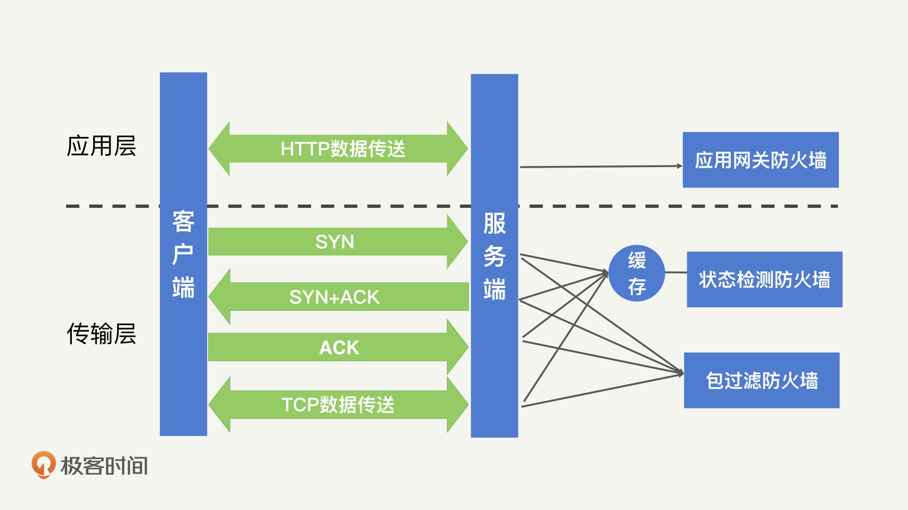

#### 能力

保护操作系统的漏洞

​		在操作系统的发展历程中，出现过很多臭名昭著的漏洞。比如：由于对网络请求处理不当，导致的 DDoS 攻击（如死亡之 PING、SYN 洪泛等）；由于高危服务默认开放导致的代码执行（如熊猫烧香扫描的是 135 和 445 端口的弱密钥）；由于服务漏洞导致的代码执行（如永恒之蓝利用的 SMB 漏洞）。如果在这些漏洞曝光时，我们能即时更新操作系统补丁、关闭对应服务，那自然是能够避免系统和应用受到侵害。但是，在通常情况下，尤其是当公司扩大规模的时候，服务器管理员意识到问题并采取措施的这段响应时间，已经足够病毒或者蠕虫进行大规模地传播了。这时，防火墙的存在就很有必要了。一方面，防火墙可以迅速对全网的服务器进行保护，拒绝向高危端口发起的请求，如 Windows 中的 135、137 和 445 等，这也就是我们之前所说的“虚拟补丁”。另一方面，更加智能的防火墙，能够检测到整体流量中的异常变化，比如，突然出现了针对某个端口的大量请求，这就说明系统或者应用中很可能出现了新的漏洞，这时，防火墙可以产生报警甚至自动对异常的请求进行拦截，及时避免网络中的操作系统受到攻击。

阻止非法的信息流动

​		在网络边界之间流动的数据，往往都会受到一定的规则约束。最著名的有中国的防火长城（Great Firewall）。防火长城的主要目的不是为了防止国外对中国发起网络攻击，而是根据法律法规，防止国内网民访问国外违法的数据信息。同样地，美国也存在类似的防火墙设备，比如：根据美国儿童网络保护法令（CHIPA），学校和图书馆的网络必须限制学生可以浏览的网页。除了防止非法地获取数据，防火墙同样能够防止敏感数据的流出。比如，防火墙可以对部分关键词或者敏感词进行检测阻止其外流。如果数据安全做得好一些的公司，可以对公司内的全部数据打上标签，然后根据标签的安全等级对跨越安全边界的数据进行处理。需要注意的是，防火墙能够提供的数据安全保护是有限的。原因在于，大部分防火墙都是用来处理较低层级的数据，且很多连接会对数据本身进行加密（VPN、HTTPS）。这就导致了防火墙实际能够看到的可识别数据并不多，拦截能力因此下降。其实，这种绕过防火墙的例子很常见，各类“梯子”能翻墙访问 Google 就是基于这个原理实现的。

限制可访问的服务和审计

​		防火墙作为安全策略的一部分，还可以帮助公司落地安全制度。公司所有对于网络方面的限制和要求，基本都可以在防火墙上进行实现。比如：限制外网开放的服务只能是 HTTP 服务，那么所有非 HTTP 的请求就会被拦截；再比如，防火墙也可以对带宽的使用进行限制，避免某个服务抢占全部的带宽资源。除此之外，防火墙作为网络安全设备，它的日志功能通常比路由器等常规网络设备更加完备。因此，在网络攻击发生之后，我们需要进行事件调查时，防火墙日志是很关键的信息来源。

#### 不足

​		我们知道，防火墙不仅是网络安全中很重要的组成部分，也是我们最为熟知的安全工具。但是，在安全领域中不存在绝对，所以防火墙对于某些攻击也同样无能为力。接下来，我会主要讲解防火墙不能防御的攻击手段，在了解这些攻击之后，我们才能提高对防火墙和网络安全的整体认识。首先，防火墙只位于网络边界。因此，防火墙只能用来对跨越边界的请求进行检测和拦截。当请求通过后，后续发起的攻击请求对于防火墙来说，就是不可见的。比如，当黑客利用弱密钥，通过合法的 SSH 登录到服务器之后，就相当于穿透了防火墙的保护，之后黑客再通过 SSH 执行的命令，防火墙都无法检测和拦截。所以，防火墙不能防御已授权服务中的恶意攻击。其次，尽管防火墙位于网络边界，但这并不意味着所有的请求都会经过防火墙。比如，直接通过物理网线接入到服务器，黑客就可以在不经过防火墙的情况下进入内网。在这种情况下，防火墙自然也起不到任何作用了。同样地，在网络内部发生的攻击行为，也不在防火墙的保护范围内。也就是说，防火墙不能防御不通过防火墙的访问。最后，作为边界设备，防火墙自身其实是暴露在外界的。因此，防火墙会遭受到黑客的直接攻击。如果防火墙自身的操作系统存在缺陷，那么，黑客就能够直接攻击并控制防火墙，然后关闭防火墙的防护功能，轻松突破边界。正是因为如此，部分防火墙厂商会为防火墙设备专门设计和开发一个加固过的专用操作系统，以此来提高防火墙的安全性。

#### 总结

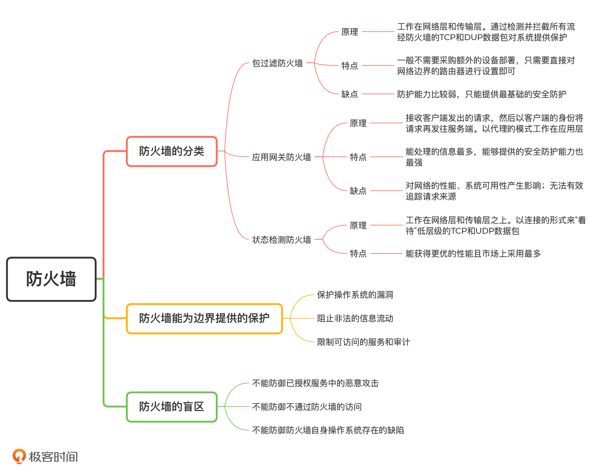

### WAF

​		WAF（Web Application Firewall，Web 应用防护系统）的概念也就被提了出来。WAF 说白了就是应用网关防火墙的一种，它只专注于 Web 安全的防御，近几年来逐渐被当成一个相对独立的产品方向来研究。

#### 工作模式

​		在 Web 安全这个方向上，WAF 对比防火墙又做出了哪些改进呢？我们可以从 WAF 的三种工作模式入手，探讨这两者的区别。这三种工作模式分别是：透明代理、反向代理和插件模式。

​		透明代理和大部分防火墙的工作模式相同：在客户端和服务端通信不需要作出任何改变的情况下，对 HTTP 流量进行请求和转发。在这个过程中，为了解密 HTTPS 流量，WAF 必须和服务端同步 HTTPS 对称密钥。

​		透明代理的优点就是容易部署，它不需要客户端和服务端进行任何改动。但是，透明代理的缺点也有很多。透明代理本身不是一个 Web 服务，所以它无法修改或者响应 HTTP 的请求，只能够控制请求的通过或者拒绝。正因为如此，它也无法实现 Web 服务所提供的认证、内容过滤等功能。

​		区别于透明代理，反向代理要求客户端将请求的目标地址指向 WAF，而不是服务端。在反向代理工作模式中，服务端接收的请求，实际上也是由 WAF 发起的。在这个过程中，WAF 本身就相当于一个 Web 服务，只不过对所有的 HTTP 请求都进行了转发。

​		因为反向代理 WAF 本质上是一个 Web 服务，所以 HTTPS 证书可以直接部署在 WAF 上。WAF 在对 HTTPS 流量解密之后，就可以在内网中用 HTTP 的形式，向服务端发起代理请求了。

​		而且，反向代理 WAF 作为一个 Web 服务，能够提供的功能也更加丰富。比如，WAF 可以充当一个前置的认证平台，对所有请求进行身份校验和身份管理。同时，也因为在反向代理工作模式中，客户端和服务端不直接通信，而是将全部请求都先请求到 WAF 上，所以反向代理 WAF 对服务端的隔离也更加彻底。

​		但是，反向代理同样存在缺点。首先，功能更丰富意味着性能开销更大。因此，反向代理 WAF 对硬件要求更高。其次，反向代理 WAF 一旦宕机，就无法响应客户端的任何请求。这样一来，即使服务端仍然正常，但用户已经无法正常使用应用了。而对于透明代理 WAF 来说，如果 WAF 宕机了，只是无法提供 Web 防护而已，客户端和服务端的通信不会受到任何影响。

​		最后，我们来看插件模式。在插件模式中，WAF 不再是网络中一个独立的安全产品了，而是以插件的形式依附于 Web 服务端本身，为 Web 安全提供防护。

​		那怎么才能将 WAF 植入到服务端的逻辑中呢？我们最常使用的一种技术就是AOP（Aspect Oriented Programming，面向切面编程）技术。在 AOP 技术中，WAF 可以作为一个切片植入到服务端的逻辑中。

​		而且，目前 AOP 技术十分流行，各类编程语言都支持。所以，插件模式的 WAF 部署同样十分简单。但是，这种将 WAF 和服务端强耦合的方式，会带来一定的负向影响。首先，WAF 和服务端一块工作在服务器上，会消耗服务器额外的资源，对 Web 服务本身的性能产生影响。其次，WAF 和服务端耦合，也就意味着 WAF 的所有改动都会直接影响到服务端。对于代理模式的 WAF 来说，通常只需要自测就可以升级了。而对于插件模式的 WAF，它本身的升级必须和服务端一起进入评估和测试流程，就会增加额外的工作量。

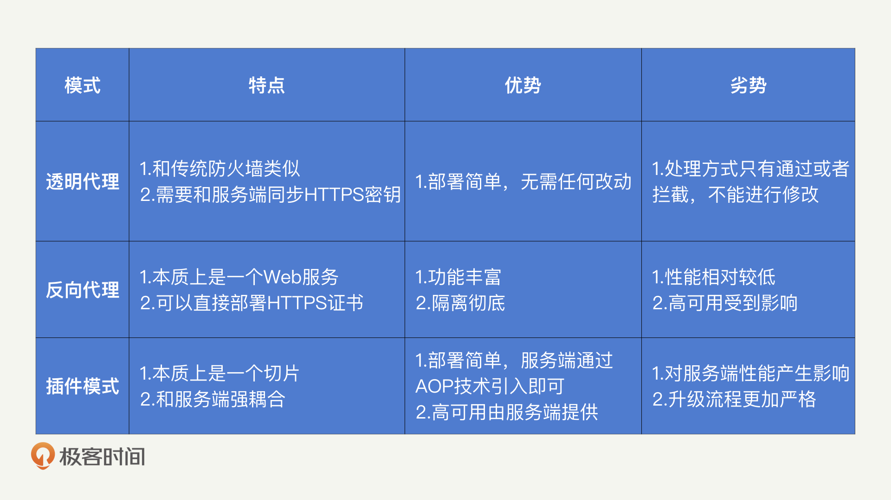

#### WAF 的功能

HTTP 解析能力

​		我们知道，WAF 专注于 Web 安全。因此，对 HTTP 请求进行解析是 WAF 最基础的能力。在 HTTP 中，通用的内容包括：请求的 URL 以及其中的参数、HTTP 头部信息、POST 的 body 内容等。除此之外，某些攻击特征可能隐藏得比较深，比如 JSON 中的某个字段，无法通过 JSON 的整体内容检测出来，我们必须一个字段一个字段去判断。因此，WAF 还需要解析 XML、JSON 等 RPC 传输协议，能够理解对应的 key 和 value 分别是什么。除了单纯地解析内容，WAF 还需要对 HTTP 内容做必要地处理。为什么要这么做呢？这主要有两方面原因。第一，HTTP 中的内容可能经过了 UrlEncode 等编码方式的处理，因此，WAF 需要具备解码能力，避免攻击的特征通过编码来进行绕过。第二，想要看到 HTTPS 中的加密内容，WAF 必须能够解密 HTTPS 请求。在透明代理模式中，WAF 需要和服务端同步 HTTPS 的密钥，才能够获得解密的请求；在反向代理中模式中，WAF 自带证书，可以直接解密；在插件模式中，WAF 依靠服务端解密请求之后，再进行 HTTP 的解析。

Web 安全防护

​		通过对 HTTP 请求进行解析、对编码内容进行解码和对 HTTPS 进行解密之后，WAF 就能够获得全部 HTTP 请求内容了。在此基础之上，WAF 就可以对请求内容进行分析，为 Web 服务提供安全保护了。我总结了三种主要的分析手段。

​		签名匹配：和杀毒软件中病毒库的概念类似，WAF 也可以维护一个攻击样本库。样本库中存有已知攻击请求的散列签名，只要 HTTP 请求内容的散列签名在这个样本库，就说明 HTTP 请求中携带了攻击内容。

​		正则匹配：签名匹配需要请求完全一致才能够检测出来，而正则匹配只需要部分特征就可以检测。WAF 可以通过抽象一些攻击特征的正则表达式，对 HTTP 请求进行检测。比如，如果请求的某个参数中出现了单引号，那么很有可能就是黑客发起的 SQL 注入攻击。

​		行为分析：除了针对单次请求的分析之外，WAF 还可以针对连续的访问请求特征进行提取和分析。为什么要这么做呢？这是因为，很多时候，我们无法准确判断单次请求是不是攻击请求，但是如果疑似的攻击请求频繁出现，我们就基本能够确定了。也就是说，一个用户不会频繁地访问同一个页面，而黑客需要对一个漏洞点发起多次尝试，才能够实现攻击的效果。

审计告警

​		WAF 还有另外一个重要的功能，就是为 Web 服务提供安全相关的审计和告警功能。Web 安全相关的审计包括：发生攻击的时间、路径、频次等。通过这些信息，开发人员能够知道自己的 Web 服务面对的攻击威胁是什么样的，也就能够更好地评估威胁，完善 Web 安全防护机制。除此之外，WAF 还能提供其他的审计能力。这是因为，WAF 能够解析出 HTTP 请求的全部内容，提供审计所需要的全部日志字段。这些日志可以是各个页面的访问次数、用户的访问行为和接口的响应性能等。尽管这些指标和安全没有太多关系，但是它们对于产品设计和服务质量来说都很常见，那么 WAF 就可以作为一个统计分析工具，来为你提供服务。

数据保护和虚拟补丁

​		反向代理或者插件模式的 WAF，还能够对 HTTP 请求中的数据进行一定的处理，提供额外的数据保护功能。最简单的，WAF 可以加密 HTTP 响应中的 Cookie 内容，使得 Cookie 以保密的形式存储在浏览器中。当浏览器将加密后的 Cookie 附加到 HTTP 请求中的时候，WAF 又可以进行解密。这样一来，服务端接收到的始终是明文的信息，而实际上，WAF 通过加解密为 Cookie 提供了额外的保护。另外，WAF 还可以对返回内容中的手机号、身份证号等敏感字段进行统一的打码处理，避免因为开发的疏忽，导致这些敏感信息的泄漏。在介绍插件漏洞的时候，我们提到了防火墙可以提供虚拟补丁的功能，来临时对插件漏洞进行修复。如果插件是 Web 相关的服务，那么 WAF 是不是也可以提供虚拟补丁的功能呢？当然是可以的。那 WAF 是如何提供虚拟补丁的呢？我来举个简单的例子。在经典的 Structs 2 漏洞中，黑客是通过 Structs 2 中包含的漏洞接口发起攻击的。所以，WAF 只需要将这些包含漏洞的接口进行封禁，或者对请求内容中的 Structs 2 攻击特征（特定接口的异常序列化数据）进行分析拦截，就能够临时避免 Structs 2 受到已公开的漏洞攻击。之后，我们只需要对 Structs 2 进行升级再打上补丁，这样就可以下线虚拟补丁了。

#### 总结

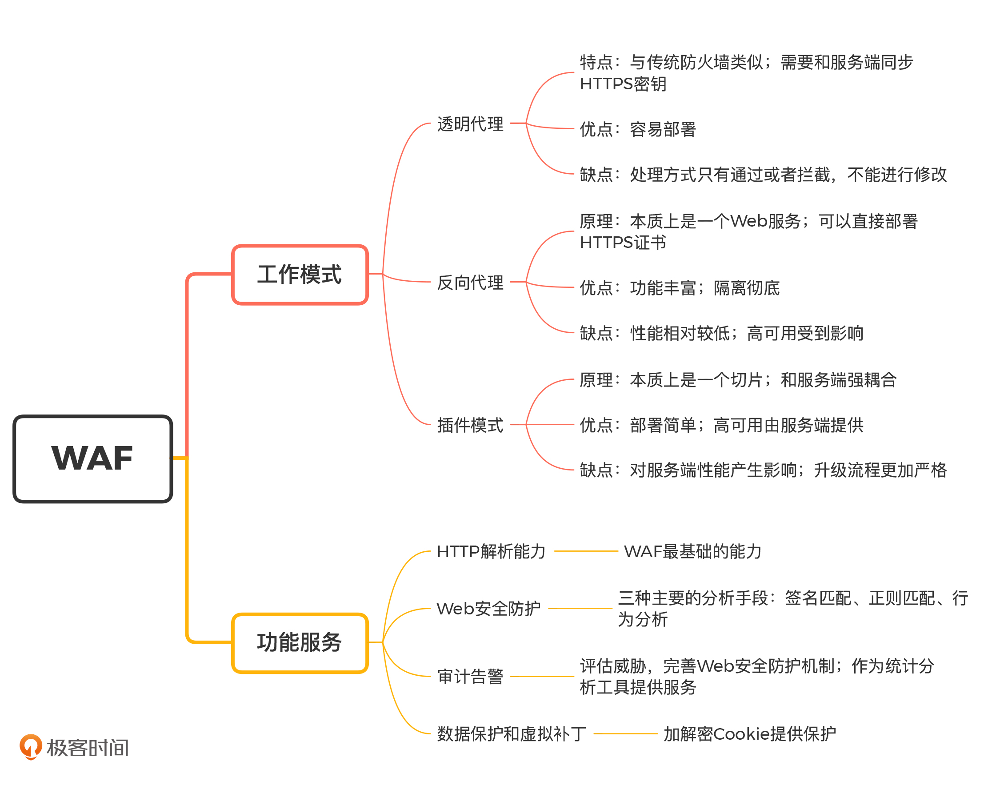

### IDS

​		无论是防火墙还是 WAF，都无法达到 100% 的防护效果。黑客总是能有很多其他的办法，来隐藏自己或者直接绕过这些保护机制。因此，我们仍然需要对内网中的行为进行检测，及时发现已经入侵到内网中的黑客。这就需要用到 IDS（Intrusion Detection System，入侵检测系统）了

​		什么是 IDS？IDS 的最终目的是检测黑客的攻击行为。那我们应该在哪里进行检测呢？首先是在网络流量中：黑客在控制了一台服务器之后，需要进行权限提升，而权限提升需要黑客在内网中挖掘各个服务器存在的漏洞。因此，黑客会发起很多探测和攻击的网络请求。其次就是在服务器系统中，黑客也可以利用服务器系统或应用本身的漏洞进行权限提升，同时，黑客也会尝试在系统中留下后门，这些行为都是通过系统操作来完成的。因此，根据检测内容的不同，IDS 可以分成两种类型：NIDS（Network Intrusion Detection System，网络入侵检测系统）和 HIDS（Host-based Intrusion Detection System，基于主机型入侵检测系统）。

#### NIDS

​		在讲防火墙的时候，我们提到防火墙存在盲区：防火墙只能够检测穿越网络边界的流量，如果黑客已经进入到了内网，那防火墙就没办法提供任何的安全防护了。这个时候，我们就需要使用 NIDS 了。NIDS 主要检测网络流量中的攻击行为。区别于部署在网络边界的防火墙，NIDS 一般部署在内网的网络节点（路由器或交换机）中，所有的网络请求都会流经这些网络节点，所以，NIDS 基本可以获取到对应网络节点下全部的网络行为。另外，和防火墙不同的是，NIDS 一般不具备拦截网络请求的能力。这也让 NIDS 能够很好地隐蔽自己，让黑客很难发现。对于防火墙和 WAF 来说，黑客总是会不断尝试各种方式来绕过这些安全产品，原因就是黑客知道自己被拦截了。因此，这些安全产品需要不断地更新规则策略对抗黑客。如果黑客都不知道 NIDS 的存在，就不会刻意地去绕过 NIDS 的检测，这也使得 NIDS 的检测能力比较稳定，不需要频繁地更新规则策略。NIDS 是一个比较经典的安全产品，你可以直接使用市面上的开源工具，比如：Snort、Suricata等。这些工具也依据 CVE 库开发了完整的入侵检测规则。以 Snort 的一条检测规则为例：

​		这个规则是用来检测 CVE 2016-8077 的。CVE 2016-8077 的攻击原理就是，黑客先构建一个恶意网站，如果用户使用 IE 浏览器访问了这个网站，就会被黑客控制。因此，在第一行的 Rule Header 中，定义了 NIDS 需要检测从外网 HTTP 服务返回给本地的 TCP 请求，也就是检测用户访问了一个网页并收到的返回请求。然后再 Detection 这个部分，对该漏洞的关键词进行正则匹配，也就是"/CacheSize\s*=\s*/"。这样一来，我们就能够发现，黑客通过这个 CVE 漏洞控制用户 IE 浏览器的攻击行为了。所以，我们在使用 NIDS 的时候，只要注意及时对规则进行维护即可。从 Snort 的规则中，我们也可以看出，NIDS 的检测逻辑就是对请求的内容进行正则匹配，不具备分析上下文的能力。因此，NIDS 一般只能够对单次的攻击请求进行检测。

#### HIDS

​		精明的黑客在控制了服务器之后，会尽可能避免发送大量的网络请求，以此来隐藏自己。那么，我们是不是就没办法发现黑客了呢？当然不是。无论多么精明的黑客也一定会在服务器上留下各种痕迹。不管是入侵的时候，通过各种 Web 漏洞执行了系统命令，还是入侵成功之后，在系统中埋下了后门，又或者是直接利用系统漏洞进行权限提升，这些操作最终都会在服务器系统上执行。因此，我们可以通过监控各个用户在服务器系统上的行为来检测黑客的存在。这就是 HIDS 的功能了。HIDS 主要检测服务器系统中的攻击行为。NIDS 运行在某个网络节点之上，相当于集中式的对网络流量进行检测，但是 HIDS 运行于每一个服务器中，也就相当于对系统行为进行分布式检测。那分布式的行为处理有什么好处呢？在 NIDS 中，我们是基于少量的网络节点检测全部的网络流量。而在 HIDS 中，只需要每个服务器检测各自内部的行为，也就相当于将资源消耗分散到了每一台服务器中，这就对硬件的性能要求比较低，也就节约了公司的防护成本。另外，HIDS 一般以 ROOT 权限运行在操作系统中。因此，HIDS 能够监控的行为更丰富，比如：执行的系统命令。发起和接受的网络请求。运行的进程、监听的端口号等。系统关键文件的完整性。其他黑客可能留下痕迹的地方。

​		对比于 NIDS，HIDS 的开发难度会高很多。主要是因为 NIDS 只需要部署在关键的网络节点上，一个公司可能也就有几百个这样的节点，而 HIDS 需要部署在公司所有的服务器中，一个公司有上万个服务器是很常见的事情。而且，我们会在日常使用中频繁改动服务器，这也使得服务器的系统环境很不统一。所以，很多公司都需要基于自己的情况自行开发 HIDS。据我了解，很多公司都会基于Osquery来开发 HIDS。Osquery 提供的信息采集功能可以满足大部分的 HIDS 需求，我们只需要运行一句简单的 SQL 语句，就能够拿到系统的关键信息了。比如：

````sql		
SELECT name, path, pid FROM processes
````

​		通过这段代码，我们可以从 Osquery 中获取到当前的全部进程信息。但是，我之前在测试 Osquery 的时候，发现它没办法在 Centos 5 版本的系统中运行，也就不适用于我公司的环境。最终，我只能选择基于 Go 和 C 语言，去一项一项实现各类信息采集的工作。

#### IPS

​		在 HIDS 和 NIDS 中，我们分别通过网络行为和服务器系统行为对黑客入侵进行检测。但是，你需要注意，它们都只是检测而已。也就是说，如果你不进行人工干预的话，黑客的入侵行为并不会受到任何影响，仍然可以持续进行。精明的黑客一定会选择夜半三更的时候发起攻击，等你睡觉起来，黑客早已经拿到它们想要的数据了，而你只能看着 HIDS 和 NIDS 给出的一堆报警无可奈何。这显然不是我们希望的结果。因此，我们在 NIDS 和 HIDS 中加入了拦截的能力，就成了 NIPS 和 HIPS，统称为 IPS（Intrusion Prevention System，入侵防御系统）。IDS 和 IPS 是相辅相成的，它们唯一的区别在于，IDS 强调的是检测，IPS 强调的是拦截。当发现了黑客的攻击行为后，IDS 会产生报警，然后公司的安全响应人员会对报警进行人工处理。IPS 同样会产生报警，不过报警的同时，IPS 会尝试对黑客的行为进行拦截，在第一时间限制攻击产生的影响范围。IPS 的实现总体和 IDS 比较类似，只是 IDS 通常不会去修改网络节点和操作系统，而 IPS 会实现额外的逻辑，对网络节点和系统内的行为进行封停，从而阻止黑客入侵。

总结

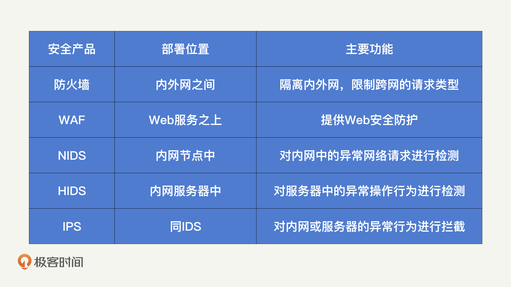

#### 蜜罐

​		在 IDS 的检测机制中，我们主要是基于对系统行为和网络请求的分析，判断是否存在攻击行为。这种检测模式会存在两个主要的问题：第一，分析结果总会出现漏报和误判，而这些漏报和误判，不论是对用户还是对安全人员，都会造成极大的困扰；第二，分析的规则都是人工产出的，会存在滞后性。当某种新型攻击出现时，我们很可能无法及时更新 IDS 的检测规则，让 IDS 形同虚设。那么，我们应该如何提升分析的准确性呢？对于未知的攻击，我们又该如何及时发现呢？蜜罐就是一种能满足这两点需求的入侵检测工具。所谓“蜜罐”，就是一台部署在内网的服务器。这个服务器没有任何保护措施，并且提供带有漏洞的服务，就是为了吸引黑客来攻击它。蜜罐由安全人员部署在网络的各个节点中，理论上，其他开发人员都不会知道蜜罐的存在，也就不会向蜜罐发起任何请求。而黑客入侵内网后，需要对内网进行探测，如果发现蜜罐中的服务有漏洞，自然就会针对蜜罐发起攻击。因此，蜜罐内的一切行为，都是黑客产生的。基于蜜罐的报警和日志，我们就能够及时发现黑客的存在，并且还原出黑客的攻击行为。

​		蜜罐的类型主要分为两种：低交互蜜罐和高交互蜜罐。

​		所谓低交互蜜罐，就是蜜罐内的所有服务都是模拟的，不能提供真实的服务功能。比如，低交互蜜罐为了模拟一个弱密码的 SSH 服务，它会监听 22 端口。而黑客一旦向这个 22 端口发起 SSH 登录请求，蜜罐就会返回登录成功的响应。但是，蜜罐并没有提供真实的 SSH 服务，只是模拟了一个登录成功的响应而已，所以黑客并不能通过 SSH 连接上服务器。

​		高交互蜜罐会提供一个真实的服务，而且不施加任何限制，只是用来做详细的记录而已。还是以上面 SSH 登录为例，在高交互蜜罐中，蜜罐会开启一个真实的 SSH 服务，黑客能够通过 SSH 连入并且控制蜜罐。但是，黑客连入蜜罐后的所有行为都会被记录下来，并产生报警。而我们只需要及时处理报警赶走黑客，就可以降低蜜罐被控制后所产生的影响。

​		低交互蜜罐和高交互蜜罐的对比也很明显。低交互蜜罐更安全，因为它不提供真实的带有漏洞的服务，只是模拟服务，所以黑客无法控制蜜罐。但模拟的服务可能被黑客发觉，导致黑客不上钩。这个时候，高交互蜜罐对黑客更有吸引力，让我们能有更大的概率发现入侵攻击的行为。

​		对比于 IDS，蜜罐提供了额外的入侵检测能力，它的主要优势包括：

​		蜜罐几乎不会产生误报

​		蜜罐内的所有行为都是真实的黑客攻击行为，因此数据量小、价值高

​		不需要已知的攻击样本，根据黑客的行为我们甚至能够发现新的攻击方式

​		当然，蜜罐也是有缺陷的。它的主要缺陷就是，入侵检测的实现非常依靠运气，实现的前提是必须有黑客找到蜜罐。也就是说，如果黑客进入内网后，首先发现其他带有漏洞的正常服务器，就不会进入到蜜罐中了。蜜罐的实现比较复杂，它需要恰到好处地把握提供多少的交互，既能吸引黑客，又不至于产生漏洞。好在你并不需要关心它的具体实现，因为网上已经有不少成熟的开源蜜罐了，你可以直接拿来使用。如果你不知道怎么选择，也有人对这些蜜罐进行了比较系统的分析比较，你可以参考一下。

#### 构建入侵检测体系

​		在了解了 IDS、IPS 和蜜罐之后，我们发现这几款入侵检测工具各有其优势和不足。因此，在实际的安全防护中，我们通常会将它们组合起来使用。首先，蜜罐具备较高的准确率，并且能够发现未知的攻击。因此，我们可以将蜜罐中黑客的行为特征作为攻击样本的特征，输入到 IDS 和 IPS 中去。这样一来，IDS 和 IPS 就具备了根据黑客行为自动学习和升级的能力。其次，IPS 通常是直接拦截黑客的攻击行为，来及时止损。但这样一来，黑客也会察觉到入侵检测系统的存在。因此，我们可以将 IPS 的检测拦截行为，调整为一旦检测到攻击行为，就将行为转发到蜜罐中。对于黑客来说，攻击行为看起来仍然是成功的，但实际上不会对系统产生任何影响，且攻击行为都被记录下来了。最后，为了提升黑客发现蜜罐的概率，我们通常需要在内网中广泛地部署蜜罐。但是，这又增加了很多额外的硬件部署成本。因此，有的 HIDS 中会嵌入“微蜜罐”，就是利用服务器本身的资源实现一个小型的蜜罐服务。比如，某个部署 HIDS 的服务器中本来没有 MySQL 服务，也没有监听 3306 端口，我们可以通过设置服务器，让 HIDS 监听 3306 端口并模拟一个 MySQL 服务出来。这个 MySQL 服务是 HIDS 模拟的，开发人员不会感知到，所以发起 MySQL 连接的一定是黑客。这就是“微蜜罐”。现在，你应该知道了，一个系统化的入侵检测系统需要依靠各个安全产品之间的相互协作，才能够实现防护能力的最大化。我总结了一个成熟的入侵检测系统的组织结构图。

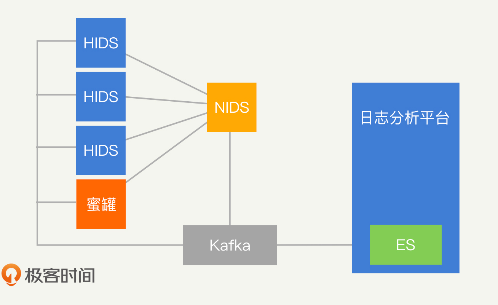

​		在这个入侵检测系统中，NIDS 负责对网络节点进行检测，网络中会包含部署了 HIDS 的系统和蜜罐系统。最终，我们需要通过 ELK 来统一收集各个安全产品的检测日志，实现信息同步。所有 IDS 或者 IPS 的信息都是相互关联的，我们就能够基于这个完整的信息进行全盘的综合分析了。

### RASP

​		对于任何安全产品来说，能获取到的数据和信息越多，检测的能力就越强，误判和漏报的概率也就越低。因此，2012 年，Gartner 提出了 RASP（Runtime Application Self Protection）的概念，就是希望将安全产品部署在应用的底层，完全站在应用的视角去发现攻击行为，从而实现更加完善的安全防护。

#### 原理

​		想要利用 RASP 实现更完善的安全防护，首先我们要知道，什么是 RASP？以及如何实现 RASP？RASP 的设计思路是通过监控应用的底层，来从根本上发现攻击行为的产生。以 Java 为例，Java 应用运行在 JVM 之上。因此，JVM 就是一个底层，它能够看到所有的应用信息。我们可以通过JavaAgent的形式将 RASP 运行在 JVM 上，然后借助Instrumentation技术 Hook 关键的类和方法。关键类和方法具体有哪些，你可以参照 OpenRASP 的Hook 列表。这样一来，RASP 就能关注到应用安全相关的信息和调用了。

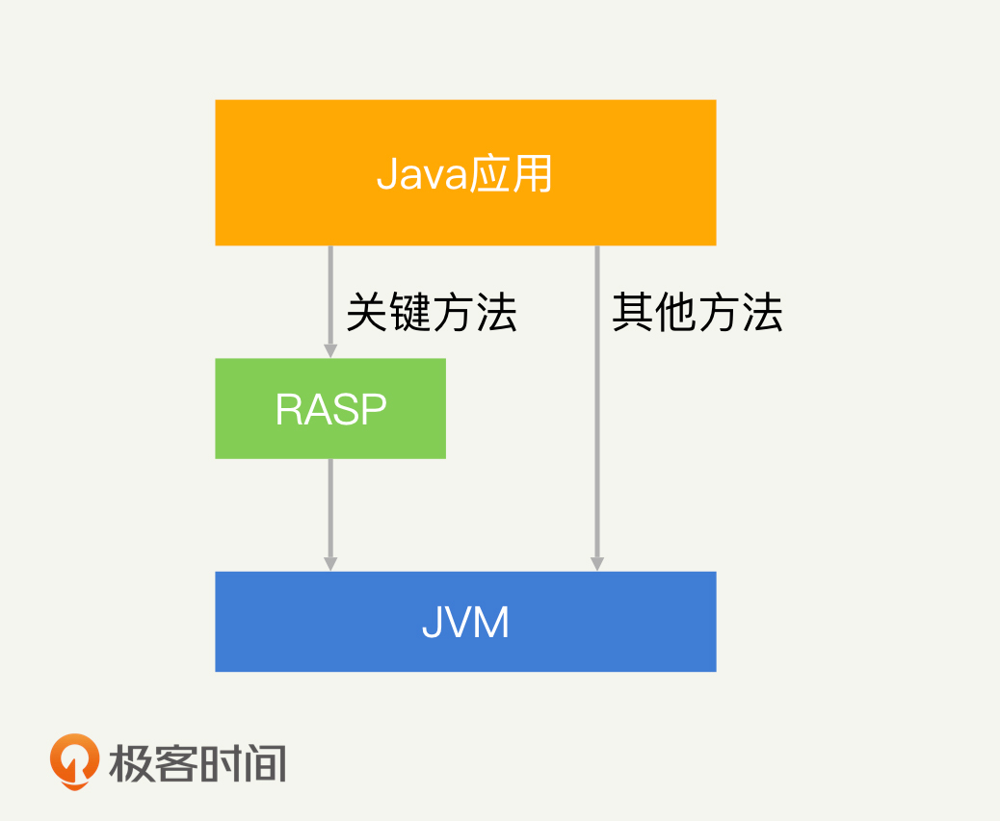

​		同样的原理，在 PHP 中，我们可以通过 PHP 扩展库来实现 RASP；在.Net 中，我们可以通过 HostingStartup 来实现 RASP。如果你想要研究 RASP 产品，那我推荐你使用百度的OpenRASP。因为 OpenRASP 在开源市场中认可度比较高，也是目前各个公司用来研究 RASP 产品的一个主要对象。

#### RASP 的优势和劣势

​		我们经常会将 RASP 和 WAF 拿来作比较，因为它们主要关注的都是应用相关的 Web 安全问题。那么对比 WAF，RASP 有哪些优势和劣势呢？首先我们来看优势。在开头我们就提到了，RASP 对比于 WAF 最大的优势在于 RASP 运行在应用的底层，从而能够知道应用运行时的上下文（比如：用户、代码逻辑、SQL 语句等）。在 Web 安全中，我们针对 Web 安全的攻击原理进行过总结：SQL 注入、反序列化等漏洞其实都是通过输入数据，篡改应用的正常逻辑实现的攻击。对于 WAF 来说，它只能够判断出输入的数据“可能”会篡改应用的正常逻辑，因此 WAF 的拦截决策都来源于这个可能性。而对于 RASP 来说，它知道应用的正常逻辑是什么，也知道应用接收输入后实际的逻辑是什么，如果实际逻辑和正常逻辑不一致，就必然发生了攻击。基于这种检测方式，RASP 基本不会产生误报或者漏报。我们以 OpenRASP 防止 SQL 注入的检测逻辑为例，来看一下 RASP 是如何进行检测的。算法描述如下：第 1 步和第 2 步很好理解，都是 SQL 注入的基本特征。那第 3 步中的“导致 SQL 语句逻辑发生变化”，OpenRASP 要如何去识别呢？假设用户的输入是万能密码"or""="，那么，应用实际执行的 SQL 语句就是：SELECT * FROM Users WHERE Username = “” AND Password = ““or””=""在这个 SQL 语句中，最后的几个字符都是用户的输入。为了检测语句逻辑的变化，OpenRASP 将这个 SQL 语句进行了 Token 化。所谓“Token 化”，就是对 SQL 语句中的关键词进行拆解，拆解后分别是：SELECT、 *、FROM、Users、WHER、Username、=、""、AND、Password、=、""、or、""、=、""。我们能够清楚的看到，用户的输入“"“or “”=”"”占据了 5 个 Token。而正常情况下，用户的输入应该只占据 1 个 Token。因此，只要用户的输入大于 1 个 Token，就说明 SQL 语句逻辑存在变化，我们就可以断定存在 SQL 注入了。其次，RASP 能够防范未知的攻击。对于 SQL 注入来说，它的注入点可以是某个 GET 参数、某个 POST 的 Body、某个 Header 字段等，具体的攻击方式也多种多样：盲注、基于 Insert 的注入等。WAF 的检测规则是一个一个去覆盖这些攻击点和攻击方式。如果黑客发现了某个新的攻击点或者使用了新的攻击方式，WAF 根本无法检测出来。

​		对于 RASP 来说，它实际上不关注具体的攻击点和攻击方式是什么，因为 SQL 注入攻击，最终都会使 SQL 语句 Token 化后的长度发生改变。因此，RASP 只需要判断执行的 SQL 语句 Token 化后的长度即可。所以我才说，RASP 能够有效地防御未知的攻击。最后，我认为 RASP 还有一个比较特别的好处，就是基本不用维护规则。我前面讲过的各类安全产品：防火墙、WAF 和入侵检测，它们的本质都是检测攻击行为。而这些安全产品的检测方式不论是签名匹配、正则匹配还是行为分析，都包含了大量的规则和算法。这些规则和算法带来的最大问题，就是针对每一家公司我们都需要制定一套单独的规则和算法。因为每家公司的应用和网络环境都不一样，面临的攻击也不一样。随着公司的发展以及黑客的对抗升级，我们还需要不停地更新和维护这套规则和算法，这就带来了极大的运营成本。而对于 RASP 来说，它当然也需要规则和算法来支持，但是它的规则和算法相对统一。比如，在 Java 中，不论你是使用的哪种开发框架，最终执行 SQL 语句的都是底层的 JDBC 插件，在这个层次上，攻击的特征都是一致的。因此，RASP 基本只需要维护一套统一的规则和策略，就能够适用于所有的公司和应用了。所以，百度在 OpenRASP覆盖面说明中敢说“若发现不能拦截的攻击或者误报的情况，请联系我们”，就是这个原因。开源的 WAF 只会提供一个维护规则的入口，而不会帮助你进行维护。

​		尽管 RASP 存在许多明显的优势，但是目前来看，国内对于 RASP 的实际落地，普遍还在试验阶段，我很少见到 RASP 在公司范围内大规模推广落地案例。这是为什么呢？要搞清楚这个问题，就不得不提到 RASP 的劣势了。RASP 的劣势主要有三方面，下面，我们一一来看。我认为最大的劣势在于推广难度上。尽管我们一直在提安全，但是事实上，大部分的开发人员并不认可安全，他们也不接受任何可能对应用产生影响的安全产品。这是因为，这些安全产品增加了检测的逻辑，就必然会影响应用的正常运行。而且，WAF 等拦截性安全产品产生的误报，会让正常的业务请求受到影响。但是，防火墙、WAF 和入侵检测，实际上都已经在各个公司很好地落地了。我认为这都归功于安全人员或者运维人员的“强推”。在部署一款 WAF 的过程中，实际上是不需要开发人员参与的，运维人员在网关上直接部署就可以了。而 RASP 不一样，RASP 和应用强耦合，它需要由开发人员去部署。比如，Java 中需要通过命令 java -javaagent:rasp.jar -jar app.jar 来启动 RASP，其中的参数 javaagent 只能由开发人员进行配置。因此，RASP 的推广实际上是安全意识的推广，所以难度也比较高。其次，RASP 的解决方案并不通用。从语言支持上来看，目前 RASP 只在 Java、PHP 和.Net 语言中具备成熟的产品。其他高级语言，如 Python 等，可能是因为没有很好的 Hook 方案，所以目前仍然局限于研究阶段。这也是 RASP 强耦合所带来的弊端：每一种开发语言，甚至是语言下不同的开发框架，都可能会需要一套独立的 RASP 产品。而 WAF 等安全产品，因为网络和系统都比较统一，则不受此限制。最后，RASP 在性能问题上也备受争议。尽管目前成熟的 RASP 产品宣称它的性能影响已经低于 5%，甚至更低了，但在实际落地的过程中，确实会出现因为系统和应用的差异，而导致性能恶化比较严重的情况。这也是 RASP 在兼容性不足上所表现出来的缺陷。

#### 总结

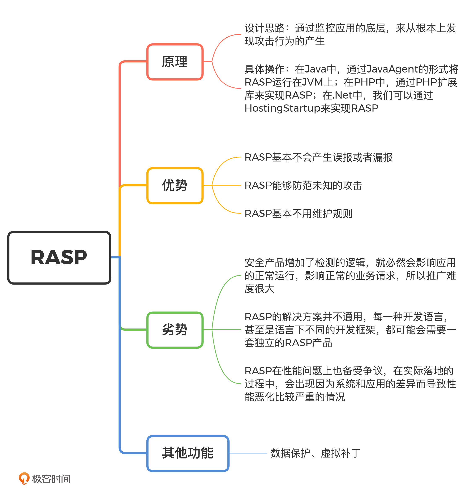

### SIEM

​		我们经常会使用 SIEM（Security Information and Event Management，安全信息和事件管理），来帮助我们运营一个安全体系。通过 SIEM，我们可以将散落于各个系统、设备和安全产品中的日志进行汇总和梳理，快速串联出黑客的完整攻击路径，更高效地完成安全体系运营的工作。

#### 功能

​		我们先来说一下 SEIM 是什么。简单来说，SIEM 就是一个基于各类日志，提供安全运营和管理能力的统一平台。基于这个定义，我们来总结一下 SIEM 的功能。首先是收集日志。对 SIEM 来说，需要收集的日志来源于操作系统、路由器、数据库等业务设备，防火墙、WAF、IDS 等安全产品，以及业务前后端本身。在收集到大量的日志之后，SIEM 会对数据进行分析统计，将海量的日志进行筛选和总结，给予安全运营人员最精简的结果，提高分析效率。经过数据分析之后，安全运营人员就能够快速发现并处理各类安全事件了。最后，SIEM 还需要提供完整的运营流程。比如，通过工单功能完成安全事件的管理，通过报表追踪各安全产品产生的报警、发起的安全事件、数据的流动情况等，清晰地表现出公司的安全现状和能力。没有 SIEM 平台之前，安全运营人员需要对这些安全事件和报警进行人工处理和记录，不仅效率较低而且容易出现纰漏。有了 SIEM 平台之后，我们就可以将整个运营工作线上化，大大提升运营的效率和质量。

#### 落地

​		不知道你有没有发现，我一直强调“运营”这个词。相比我们之前讲过的安全产品，SIEM 更加注重运营。因此，落地 SIEM 可不仅仅是部署一款安全产品这么简单。我们之前提到的安全产品（防火墙、WAF、IDS 等）都是以技术为导向的。换一句话说，这些安全产品效果好不好，实际上取决于技术和检测规则。只要技术实现上能够满足性能要求，规则上能够尽可能多地覆盖攻击特征、检测黑客行为、减少误伤，就很容易落地并产生收益。但是 SIEM 不一样。我在说 SIEM 的核心功能的时候，你可能很快联想到，可以使用经典的日志分析组件 ELK，去实现 SIEM 的各个功能。所以你看，SIEM 其实不存在特别明显的技术挑战。那为什么很多公司在规划做一个 SIEM 的时候，最终都“虎头蛇尾”、不了了之了呢？原因就是我们一直强调的“运营”能力不足。运营能力不足让这些公司做出来的 SIEM 空有一个架子，无法实际落地，也就无法产生应有的价值。那么问题来了，SIEM 究竟该如何落地呢？下面，我就结合 SIEM 落地的流程图，带你一起分析。

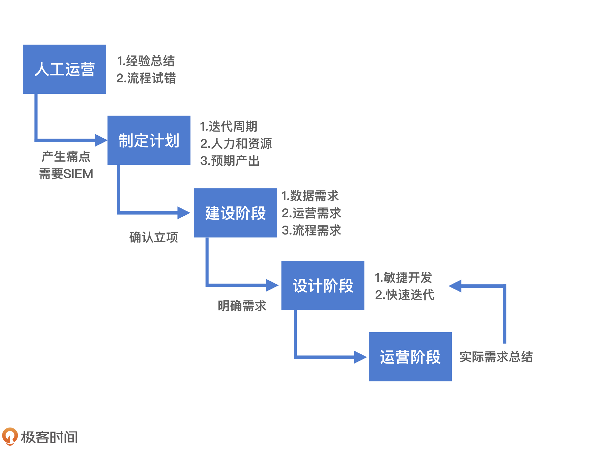

1.制定计划

2.设计阶段

​	第一方面：SIEM 需要管理哪些设备，收集哪些数据。

​	第二方面：安全运营目前遇到的痛点的典型场景是什么，预期的解决方案又是怎么样的。

​	第三方面：完整的安全运营流程是什么。

3.建设阶段

4.运营阶段

#### 问题

第一个：垃圾数据太多。

第二个：数据维度缺失。

第三个：人员投入不足。

#### 总结

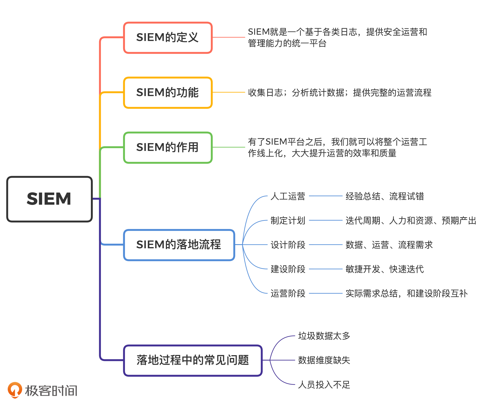

### SDL

 SDL（Security Development Lifecycle，安全开发生命周期）

​		和安全标准一样，SDL 本质上是一个宏观指导性质的框架。但是，它确实成为了很多公司建设安全开发体系的参照标准。各个公司依据微软的 SDL 标准，结合自身的实际情况，衍生出了适合公司自身发展的 SDL。

​		SDL 中的基础概念我们先来看一个软件开发中的经典概念：软件开发生命周期 DLC（Software Development Life Cycle）（这个概念的英文缩写种类比较多，为了和 SDL 区分，我们用 DLC 代表软件开发生命周期）。SDL 是以软件开发生命周期为基础发展成的安全框架，所以，了解 DLC 能够帮助我们更好地认识 SDL。DLC 将软件开发过程分为 5 个阶段：需求分析、设计、开发、测试和部署。DLC 对5 个阶段的具体描述，都是以业务功能为核心进行展开的，并没有涵盖安全的工作。这显然不安全。而且我们都知道，安全问题对公司的威胁是客观存在的。因此，很多公司将安全纳入到测试的工作中。但是，这种做法会导致两个问题：第一，安全问题要等到软件开发完成后才能发现。这个时候，因为一个安全隐患（不是 BUG），让开发人员重启开发流程，推动上会遇到较大的阻力；第二，只能关注到最终完成的软件，往往会导致安全人员因为对业务了解不足，漏过一些安全隐患。这些问题的出现，让业内亟需一个能够更好地满足安全需求的软件开发流程，SDL 也就应运而生了。

​		SDL 的出现不是为了颠覆传统的 DLC 框架，而是希望在 DLC 中加入足够清晰的安全需求，以此来为软件开发的过程提供完整的安全防护。SDL 的标准执行流程有 7 个步骤：安全培训、需求分析、设计、开发、测试、部署和响应。