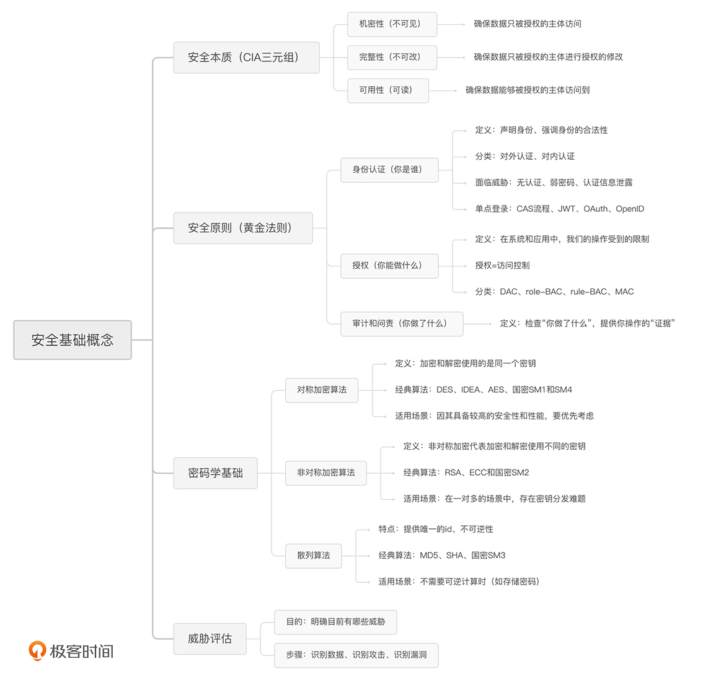

### 安全的本质

安全的本质就是保护数据被合法的使用。有三个基本原则：

安全原则：机密性（Confidentiality）、完整性（Integrity）、可用性（Availability）简称CIA。

1.机密性用一句话来说就是，确保数据只被授权的主体访问，不被任何未授权的主体访问。 简单用一个词总结就是“不可见”。

2.完整性就是确保数据只被授权的主体进行授权的修改，简单来说，就是“不可改”。

3.可用性就是确保数据能够被授权的主体访问到， 简单来说，就是“可读”。

### 从何入手解决安全问题

黄金法则：认证（Authentication）、授权（Authorization）、审计（Audit）

大部分情况下，事前防御属于认证，事中防御属于授权，事后防御属于审计。

### 密码学

总的来说，在使用的时候，你要记住下面这些内容：对称加密具备较高的安全性和性能，要优先考虑。在一对多的场景中（如多人登录服务器），存在密钥分发难题的时候，我们要使用非对称加密；不需要可逆计算的时候（如存储密码），我们就使用散列算法。在具体算法的选取上，你只需要记住：对称加密用 AES-CTR、非对称加密用 ECC、散列算法用 SHA256 加盐。这些算法就能够满足大部分的使用场景了，并且在未来很长一段时间内，都可以保持一个较高的安全强度。

### 单点登录

单点登录（Single Sign On，SSO）：用户只需要进行一次认证，就可以访问所有的网页、应用和其他产品了。

#### CAS 

#### JWT

JWT（JSON Web Token）是一种非常轻量级的单点登录流程。它会在客户端保存一个凭证信息，之后在你每一次登录的请求中都带上这个凭证，将其作为登录状态的依据。JWT 的好处在于，不需要应用服务端去额外维护 Cookie 或者 Session 了。但是，正是因为它将登录状态落到了客户端，所以我们无法进行注销等操作了。

#### OAuth

OAuth（Open Authorization）的主要特点是授权，也是我们通常用 QQ、微信登录其他应用时所采用的协议。通过 OAuth，用户在完成了认证中心的登录之后，应用只能够验证用户确实在第三方登录了。但是，想要维持应用内的登录状态，应用还是得颁发自己的登录凭证。这也就是为什么 QQ 授权后，应用还需要绑定你的手机号码。这也就意味着，应用是基于 QQ 的信息创建了一个自身的账号。

####  OpenID

OpenID（Open Identity Document）和 OAuth 的功能基本一致。但是，OpenID 不提供授权的功能。最常见的，当我们需要在应用中使用微信支付的时候，应用只需要收集支付相关的信息即可，并不需要获取用户的微信头像。

总结：JWT 适用范围广，在单点登录的选取上面，如果想要将用户信息做统一管理，选择它最为简单；如果认证中心只是被用来维护账号密码，由业务去维护用户所绑定的其他手机等信息，那么，采用 OAuth 更合适。

### 访问控制机制

常见的访问控制机制有 4 种：DAC、role-BAC、rule-BAC、MAC。 

DAC（Discretionary Access Control，自主访问控制）：DAC 就是让客体的所有者来定义访问控制规则。想象一下，你想要从图书馆中拿走一本书。这个时候，管理员说，“你经过这本书的所有人同意了吗？”这个过程就是 DAC。在 DAC 中，访问控制的规则维护完全下发到了所有者手上，管理员在理论上不需要对访问控制规则进行维护。因此，DAC 具备很高的灵活性，维护成本也很低。相对的，尽管 DAC 降低了管理员的工作难度，但是会增加整体访问控制监管的难度，以至于安全性完全取决于所有者的个人安全意识。这么说来，DAC 的特性其实就是将安全交到了用户手中，因此，DAC 适合在面向用户的时候进行使用。当用户需要掌控自己的资源时，我们通常会采取 DAC，来完成访问控制。比方说，Linux 中采用的就是 DAC，用户可以控制自己的文件能够被谁访问。

role-BAC（role Based Access Control，基于角色的访问控制）：role-BAC 就是将主体划分为不同的角色，然后对每个角色的权限进行定义。我们还是以图书馆为例。当你想借书的时候，管理员说，“你是学生吗？”这个过程就是 role-BAC。管理员只需要定义好每一个角色所具备的功能权限，然后将用户划分到不同的角色中去，就完成了访问控制配置的过程。role-BAC 是防止权限泛滥，实现最小特权原则的经典解决方案。试想一下，假如没有角色的概念，那么管理员需要给每一个用户都制定不同的权限方案。当用户的岗位或职责发生变更时，理论上管理员需要对这个用户的权限进行重新分配。但是，准确识别每一个用户需要哪些权限、不需要哪些权限，是一个很有挑战的工作。如果采用了 role-BAC，那么管理员只需要简单地将用户从一个角色转移到另一个角色，就可以完成权限的变更。因此，role-BAC 更适合在管理员集中管理的时候进行使用。在这种情况下，所有的权限都由管理员进行分配和变更，所以，使用 role-BAC 可以大大降低管理员的工作难度，提高他们的工作效率。同样的原理也适用于应用，应用可以对不同的角色限定不同的操作权限，比如：运维人员给开发、产品、运维划分不同的机器操作权限。

rule-BAC（rule Based Access Control，基于规则的访问控制）：rule-BAC 就是制定某种规则，将主体、请求和客体的信息结合起来进行判定。在 rule-BAC 的控制机制中，如果你想要在图书馆借书，管理员会说，“根据规定，持有阅览证就可以借书。”相比较来说，DAC 是所有者对客体制定的访问控制策略，role-BAC 是管理员对主体制定的访问控制策略，而 rule-BAC 可以说是针对请求本身制定的访问控制策略。在 rule-BAC 中，有一点需要我们注意。那就是，我们需要定义是“默认通过”还是“默认拒绝”，即当某次请求没有命中任何一条规则时，我们是应该让它“通过”还是“拒绝”呢？这需要根据安全的需求来进行综合考量。比如，某个服务只提供了 80 和 443 端口的 Web 服务，那么防火墙配置的规则是允许这两个端口的请求通过。对于其他任何请求，因为没有命中规则，所以全部拒绝。这就是“默认拒绝”的策略。很多时候，为了保障更高的可用性，应用会采取“默认通过”的策略。rule-BAC 适合在复杂场景下提供访问控制保护，因此，rule-BAC 相关的设备和技术在安全中最为常见。一个典型的例子就是防火墙。防火墙通过将请求的源 IP 和端口、目标 IP 和端口、协议等特征获取到后，根据定义好的规则，来判定是否允许主体访问。比如，限制 22 端口，以拒绝 SSH 的访问。同样地，应用也往往会采取风控系统，对用户异常行为进行判定。

 MAC（Mandatory Access Control，强制访问控制）：MAC 是一种基于安全级别标签的访问控制策略。只看这个定义你可能不太理解，我们还是用图书馆的例子来解释一下，当你在图书馆排队借书的时候，听到管理员说：“初中生不能借阅高中生的书籍。”这就是一种强制访问控制。在互联网中，主体和客体被划分为“秘密、私人、敏感、公开”这四个级别。MAC 要求对所有的主体和客体都打上对应的标签，然后根据标签来制定访问控制规则。比如：为了保证机密性，MAC 不允许低级别的主体读取高级别的客体、不允许高级别的主体写入低级别的客体；为了保证完整性，MAC 不允许高级别的主体读取低级别的客体，不允许低级别的主体写入高级别的客体。这么说有些难以理解，我们可以这样来记：机密性不能低读、高写；完整性不能高读、低写。MAC 是安全性最高的访问控制策略。但它对实施的要求也很高，需要对系统中的所有数据都进行标记。在实际工作中，想要做到这一点并不容易。每一个应用和系统，每时每刻都在不停地生产新的数据，数据也不停地在各个系统之间流转。你需要对这些行为进行全面的把控，才能将标签落地。因此，MAC 仅仅会出现在政府系统中，普通公司在没有过多的合规需求下，不会采取 MAC。

总结：

​	我们主要介绍了 4 种常见的访问控制机制：DAC、role-BAC、rule-BAC 和 MAC。它们的特点分别是：自主访问控制、基于角色的访问控制、基于规则的访问控制和基于标签的访问控制。通过学习它们的特点，我们就能知道它们的使用场景：DAC 适合面向用户；role-BAC 适合集中管理使用；rule-BAC 适合复杂场景；MAC 安全性最高，一般只出现在政府系统中。在实际的工作中，我们往往需要把它们进行组合使用。在任何的应用中，权限都必然会存在。通过对访问机制的理解学习，会引导你去思考在设计应用的过程中，有哪些点被忽视了。这样在实际的开发工作中，我们就能通过合理的设计，选取合适的访问控制机制，来避免安全问题的产生。除此之外，我们又介绍了威胁评估。威胁评估的主要思路是，通过识别数据、识别攻击、识别漏洞这三个步骤，来评估公司当前所面临的潜在威胁。只有明确了公司目前存在的安全威胁，你的安全方案才能顺利推进和落地实施。

### 威胁评估

威胁评估主要有三个步骤：识别数据、识别攻击、识别漏洞。

我们先来看一下识别数据。我们知道，安全保护的核心资产就是数据。因此，威胁评估的第一步就是去识别数据。识别数据的最终目的是，当发生攻击，某一份数据的 CIA 受到影响时，会对公司造成多大的损失。这也是我们衡量安全投入高低的一个主要指标。一般情况下，在识别完数据之后，我们就能推测出黑客会采取哪些方式进行攻击，这也就到了第二个步骤：识别攻击。识别攻击的核心就是，明确什么样的数据有价值被攻击。比如，对于公开的数据，没有被窃取的意义，所以黑客只会通过爬虫来抓站，而不会花费更大的成本去盗号。在识别了数据和攻击之后，我们就需要根据应用去识别可能的漏洞了。这也就是第三个步骤：识别漏洞。比如，对于 Web 应用，它可能出现诸如 XSS、SQL 注入等 Web 漏洞。关于这一点，业内将常见的攻击和漏洞进行了总结。比如，近两年来由 MITRE 提出的ATTACK框架比较知名。在识别漏洞的时候，我们可以基于这些总结性框架去进行罗列。

